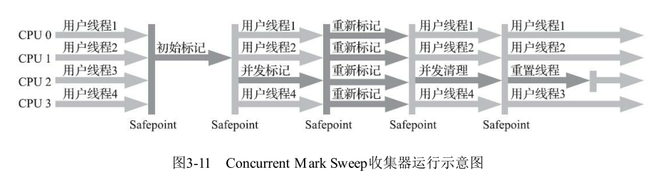
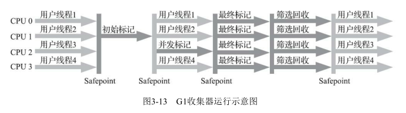
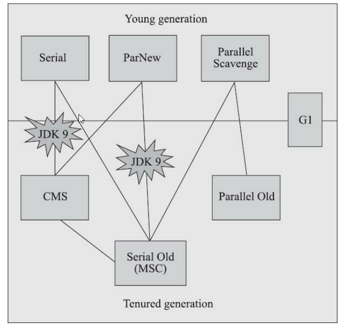

# jvm的垃圾回收

[扒一扒JVM的垃圾回收机制，下次面试你准备好了吗](https://www.cnblogs.com/1024Community/p/honery.html)

## 判断对象是否存活

### 引用计数法

对象中添加一个引用计数器，每当有地方引用它的时候，计数器就加1，引用失效的时候，计数器就减1，如果计数器是0，则代表没有人引用它。

但是**缺点就是无法解决循环引用的问题**。如果A和B互相引用，这样两个对象的引用计数都是1，但是除此之外没有地方引用它们，这样它们就永远不会被回收。

### 可达性分析算法

从一系列GC Root出发，如果无法到达的对象，就当它已经死亡了。

这里要介绍一下什么可以作为gc root：

#### GC root

​    **a.** java虚拟机栈(栈帧中的本地变量表)中的引用的对象。 

​    **b**.方法区中的类静态属性引用的对象。 

​    **c**.方法区中的常量引用的对象。 

​    **d**.本地方法栈中JNI本地方法的引用对象

可达性算法可以解决循环问题，但是在多线程情况下可能出现问题。

一个线程把一个对象标记为不可达，但是另一个线程重新引用了，结果这个对象被回收了，结果之后要用到这个对象的时候，可能会造成系统崩溃。

而如果一个对象已经是可达到的，但是后面又把它设置成null，这样这个对象就变成垃圾了，可是GC的时候却没把它当成垃圾收集。

所以在GC过程中会出现一些停顿，Sun称为stop the world。我理解就是所有的程序都停下来，让GC完成任务。把所有程序停下来感觉挺夸张的，但是现在已经优化得很好了，通常就一瞬间的事，表现就像停顿了一下。

当然stop the world 的过程中也有很多细节，程序也不是可以在任意时刻就停止的，不然可能造成其他程序的错误。这里有安全点和安全区域的概念，就是程序跑到这个安全点的位置才可以放心的停止。

而有些线程可能休眠了，无法跑到安全点，但是也有个安全区域，比如程序休眠了，那么此时程序就会标记自己在安全区域了，GC的时候就不用担心这些在安全区域的线程了。而这些安全区域的线程如果要离开安全区域的时候，会判断一下系统是否在GC，只有不在GC的时候才会离开安全区域。

无论是引用计数，还是可达性分析，都需要判断对象是否被引用。这里有一个引用的概念：强引用、软引用、弱引用、虚引用。这四种引用强度依次减弱，强引用是不会被回收的，其余都有可能被回收。

## 垃圾收集算法

### 标记-清除算法

把死亡的对象空间标记为空闲内存，并记录在一个空闲列表中（free list），当需要创建内存的时候，就去空闲列表里面找，并划分给新建的对象。缺点就是会有空间碎片

### 复制算法

可以把内存分成两份，一个空间满了之后，就根据gc root扫描，把存活的对象移到另外的空间，然后再把原来的空间清空，这样就不会有空间碎片。缺点也很明显，内存变成了原来的一半，浪费空间

### 标记-整理算法

在标记-清除的基础上，会整理内存，不会有空间碎片。缺点就是要移动对象，因此成本更高

### 分代收集算法

当前的主流方法，对不同的年代，使用不同的算法。我们重点来看一下。

按照通常的 GC 年代方式划分，Java 堆内分为：

1. 新生代

新生代是大部分对象创建和销毁的区域，在通常的 Java 应用中，绝大部分对象生命周期都是很短暂的。其内部又分为 Eden 区域，作为对象初始分配的区域；两个 Survivor，有时候也叫 from、to 区域，被用来放置从 Minor GC 中保留下来的对象。

JVM 会随意选取一个 Survivor 区域作为“to”，然后会在 GC 过程中进行区域间拷贝，也就是将 Eden 中存活下来的对象和 from 区域的对象，拷贝到这个“to”区域。这种设计主要是为了防止内存的碎片化，并进一步清理无用对象。

#### TLAB

Hotspot JVM 还有一个概念叫做 Thread Local Allocation Buffer（TLAB），这是 JVM 为每个线程分配的一个私有缓存区域。

因为我们使用new指令的时候，会在Eden区域划出一块作为存储对象的内存，由于堆空间是线程共享的，所以可能出现多个线程操作同一地址，为了避免这种情况，可能需要使用加锁等机制，但是会影响分配速度。

所以每个线程可以向虚拟机申请一段连续的内存，比如2048字节，作为线程私有的TLAB。线程维护两个指针，一个指向TLAB的空闲位置，另一个指向TLAB的结尾。

当对于new指令，可以使用指针加法来实现，即把指向空闲位置的指针，加上所请求的字节数。如果TLAB空间不够，可以重新申请新的TLAB

2. 老年代

放置长生命周期的对象，通常都是从 Survivor 区域拷贝过来的对象。当然，也有特殊情况，我们知道普通的对象会被分配在 TLAB 上；如果对象较大，JVM 会试图直接分配在 Eden 其他位置上；如果对象太大，完全无法在新生代找到足够长的连续空闲空间，JVM 就会直接分配到老年代。

3. 永久代

这部分就是早期 Hotspot JVM 的方法区实现方式了，储存 Java 类元数据、常量池、Intern 字符串缓存，在 JDK 8 之后就不存在永久代这块儿了。

来看一下新生代GC的过程

#### 新生代GC的过程

第一，Java 应用不断创建对象，通常都是分配在 Eden 区域，当其空间占用达到一定阈值时，触发 minor GC。仍然被引用的对象存活下来，被复制到 JVM 选择的 Survivor 区域，而没有被引用的对象则被回收。

第二， 经过一次 Minor GC，Eden 就会空闲下来，直到再次达到 Minor GC 触发条件，这时候，另外一个 Survivor 区域则会成为 to 区域，Eden 区域的存活对象和 From 区域对象，都会被复制到 to 区域，并且存活的年龄计数会被加 1。

第三， 类似第二步的过程会发生很多次，直到有对象年龄计数达到阈值，这时候就会发生所谓的晋升（Promotion）过程，超过阈值的对象会被晋升到老年代。这个阈值是可以通过参数指定：

-XX:MaxTenuringThreshold=&lt;N>

后面就是老年代 GC，具体取决于选择的 GC 选项，对应不同的算法。标记 - 整理算法中，老年代中的无用对象被清除后， GC 会将对象进行整理，以防止内存碎片化。

通常我们把老年代 GC 叫作 Major GC，将对整个堆进行的清理叫作 Full GC，但是这个也没有那么绝对，因为不同的老年代 GC 算法其实表现差异很大，例如 CMS，“concurrent”就体现在清理工作是与工作线程一起并发运行的。

## 垃圾收集器

谈谈最主流的 Oracle JDK的收集器。

### Serial GC

Serial GC，它是最古老的垃圾收集器，“Serial”体现在其收集工作是单线程的，并且在进行垃圾收集过程中，会进入臭名昭著的“Stop-The-World”状态。当然，其单线程设计也意味着精简的 GC 实现，无需维护复杂的数据结构，初始化也简单，所以一直是 Client 模式下 JVM 的默认选项。

从年代的角度，通常将其老年代实现单独称作 Serial Old，它采用了标记 - 整理（Mark-Compact）算法，区别于新生代的复制算法。

Serial GC 的对应 JVM 参数是：

-XX:+UseSerialGC

### ParNew GC

ParNew GC，很明显是个新生代 GC 实现，它实际是 Serial GC 的多线程版本，最常见的应用场景是配合老年代的 CMS GC 工作，下面是对应参数

-XX:+UseConcMarkSweepGC -XX:+UseParNewGC

### CMS

CMS（Concurrent Mark Sweep） GC，基于标记 - 清除（Mark-Sweep）算法，设计目标是尽量减少停顿时间，这一点对于 Web 等反应时间敏感的应用非常重要，一直到今天，仍然有很多系统使用 CMS GC。

但是，CMS 采用的标记 - 清除算法，存在着内存碎片化问题，所以难以避免在长时间运行等情况下发生 full GC，导致恶劣的停顿。

另外，既然强调了并发（Concurrent），CMS 会占用更多 CPU 资源，并和用户线程争抢。

还有个问题就是没法处理浮动垃圾。在CMS的并发标记和并发清理阶段，用户线程是还在继续运行的，会产生新的垃圾。但这一部分CMS只好留待下一次垃圾收集时再清理掉，就称为“浮动垃圾”。所以CMS就要预留一些空间给浮动垃圾，如果预留的空间太小了，要是CMS运行期间预留的内存无法满足程序分配新对象的需要，就会出现一次“并发失败”（Concurrent Mode Failure），这时候虚拟机将不得不启动后备预案：冻结用户线程的执行，临时启用Serial Old收集器来重新进行老年代的垃圾收集，但这样停顿时间就很长了。

CMS是重点，需要详细说说。

CMS整个过程可以细分为五个步骤：

1. 初始标记 自己线程
2. 并发标记：并发标记线程+用户线程
3. 重新标记：重新标记线程
4. 并发清理：并发清理线程+用户线程
5. 并发重置：重置线程+用户线程

初始标记、重新标记这两个步骤仍然需要“Stop The World”。所以可以看到，初始标记、重新标记只有CMS自己的线程，没有用户线程。

### Parrallel GC

Parrallel GC，在早期 JDK 8 等版本中，它是 server 模式 JVM 的默认 GC 选择，也被称作是吞吐量优先的 GC。吞吐量就是cup运行用户代码的时间，吞吐量越大，表示运行用户代码的时间比例越多，gc占用的时间较少。它的算法和 Serial GC 比较相似，尽管实现要复杂的多，其特点是新生代和老年代 GC 都是并行进行的，在常见的服务器环境中更加高效。

开启选项是：

-XX:+UseParallelGC

另外，Parallel GC 引入了开发者友好的配置项，我们可以直接设置暂停时间或吞吐量等目标，JVM 会自动进行适应性调整，例如下面参数：

-XX:MaxGCPauseMillis=value-XX:GCTimeRatio=N // GC 时间和用户时间比例 = 1 / (N+1)

### G1 GC

G1 GC 这是一种兼顾吞吐量和停顿时间的 GC 实现，是 Oracle JDK 9 以后的默认 GC 选项。G1 可以直观的设定停顿时间的目标，相比于 CMS GC，G1 未必能做到 CMS 在最好情况下的延时停顿，但是最差情况要好很多。

G1 GC 仍然存在着年代的概念，但是其内存结构并不是简单的条带式划分，而是类似棋盘的一个个 region。Region 之间是复制算法，但整体上实际可看作是标记 - 整理（Mark-Compact）算法，可以有效地避免内存碎片，尤其是当 Java 堆非常大的时候，G1 的优势更加明显。

默认的回收策略是优先处理回收价值最大的Region

CMS 已经在 JDK 9 中被标记为废弃（deprecated），所以 G1 GC 值得你深入掌握。

如果我们不去计算用户线程运行过程中的动作（如使用写屏障维护记忆集的操作），G1收集器的
运作过程大致可划分为以下四个步骤：

- 初始标记（Initial Marking）：仅仅只是标记一下GC Roots能直接关联到的对象，并且修改TAMS
  指针的值，让下一阶段用户线程并发运行时，能正确地在可用的Region中分配新对象。这个阶段需要
  停顿线程，但耗时很短，而且是借用进行Minor GC的时候同步完成的，所以G1收集器在这个阶段实际
  并没有额外的停顿。
- 并发标记（Concurrent Marking）：从GC Root开始对堆中对象进行可达性分析，递归扫描整个堆
  里的对象图，找出要回收的对象，这阶段耗时较长，但可与用户程序并发执行。当对象图扫描完成以
  后，还要重新处理SATB（原始快照）记录下的在并发时有引用变动的对象。
  ·最终标记（Final Marking）：对用户线程做另一个短暂的暂停，用于处理并发阶段结束后仍遗留
  下来的最后那少量的SATB记录。
- 筛选回收（Live Data Counting and Evacuation）：负责更新Region的统计数据，对各个Region的回
  收价值和成本进行排序，根据用户所期望的停顿时间来制定回收计划，可以自由选择任意多个Region
  构成回收集，然后把决定回收的那一部分Region的存活对象复制到空的Region中，再清理掉整个旧
  Region的全部空间。这里的操作涉及存活对象的移动，是必须暂停用户线程，由多条收集器线程并行
  完成的。
  从上述阶段的描述可以看出，G1收集器除了并发标记外，其余阶段也是要完全暂停用户线程的。

### Shenandoah

RedHat公司开发的Shen-andoah像是Oracle的G1收集器的实际继承者。

在并发回收的时候，需要移动对象，如果是暂停的状态，这个操作很简单，但如果是并发的情况下，用户线程仍然要对移动的对象进行访问，这就很难。

Shenandoah是通过读屏障和被称为“Brooks Pointers”的转发指针来解决。如果没有发生转移的话，转发指针是指向自己的，而如果发生了转移，则指向新的复制的地址。

主要是通过读屏障来增加额外的转发处理。因为读的操作太多了，加了这么一步会给性能产生影响。

它与G1至少有三个明显的不同之处，最重要的当然是支持并发的整理算法。

其次，Shenandoah（目前）是默认不使用分代收集的，换言之，不会有专门的新生代Region或者老年代Region的存在，没有实现分代，并不是说分代对Shenandoah没有价值，这更多是出于性价比的权衡，基于工作量上的考虑而将其放到优先级较低的位置上。

最后，Shenandoah摒弃了在G1中耗费大量内存和计算资源去维护的记忆集，改用名为“连接矩阵”（Connection
Matrix）的全局数据结构来记录跨Region的引用关系，降低了处理跨代指针时的记忆集维护消耗，也降低了伪共享问题（见3.4.4节）的发生概率。连接矩阵可以简单理解为一张二维表格，如果Region N有对象指向Region M，就在表格的N行M列中打上一个标记。

### ZGC

这款收集器的名字就叫作Z Garbage Collector

ZGC收集器是一款基于Region内存布局的，（暂时）不设分代的，使用了读屏障、染色指针和内存多重映射等技术来实现可并发的标记-整理算法的，以低延迟为首要目标的一款垃圾收集器。承诺停顿在10ms以内。

全部四个阶段都是可以并发执行的，仅是两个阶段中间会存在短暂的停顿小阶段

ZGC也采用基于Region的堆内存布局，但其他GC不同的是，ZGC的Region具有动态性——动态创建和销毁，以及动态的区域容量大小。在x64硬件平台下，ZGC的Region可以具有大、中、小三类容量：不固定、32MB、2MB

ZGC的核心问题——并发整理算法的实现。ZGC的染色指针直接把标记信息记在引用对象的指针上。

为什么指针本身也可以存储额外信息呢？，64位的Linux分别支持47位（128TB）的进程虚拟地址空间和46位（64TB）的物理地址空间。

Linux下剩余的46位指针所能支持的64TB内存在今天仍然能够充分满足大型服务器的需要。鉴于此，ZGC的染色指针技术继续盯上了这剩下的46位指针宽度，将其高4位提取出来存储四个标志信息。所以指针可用长度只有42位了
，因此ZGC能够管理的内存不可以超过4TB（2的42次幂）。

染色指针有4TB的内存限制，不能支持32位平台，不能支持压缩指针（-XX:+UseCompressedOops）等诸多约束

Linux/x86-64平台上的ZGC使用了多重映射（Multi-Mapping）将多个不同的虚拟内存地址映射到同一个物理内存地址上，这是一种多对一映射，意味着ZGC在虚拟内存中看到的地址空间要比实际的堆内存容量来得更大。把染色指针中的标志位看作是地址的分段符，那只要将这些不同的地址段都映射到同一个物理内存空间，经过多重映射转换后，就可以使用染色指针正常进行寻址了.

### 总结

serial是串行，其余都是并发的

Serial收集器：**串行运行**；作用于新生代；复制算法；响应速度优先；适用于单CPU环境下的client模式。

Serial Old收集器：**串行运行**；作用于老年代；标记-整理算法；响应速度优先；单CPU环境下的Client模式。

ParNew收集器：**多线程版的Serial**，用于新生代；复制算法；响应速度优先；多CPU环境Server模式下与CMS配合使用。

Parallel Scavenge收集器：**Parallel 被称作是吞吐量优先的 GC**；作用于新生代；复制算法；吞吐量优先；适用于后台运算而不需要太多交互的场景。

Parallel Old收集器：作用于老年代；标记-整理算法；吞吐量优先；适用于后台运算而不需要太多交互的场景。

CMS收集器：**设计目标是尽量减少停顿时间**；作用于老年代；标记-清除算法；响应速度优先；适用于互联网或B/S业务。 **CMS 已经在 JDK 9 中被标记为废弃**

G1收集器：**吞吐量和停顿表现都非常不错，并且仍然在不断地完善**；可作用于新生代或老年代；标记-整理算法+复制算法；响应速度优先；面向服务端应用。 

