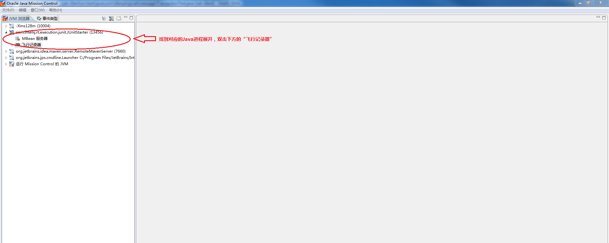
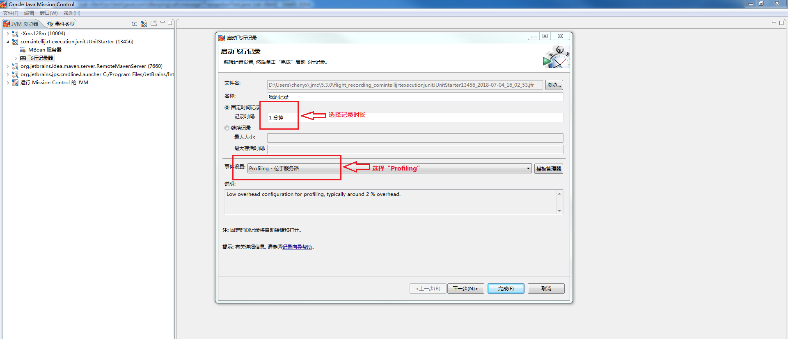
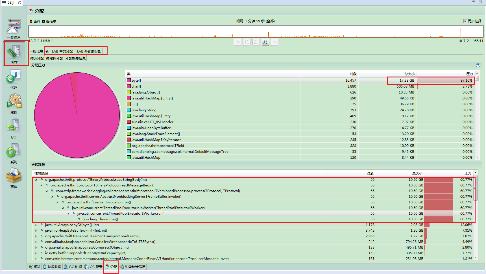
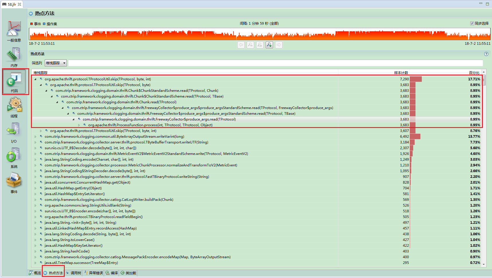

# jvm问题排查

## GC频繁

思路一：

**通过jmap分析出占用内存占用最多的类，进行代码优化以减少内存使用**

```shell
jmap -histo[:live] {pid}
# 加上live参数会触发一次Full GC
例：jmap -histo:live 30527 | more
```

思路二：

**通过Flight Recorder分析出分配内存最多的代码路径，进行代码优化以减少内存使用**

- JVM参数中添加-XX:+UnlockCommercialFeatures(若启动时没有加此参数可以通过jcmd {pid} VM.unlock_commercial_features 动态打开) -XX:+FlightRecorder（注意：加上此参数可能会对进程有一定性能影响，生产环境请谨慎）
- 若是本地开发环境，可以通过[Java Mission Control](http://www.oracle.com/technetwork/java/javaseproducts/mission-control/java-mission-control-1998576.html)进行运行时数据抓取（Java Mission Control操作如下图所示）





- 若是测试环境或者生产环境，可以登录到对应机器执行如下命令，抓取运行时数据文件并下载到本地通过[Java Mission Control](http://www.oracle.com/technetwork/java/javaseproducts/mission-control/java-mission-control-1998576.html)打开此数据文件进行分析。

```shell
/usr/java/default/bin/jcmd {jvm-pid} JFR.start duration={time} settings=profile filename={path}
# time是抓取多长时间的运行时数据，如，60s：表示60秒
# path为运行时数据文件的输出路径和文件名(文件后缀为jfr)，如，/home/deploy/profile-data.jfr
# 执行完以上命令后，可以通过/usr/java/default/bin/jcmd {jvm-pid} JFR.check 来检查上述命令是否已经执行完成
```

内存分配分析如下图：



## cpu高

- 思路1：找到CPU使用高的Java线程，进行问题定位和代码优化

  1. top -H -p {pid}  # 按照CPU使用率从高到低列出所有线程
  2. jstack {pid} > {filePath}  # 把pid对应的Jvm中的所有线程stack trace输出到filePath指定的文件中
  3. python中执行print "%x" {topCPUUsagePid}  # 计算第1步获取到的pid的16进制表示方式
  4. 在第2步的输出文件中查找第3步16进制pid对应的线程看看对应的线程堆栈，可以知道对应的线程正在做什么操作

  - 以上步骤可以通过一个一键脚本（点击此[链接](https://github.com/oldratlee/useful-scripts/blob/master/show-busy-java-threads)）进行打印

    

- **思路2：通过Flight Recorder获取热点方法，进行问题定位和代码优化**

热点方法分析如下图：



## 内存泄漏

- ## **Heap内存泄漏**

  - **现象**
    - 抛出OutOfMemoryError
    - 多次Full GC后占用的内存呈上升趋势
  - 思路
    1. jmap -dump:live,format=b,file={filePath} {pid}  # 获取此pid对应的jvm进程的内存dump文件，存放到filePath指定的路径和文件中。注意：此命令中的live参数会触发一次Full GC
    2. 通过MAT工具进行内存分析

- ## **非Heap内存泄漏**

  - **现象**
    - 进程crash
    - top命令显示进程占用的RES内存不断上升（远大于Xmx设置的值）或者Cat/Hickwall中看到机器可用内存一直下降

查看Direct Memory使用情况

- 检查代码中是否有大量使用String.intern()
- 检查代码中是否存在使用了GZIPInputStream/GZIPOutputStream/DeflaterInputStream/DeflaterOutputStream但是某些情况没有close
- 线程数量是否过多(每个线程会占用-Xss参数指定的大小的非Heap内存)