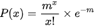

# HashMap在jdk1.7和1.8中的区别

## 1.数据结构

Java 7及以前是数组+链表、Java 8及以后是数组+链表+红黑树。

1.8中，当链表长度到达8的时候，会转化成红黑树。

## 2.插入链表的方式

1.7是头插法，1.8是尾插法

## 3.扩容时，调整数据的方式

1.7其实就是根据hash值重新计算索引位置，然后将数据重新放到应该在的位置。

而1.8优化了一下，扩容之后，每个数据要么在原来的位置，要么就在j + oldCap的位置，j是原来的下标位置，oldcap就是原来数组的大小。至于这个具体原因可以看我另一个文章。 [HashMap详解](https://blog.csdn.net/weixin_43094917/article/details/106427322)中jdk1.8的扩容部分

所以1.8调整数据的时候，将原来的一条链表分成了两个链表，一个是原来的下标位置，另一个新的下标位置。

## 4.hash值的计算方式

jdk1.7获取hash值是9次扰动处理=4次位运算+5次异或，而JDK1.8只用了2次扰动处理=1次位运算+1次异或。

jdk1.8获取hash值比较简单，`h ^ (h >>> 16) `这里的h是key的hashcode。

可以看到只是将高16位和低16位进行异或就得到了。

为什么这里需要将高位数据移位到低位进行异或运算呢？

这是因为有些数据计算出的哈希值差异主要在高位，而 HashMap 里的哈希寻址是忽略容量以上的高位的，那么这种处理就可以有效避免类似情况下的哈希碰撞。

## 还有一些额外的问题

**1.8转化成树的阈值为什么是8**？

可以看到HashMap源码中有这段注释。

```
    /*
    ......
     * Ideally, under random hashCodes, the frequency of
     * nodes in bins follows a Poisson distribution
     * (http://en.wikipedia.org/wiki/Poisson_distribution) with a
     * parameter of about 0.5 on average for the default resizing
     * threshold of 0.75, although with a large variance because of
     * resizing granularity. Ignoring variance, the expected
     * occurrences of list size k are (exp(-0.5) * pow(0.5, k) /
     * factorial(k)). The first values are:
     *
     * 0:    0.60653066
     * 1:    0.30326533
     * 2:    0.07581633
     * 3:    0.01263606
     * 4:    0.00157952
     * 5:    0.00015795
     * 6:    0.00001316
     * 7:    0.00000094
     * 8:    0.00000006
     * more: less than 1 in ten million
     *......
     */
```

理想情况下，在随机哈希码和默认门限值为 0.75 的情况下,存储桶中元素个数出现的频率遵循泊松分布,平均参数为 0.5，对应k 值下,随机事件出现频率的计算公式为 (exp(-0.5) * pow(0.5, k) /factorial(k)

先来看看泊松分布的公式，来源[百度百科]([https://baike.baidu.com/item/%E6%B3%8A%E6%9D%BE%E5%88%86%E5%B8%83/1442110?fr=aladdin](https://baike.baidu.com/item/泊松分布/1442110?fr=aladdin))：

观察事物平均发生m次的条件下，实际发生x次的概率P（x）可用下式表示：



根据注释所说，m的值为0.5，所以可以计算x等于0到8的概率值为注释写的那些，可以看到8个元素出现在一个桶中的概率是0.00000006，再往上的概率就小于千万分之一了，所以没有必要。太小了的话，树化没有必要，就几个节点，直接都遍历一般也是一样的。

**为什么退化成链表的默认阈值是6？**

首先，肯定要小于8，然后不能和8太接近，不然会频繁发生树化和退树的操作，所以7也不行。为啥是6呢？因为在小就没必要了，如果太小的话，很多节点都会变成树节点，树节点都是引用属性，占用的空间比较多。另一方面，当节点数量很少的时候，树的遍历操作并没有比链表快。（事实上由 MIN_TREEIFY_CAPACITY=64 参数，只有容量大于 64 时才会开启树化）。所以综合考虑，选择了6。

**为什么在JDK1.7的时候是先进行扩容后进行插入，而在JDK1.8的时候则是先插入后进行扩容的呢？**

待完善