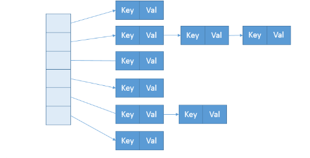

# HashMap详解

## 1.7的HashMap

### 数据结构

首先来看一下它的数据结构

```java
transient Entry<K,V>[] table = (Entry<K,V>[]) EMPTY_TABLE;
```

其实就是一个Entry数组

Entry的属性是这样的

```java
        final K key;
        V value;
        Entry<K,V> next;
        int hash;
		// 构造函数
        Entry(int h, K k, V v, Entry<K,V> n) {
            value = v;
            next = n;
            key = k;
            hash = h;
        }
```

所以其实可以看到Entry就是一个链表中的节点。

所以，我们对1.7的HashMap的数据结构就清楚了，首先是一个数组，然后每个数组里面的值是一个链表。就像下图



想象一下put的过程，放进一个数的时候，根据hash值找到对应的数组下标位置，该下标的单元格放的是一个链表，我们在该链表上面加上一个节点。就完成了一个put操作。

具体来看一下源码是怎么实现的。

### put

**put()**

```java
    public V put(K key, V value) {
        // 如果是空，就初始化
        if (table == EMPTY_TABLE) {
            inflateTable(threshold);
        }
        // 对null的key特别处理
        if (key == null)
            return putForNullKey(value);
        // 获取hash值
        int hash = hash(key);
        /****** 1. 根据hash值获取索引位置 *****/
        int i = indexFor(hash, table.length);
        // 遍历索引所在位置的链表
        for (Entry<K,V> e = table[i]; e != null; e = e.next) {
            Object k;
            // 如果hash值相等，并且key相等，就替换该值
            if (e.hash == hash && ((k = e.key) == key || key.equals(k))) {
                V oldValue = e.value;
                e.value = value;
                e.recordAccess(this);
                return oldValue;
            }
        }
		
        modCount++;
        /***** 2. 这个key之前都没出现过，就增加节点 *****/
        addEntry(hash, key, value, i);
        return null;
    }
```

其实这里面每个方法都有很多巧妙的地方，大家可以自己看看，我就主要讲一下有序号的那些方法。

1.根据hash值获取索引位置里面的代码很简单，return h & (length-1);在HashMap里面数组的大小确保了会是2的幂次方，所以length-1就是00001111这样的数，这样hash值异或就确保了最后的索引值会是小于length的正数。

2.然后是是增加节点的代码

**addEntry()**

```java
    void addEntry(int hash, K key, V value, int bucketIndex) {
        // 如果大小大于阈值，需要扩容
        if ((size >= threshold) && (null != table[bucketIndex])) {
            /***** 1.扩容的代码 *****/
            resize(2 * table.length);
            hash = (null != key) ? hash(key) : 0;
            bucketIndex = indexFor(hash, table.length);
        }
		/***** 2.创建节点 *****/
        createEntry(hash, key, value, bucketIndex);
    }
```

1. 可以看到扩容的时候，是扩大了两倍，来看看代码

```java
    void resize(int newCapacity) {
        Entry[] oldTable = table;
        int oldCapacity = oldTable.length;
        // 确保大小不会超过最大值，最大值为1 << 30
        if (oldCapacity == MAXIMUM_CAPACITY) {
            threshold = Integer.MAX_VALUE;
            return;
        }
		// 扩容只需要把数组扩大一下就好了
        Entry[] newTable = new Entry[newCapacity];
        /***** 1.但是麻烦的是，数组扩大之后，根据hash值获得的索引位置也会发生变化，*****/
        // 所以需要把map里面的数据重新调整
        transfer(newTable, initHashSeedAsNeeded(newCapacity));
        table = newTable;
        threshold = (int)Math.min(newCapacity * loadFactor, MAXIMUM_CAPACITY + 1);
    }
```

**transfer()**

```java
    void transfer(Entry[] newTable, boolean rehash) {
        int newCapacity = newTable.length;
        for (Entry<K,V> e : table) {
            while(null != e) {
                Entry<K,V> next = e.next;
                if (rehash) {
                    e.hash = null == e.key ? 0 : hash(e.key);
                }
                int i = indexFor(e.hash, newCapacity);
                e.next = newTable[i];
                newTable[i] = e;
                e = next;
            }
        }
    }
```

这代码很简单，就是把原先table的数据再重新放到newTable里面，其实就是在newTable又做了一遍put的操作。

回到原来的代码，看完resize，来看看createEntry。

**createEntry()**

```java
    void createEntry(int hash, K key, V value, int bucketIndex) {
        // 原先的entry节点
        Entry<K,V> e = table[bucketIndex];
        // 新建一个entry节点，next指向之前的entry节点
        table[bucketIndex] = new Entry<>(hash, key, value, e);
        size++;
    }
```

所以可以看到，每次新增节点都是“头插法”，因为这里新建节点的next指向原来的节点e，所以每次新增的节点都在前面。

好了，一个put的操作就完成了，里面涉及到的扩容也讲到了。

## jdk8中HashMap源码实现

### 成员变量和常量

**成员变量**

```java
    // 存放数据的数组，在第一次使用的时候初始化，数组的长度总是2的n次方
	// 1.7是Entry<K,V>[] table，其实只是换了个名字
	transient Node<K,V>[] table;

	// 缓存了entrySet()方法需要的数据
    transient Set<Map.Entry<K,V>> entrySet;

	// <k,v>键值对的数量，就是数据的数量
    transient int size;

	// 修改的次数，用于fail-fast策略
    transient int modCount;

	// 扩容阈值，超过这个值就进行resize，这个值等于capacity * load factor
    int threshold;

	// 负载因子
    final float loadFactor;
```

**常量**

```java
	// 默认的初始容量，必须2的n次方
    static final int DEFAULT_INITIAL_CAPACITY = 1 << 4; // aka 16

	// 最大容量，2的n次方
    static final int MAXIMUM_CAPACITY = 1 << 30;

    // 负载因子
    static final float DEFAULT_LOAD_FACTOR = 0.75f;

    // 当节点个数大于这个值，就将链表转成红黑树
    static final int TREEIFY_THRESHOLD = 8;

    // 当树的节点个数小于这个值，就将红黑树转成链表
    static final int UNTREEIFY_THRESHOLD = 6;

    // 如果容量小于64，即使节点个数大于8也不进行树化，而是优先选择扩容。
    static final int MIN_TREEIFY_CAPACITY = 64;
```

### Node类

前面提到的成员变量`transient Node<K,V>[] table`.table是我们存放数据的地方，可以看到它是一个数组，类型是Node，让我们来看看Node类

```java
   static class Node<K,V> implements Map.Entry<K,V> {
        final int hash;
        final K key;
        V value;
        Node<K,V> next;

        Node(int hash, K key, V value, Node<K,V> next) {
            this.hash = hash;
            this.key = key;
            this.value = value;
            this.next = next;
        }

        public final K getKey()        { return key; }
        public final V getValue()      { return value; }
        public final String toString() { return key + "=" + value; }

        public final int hashCode() {
            return Objects.hashCode(key) ^ Objects.hashCode(value);
        }

        public final V setValue(V newValue) {
            V oldValue = value;
            value = newValue;
            return oldValue;
        }

        public final boolean equals(Object o) {
            if (o == this)
                return true;
            if (o instanceof Map.Entry) {
                Map.Entry<?,?> e = (Map.Entry<?,?>)o;
                if (Objects.equals(key, e.getKey()) &&
                    Objects.equals(value, e.getValue()))
                    return true;
            }
            return false;
        }
    }
```

可以看到东西不多，一个哈希值，key和value，还有一个Node<K,V>  next，用来指向链表的下一个数据。还有一些基本的方法。HashMap中大部分数据都是用Node存储的，除了红黑树。红黑树我们后面再讲。

### 构造函数

一共有四个构造函数，我们就拿其实两个来看一下

**HashMap()**

```java
    public HashMap() {
        this.loadFactor = DEFAULT_LOAD_FACTOR; // all other fields defaulted
    }
```

**HashMap()**是我们常常用的，在这里只设置了默认的负载因子，那容量没有设置吗？还记得我们前面介绍Node<K,V>[] table的时候说过，在使用的时候再进行初始化。所以容量是后面再设置的。

**HashMap(int , float)**

```java
    public HashMap(int initialCapacity, float loadFactor) {
        if (initialCapacity < 0)
            throw new IllegalArgumentException("Illegal initial capacity: " +
                                               initialCapacity);
        if (initialCapacity > MAXIMUM_CAPACITY)
            initialCapacity = MAXIMUM_CAPACITY;
        if (loadFactor <= 0 || Float.isNaN(loadFactor))
            throw new IllegalArgumentException("Illegal load factor: " +
                                               loadFactor);
        // 前面都是对输入参数进行验证，主要就是下面这两行
        this.loadFactor = loadFactor;
        this.threshold = tableSizeFor(initialCapacity);
    }
```

我们也可以指定容量和负载因子。这里有个tableSizeFor()方法，因为前面提到容量是2的n次方，这里就是对我们传入的初始容量进行了处理，让其成为2的n次方。如果传入的是10，则返回16，如果传入17，则返回32。这个方法实现挺巧妙的。

```java
static final int tableSizeFor(int cap) {
    int n = cap - 1;
    n |= n >>> 1;
    n |= n >>> 2;
    n |= n >>> 4;
    n |= n >>> 8;
    n |= n >>> 16;
    return (n < 0) ? 1 : (n >= MAXIMUM_CAPACITY) ? MAXIMUM_CAPACITY : n + 1;
}
```

如果n的二进制是001xxxx，第一次运算后会变成00011xxx，这样子前面有两个1了，然后第二次运算，变成了000001111X，现在有四个1了，所以到最后n会变成11111...的形式，最后返回的时候再加上1，就变成了1000000...这样就保证会是2的n次方了。为什么一开始需要n = cap - 1，因为如果n是16这种2的幂次方的形式，按照这种方式最后会变成32，所以需要先把cap减一变成15，这样最后就会返回16了。所以16进行运算之后就不会变成32，而是还是16。这个方式和1.7是一样的，只是1.7直接使用Integer.highestOneBit的方法。

### get方法

get方法比较简单，我们先来看看get。

```java
    public V get(Object key) {
        Node<K,V> e;
        return (e = getNode(hash(key), key)) == null ? null : e.value;
    }
    
    final Node<K,V> getNode(int hash, Object key) {
        Node<K,V>[] tab; Node<K,V> first, e; int n; K k;
        // if里面先判断table里面有没有数据，再判断hash值对应的位置有没有值，
        // 如果判断为false，则返回null
        if ((tab = table) != null && (n = tab.length) > 0 &&
            (first = tab[(n - 1) & hash]) != null) {
            // 进入到这里说明我们已经拿到了对应位置的值——first了。
            // 判断first的hash值是否相等，再判断key是否相同，相同直接返回这个值
            if (first.hash == hash && // always check first node
                ((k = first.key) == key || (key != null && key.equals(k))))
                return first;
            // 第一个节点first不是我们要的，继续去下一个节点找
            if ((e = first.next) != null) {
                // 如果是红黑树，则使用红黑树的方法寻找
                if (first instanceof TreeNode)
                    return ((TreeNode<K,V>)first).getTreeNode(hash, key);
                do {
                    // 不是红黑树，那就是链表了，遍历链表找我们要的值
                    if (e.hash == hash &&
                        ((k = e.key) == key || (key != null && key.equals(k))))
                        return e;
                } while ((e = e.next) != null);
            }
        }
        return null;
    }
```

可以看到整个get的逻辑很简单，内部是使用了getNode方法取得值的，getNode方法传入了hash值和key。所以我们看到在方法中判断是不是我们要找的数据，使用的就是hash和key

```java
if (first.hash == hash && 
	((k = first.key) == key || (key != null && key.equals(k))))
	return first;
```

在HashMap中都是使用这种方法判断相等的情况。

先判断hash值是否相等，如果不相等，那两个数据肯定不一样。hash值相等并不等于数据会相等，因为不同对象的hash值可能会一样，所以还要判断key是否一样。

判断key先使用==来判断，如果==成立了，那么这两个数据肯定一样了。如果==不成立，只能说明两个对象不是同个对象，但是这两个对象可能内容是一样的，所以要再调用equals方法来判断。那我们常用的string来说

```java
        String s1 = new String("hello");
        String s2 = new String("hello");
```

我们知道s1 == s2 会是false，s1.equals(s2)会是true，如果s1和s2作为HashMap的key，我们是需要他们判断一样的。所以在==不成立之后，还需要equals来判断。

### put方法

```java
    public V put(K key, V value) {
        return putVal(hash(key), key, value, false, true);
    }
    // onlyIfAbsent为true时，不改变已经存在的值。就是如果key重复了，则不会覆盖原有的值，
	// 我们这里传的是false，所以会覆盖值
	// evict  if false, the table is in creation mode.（不太清楚）
    final V putVal(int hash, K key, V value, boolean onlyIfAbsent,
                   boolean evict) {
        Node<K,V>[] tab; Node<K,V> p; int n, i;
        // 如果table还没创建，则先初始化，这里就是前面说的使用的时候再初始化
        if ((tab = table) == null || (n = tab.length) == 0)
            n = (tab = resize()).length;
        // 找到要放入的位置，如果该位置没有数据，则直接放入
        if ((p = tab[i = (n - 1) & hash]) == null)
            tab[i] = newNode(hash, key, value, null);
        else {
            Node<K,V> e; K k;
            // 判断是否是相同的key，相同的话后面再判断是否覆盖
            // 如果不一样则要选择链表或者红黑树来插入这个数据
            if (p.hash == hash &&
                ((k = p.key) == key || (key != null && key.equals(k))))
                e = p;
            // 是红黑树则使用putTreeVal方法插入
            else if (p instanceof TreeNode)
                e = ((TreeNode<K,V>)p).putTreeVal(this, tab, hash, key, value);
            else {
                // 是链表的话，就遍历链表。 binCount在遍历过程中记下链表的个数
                for (int binCount = 0; ; ++binCount) {
                    // 遍历到末尾，将数据插到末尾
                    if ((e = p.next) == null) {
                        p.next = newNode(hash, key, value, null);
                        // 判断是否要转为红黑树
                        if (binCount >= TREEIFY_THRESHOLD - 1) // -1 for 1st
                            treeifyBin(tab, hash);
                        break;
                    }
                    // 遍历过程中判断各自节点的数据是否和要插入的数据一样，如果一样就不用遍历了
                    if (e.hash == hash &&
                        ((k = e.key) == key || (key != null && key.equals(k))))
                        break;
                    p = e;
                }
            }
            // 如果e不为空表示有相同的值，判断是否覆盖
            if (e != null) { // existing mapping for key
                V oldValue = e.value;
                if (!onlyIfAbsent || oldValue == null)
                    e.value = value;
                afterNodeAccess(e);
                return oldValue;
            }
        }
        ++modCount;
        // 扩容
        if (++size > threshold)
            resize();
        // 在HashMap中，这个方法没有实现，在HashMap的子类LinkedHashMap中有实现
        afterNodeInsertion(evict);
        return null;
    }
```

这里根据hash值查找位置很简单，就是tab[ (n - 1) & hash])，n是数组的长度，前面我们一直在说数组的长度要是2的n次方，所以这里(n - 1) & hash就等价于 hash % n。&和%相比，&运算效率肯定更高一点。

put方法中实际是调用putVal方法，这里计算了一下hash值

```java
    static final int hash(Object key) {
        int h;
        return (key == null) ? 0 : (h = key.hashCode()) ^ (h >>> 16);
    }
```

hash值的计算很简单，就是用hashCode的高16位和低16位异或。

### resize扩容方法

这里先学点理论知识。HashMap的扩容是扩大两倍。我们前面提到使用(n - 1) & hash来寻找对应的位置，扩容后n变成两倍，那各个数据的位置也就会发生变化。但是这里有点规律。

假设原来n是8，即1000，现在n是16，即10000，hash假设是9，即1001。我们来分别算一下(n - 1) & hash

|       | n = 8 | n = 16 |
| ----- | ----- | ------ |
| n - 1 | 0111  | 1111   |
| hash  | 1001  | 1001   |
| &结果 | 0001  | 1001   |

再仔细看看，两个n - 1都是低位是1，只有最高位不一样，所以就造成了结果中低位都一样，只有最高位不一样。

所以最关键的只有hash值的最高位，如果最高位是0，则扩容后的位置不会变化，如果最高位是1，则位置就是原来的位置加上2的n次方，就那我们这个例子来说，原来是0001，现在是0001加上1000（8）。

这里说的最高位就是扩容前n的最高位，扩容前n是1000，则最高位就是1所在的位置。所以我们判断hash值的最高位是0还是1只需要使用`hash & oldCap == 0`来判断，oldCap 是扩容前的n。

在1.7，链表里面的节点在扩容后会变成逆序，在1.8中可以保留顺序，我们前面说的方法也是在链表里面用到的。好，让我们来看一下具体的代码

```java
    final Node<K,V>[] resize() {
        Node<K,V>[] oldTab = table;
        // 旧的容量
        int oldCap = (oldTab == null) ? 0 : oldTab.length;
        // 旧的扩容阈值
        int oldThr = threshold;
        int newCap, newThr = 0;
        if (oldCap > 0) {
            // 如果已经大于最大容量了，就无法扩容了。
            if (oldCap >= MAXIMUM_CAPACITY) {
                threshold = Integer.MAX_VALUE;
                return oldTab;
            }
            // 如果判断是true的话，newCap和newThr都变成原来的两倍（一般情况下都是执行这段代码）
            else if ((newCap = oldCap << 1) < MAXIMUM_CAPACITY &&
                     oldCap >= DEFAULT_INITIAL_CAPACITY)
                newThr = oldThr << 1; // double threshold
        }
        // oldCap = 0 oldThr > 0 的情况，不太清楚这种情况什么时候发生
        else if (oldThr > 0) // initial capacity was placed in threshold
            newCap = oldThr;
        // 第一次初始化的时候
        else {               // zero initial threshold signifies using defaults
            newCap = DEFAULT_INITIAL_CAPACITY;
            newThr = (int)(DEFAULT_LOAD_FACTOR * DEFAULT_INITIAL_CAPACITY);
        }
        // 对于一些特殊情况计算newThr
        if (newThr == 0) {
            float ft = (float)newCap * loadFactor;
            newThr = (newCap < MAXIMUM_CAPACITY && ft < (float)MAXIMUM_CAPACITY ?
                      (int)ft : Integer.MAX_VALUE);
        }
        // 前面都是判断各种情况下newThr和newCap的值应该是什么，到这里我们就得到了合理的值了。
        threshold = newThr;
        @SuppressWarnings({"rawtypes","unchecked"})
            Node<K,V>[] newTab = (Node<K,V>[])new Node[newCap];
        table = newTab;
        if (oldTab != null) {
            // 遍历每个数据
            for (int j = 0; j < oldCap; ++j) {
                Node<K,V> e;
                if ((e = oldTab[j]) != null) {
                    oldTab[j] = null;
                    if (e.next == null)// 如果只有一个数据，直接返回
                        newTab[e.hash & (newCap - 1)] = e;
                    else if (e instanceof TreeNode) // 如果是红黑树
                        ((TreeNode<K,V>)e).split(this, newTab, j, oldCap);
                    else { // preserve order
                        // 如果是链表，分成两个链表，一个就是还在原来位置，另一个加上oldCap
                        Node<K,V> loHead = null, loTail = null;
                        Node<K,V> hiHead = null, hiTail = null;
                        Node<K,V> next;
                        do {
                            next = e.next;
                            if ((e.hash & oldCap) == 0) {
                                if (loTail == null)
                                    loHead = e;
                                else
                                    loTail.next = e;
                                loTail = e;
                            }
                            else {
                                if (hiTail == null)
                                    hiHead = e;
                                else
                                    hiTail.next = e;
                                hiTail = e;
                            }
                        } while ((e = next) != null);
                        if (loTail != null) {
                            loTail.next = null;
                            newTab[j] = loHead;
                        }
                        if (hiTail != null) {
                            hiTail.next = null;
                            newTab[j + oldCap] = hiHead;
                        }
                    }
                }
            }
        }
        return newTab;
    }
```

### 红黑树

```java
    static final class TreeNode<K,V> extends LinkedHashMap.Entry<K,V> {
        TreeNode<K,V> parent;  // red-black tree links
        TreeNode<K,V> left;
        TreeNode<K,V> right;
        TreeNode<K,V> prev;    // needed to unlink next upon deletion
        boolean red;
        TreeNode(int hash, K key, V val, Node<K,V> next) {
            super(hash, key, val, next);
        }
	}
```

可以看到继承的是LinkedHashMap.Entry，其实最后也是继承HashMap.Node

```java
/**
 * HashMap.Node subclass for normal LinkedHashMap entries.
 */
static class Entry<K,V> extends HashMap.Node<K,V> {
    Entry<K,V> before, after;
    Entry(int hash, K key, V value, Node<K,V> next) {
        super(hash, key, value, next);
    }
}
```

**红黑树的特性**:

1. 每个节点或者是黑色，或者是红色。
2. 根节点是黑色。
3. 每个叶子节点（NIL）是黑色。 **[注意：这里叶子节点，是指为空(NIL或NULL)的叶子节点！]**
4. 如果一个节点是红色的，则它的子节点必须是黑色的。
5. 从一个节点到该节点的子孙节点的所有路径上包含相同数目的黑节点。

特性(5)，确保没有一条路径会比其他路径长出俩倍。因而，红黑树是相对是接近平衡的二叉树。

那为什么不使用平衡二叉树呢？AVL树是**严格的平衡二叉树**，只要不满足条件，就要通过旋转来保持平衡。

红黑树的定义比较宽泛一些，所以需要旋转的情况少一点。平衡二叉树只适合查询多的情况，红黑树适合修改多的情况。

1.7和1.8的区别总结可以看我的另一篇文章[HashMap在jdk1.7和1.8中的区别](https://blog.csdn.net/weixin_43094917/article/details/106427528)

