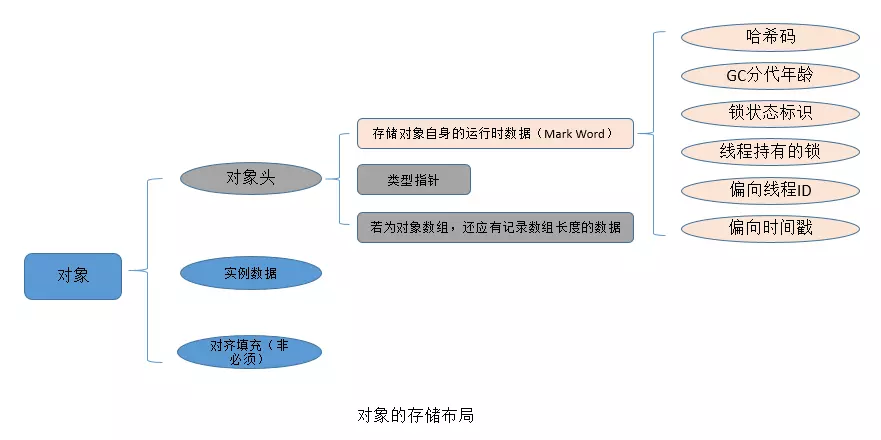

Synchronized原理

## 同步原理

先来看一下基本使用

```java
package com.paddx.test.concurrent;
public class SynchronizedDemo {
    public void method() {
        synchronized (this) {
            System.out.println("Method 1 start");
        }
    }
}
```

这个代码反编译出来的结果是这样的：


可以看到代码前后有一个**monitorenter**和一个**monitorexit**

**monitorenter**：每个对象都有一个监视器锁（monitor）。当monitor被占用时就会处于锁定状态，线程执行monitorenter指令时尝试获取monitor的所有权，过程如下：

> 1. 如果monitor的进入数为0，则该线程成为该monitor的所有者，然后将monitor的进入数设置为1；
> 2. 如果线程已经占有该monitor，只是重新进入，则进入monitor的进入数加1；
> 3. 如果其他线程已经占用了monitor，则该线程进入阻塞状态，直到monitor的进入数为0，再重新尝试获取monitor的所有权；

**monitorexit**：则相反的过程

而对于同步方法，也就是synchronized修饰的方法，反编译的情形有所不同

```java
package com.paddx.test.concurrent;

public class SynchronizedMethod {
    public synchronized void method() {
        System.out.println("Hello World!");
    }
}
```


从编译的结果来看，方法的同步并没有通过指令 `monitorenter` 和 `monitorexit` 来完成，不过相对于普通方法，其常量池中多了 `ACC_SYNCHRONIZED` 标示符。JVM就是根据该标示符来实现方法的同步的：

当方法调用时，调用指令将会检查方法的 ACC_SYNCHRONIZED 访问标志是否被设置，如果设置了，执行线程将先获取monitor，获取成功之后才能执行方法体，方法执行完后再释放monitor。**在方法执行期间，其他任何线程都无法再获得同一个monitor对象。**

那么什么是**monitor**呢？

## monitor(监视器)

我们可以把它理解为一个同步工具，也可以描述为一种同步机制，它通常被描述为一个对象。

与一切皆对象一样，所有的Java对象是天生的Monitor，每一个Java对象都有成为Monitor的潜质，因为在Java的设计中 ，每一个Java对象自打娘胎里出来就带了一把看不见的锁，它叫做内部锁或者Monitor锁。

## 对象的存储结构

Java对象的对象头Mark Word会存放Monitor对象的引用地址，这个Mark Word是什么东西？

在JVM中**，对象在内存中的布局分为三块区域：对象头、实例数据和对齐填充。**如下图所示：



1. 实例数据：存放类的属性数据信息，包括父类的属性信息；
2. 对齐填充：由于虚拟机要求 对象起始地址必须是8字节的整数倍。填充数据不是必须存在的，仅仅是为了字节对齐；
3. **对象头**：记录了一些基本的信息，如图片所示，我们提到的Mark Word就是在这个地方。

下面是32位机器的mark word存储的数据格式，可以看到不同级别的锁，存储的数据是不一样的。


## 锁的优化

从JDK6开始，就对synchronized的实现机制进行了较大调整，包括使用JDK5引进的CAS自旋之外，还增加了自适应的CAS自旋、锁消除、锁粗化、偏向锁、轻量级锁这些优化策略。

### 自旋锁

所谓自旋锁，就是指当一个线程尝试获取某个锁时，如果该锁已被其他线程占用，就一直循环检测锁是否被释放，而不是进入线程挂起或睡眠状态。

自旋锁在JDK 1.4.2中引入，默认关闭，但是可以使用-XX:+UseSpinning开开启，在JDK1.6中默认开启。同时自旋的默认次数为10次，可以通过参数-XX:PreBlockSpin来调整。

次数固定的话，可能默认次数会不准确，于是JDK1.6引入自适应的自旋锁，让虚拟机会变得越来越聪明。

### 适应性自旋锁

JDK 1.6引入了更加聪明的自旋锁，即自适应自旋锁。所谓自适应就意味着自旋的次数不再是固定的，它是由前一次在同一个锁上的自旋时间及锁的拥有者的状态来决定。那它如何进行适应性自旋呢？ 

**线程如果自旋成功了，那么下次自旋的次数会更加多，因为虚拟机认为既然上次成功了，那么此次自旋也很有可能会再次成功，那么它就会允许自旋等待持续的次数更多。反之，如果对于某个锁，很少有自旋能够成功，那么在以后要或者这个锁的时候自旋的次数会减少甚至省略掉自旋过程，以免浪费处理器资源。**

### 偏向锁

偏向锁是JDK6中的重要引进，因为HotSpot作者经过研究实践发现，在大多数情况下，锁不仅不存在多线程竞争，而且总是由同一线程多次获得，为了让线程获得锁的代价更低，引进了偏向锁。

按照之前的HotSpot设计，每次加锁/解锁都会涉及到一些CAS操作（比如对等待队列的CAS操作），CAS操作会延迟本地调用，**因此偏向锁的想法是 一旦线程第一次获得了监视对象，之后让监视对象“偏向”这个线程，之后的多次调用则可以避免CAS操作(说白了就是置个变量)，如果发现为true则无需再走各种加锁/解锁流程。**

当一个线程访问同步块并获取锁时，会在对象头和栈帧中的锁记录里存储锁偏向的线程ID，以后该线程进入和退出同步块时不需要花费CAS操作来争夺锁资源，只需要检查是否为偏向锁、锁标识为以及ThreadID即可，处理流程如下：

1. 检测Mark Word是否为可偏向状态，即是否为偏向锁1，锁标识位为01；
2. 若为可偏向状态，则测试线程ID是否为当前线程ID，如果是，则执行同步代码块，否则执行步骤（3）；
3. 如果测试线程ID不为当前线程ID，则通过CAS操作竞争锁，竞争成功，则将Mark Word的线程ID替换为当前线程ID，否则执行线程（4）；
4. 通过CAS竞争锁失败，证明当前存在多线程竞争情况，当到达全局安全点，获得偏向锁的线程被挂起，偏向锁升级为轻量级锁，然后被阻塞在安全点的线程继续往下执行同步代码块；

偏向锁的释放采用了 一种只有竞争才会释放锁的机制，线程是不会主动去释放偏向锁，需要等待其他线程来竞争。偏向锁的撤销需要 等待全局安全点（这个时间点是上没有正在执行的代码）。其步骤如下：

> 1. 暂停拥有偏向锁的线程；
> 2. 判断锁对象是否还处于被锁定状态，否，则恢复到无锁状态（01），以允许其余线程竞争。是，则挂起持有锁的当前线程，并将指向当前线程的锁记录地址的指针放入对象头Mark Word，升级为轻量级锁状态（00），然后恢复持有锁的当前线程，进入轻量级锁的竞争模式；

### 轻量级锁

当关闭偏向锁功能或者多个线程竞争偏向锁导致偏向锁升级为轻量级锁，则会尝试获取轻量级锁，其步骤如下：

1. 在线程进入同步块时，如果同步对象锁状态为无锁状态（锁标志位为“01”状态，是否为偏向锁为“0”），虚拟机首先将在当前线程的栈帧中建立一个名为锁记录（Lock Record）的空间，用于存储锁对象目前的Mark Word的拷贝，官方称之为 Displaced Mark Word。Lock Record里面有一个owner,用来保存一个指针，指向获取到该锁的线程。
2. 拷贝对象头中的Mark Word复制到锁记录（Lock Record）中；
3. 拷贝成功后，虚拟机将使用CAS操作尝试将对象Mark Word中的Lock Word更新为指向当前线程Lock Record的指针，并将Lock record里的owner指针指向object mark word（就是两个地方都互相保存对方的引用）。如果更新成功，则执行步骤（4），否则执行步骤（5）；
4. 如果这个更新动作成功了，那么当前线程就拥有了该对象的锁，并且对象Mark Word的锁标志位设置为“00”，即表示此对象处于轻量级锁定状态.此时线程堆栈与对象头的状态如下图所示：


5. 如果这个更新操作失败了，虚拟机首先会检查对象Mark Word中的Lock Word是否指向当前线程的栈帧，如果是，就说明当前线程已经拥有了这个对象的锁，那就可以直接进入同步块继续执行。否则说明多个线程竞争锁，进入自旋执行（3），若自旋结束时仍未获得锁，轻量级锁就要膨胀为重量级锁，锁标志的状态值变为“10”，Mark Word中存储的就是指向重量级锁（互斥量）的指针，当前线程以及后面等待锁的线程也要进入阻塞状态。

### 重量级锁

Synchronized是通过对象内部的一个叫做监视器锁（monitor）来实现的，监视器锁本质又是依赖于底层的操作系统的Mutex Lock（互斥锁）来实现的。而操作系统实现线程之间的切换需要从用户态转换到核心态，这个成本非常高，状态之间的转换需要相对比较长的时间，这就是为什么Synchronized效率低的原因。因此，这种依赖于操作系统Mutex Lock所实现的锁我们称之为“重量级锁”。

参考：[深入分析Synchronized原理(阿里面试题)](https://www.cnblogs.com/aspirant/p/11470858.html)