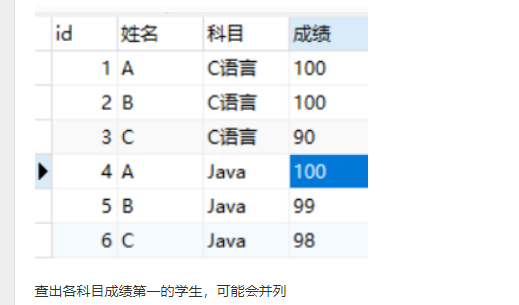

# java基础

## Map集合

### map了解吗，说说hashmap，hashtable，treemap

**关于null值**

只有HashMap支持null的key和value。

TreeMap支持null的value。因为要对key做比较，所以key不能为null。

HashTable 不支持null的key和value。对null的value做了限制，对key会获取key的hashcode，所以null的key会报错。

**线程安全**

HashTable是线程安全的，相关操作的方法都加了synchronized。

hashmap1.8阈值为什么是8

Hashtable 和 HashMap的区别 ： { 底层数据结构 (JDK1.8后不同)、父类不同  、扩容方法不同 、 线程上锁范围不同（重点） 红黑树区别，有序无序}

区别，性能，原理，hashmap为什么不安全，举例子，jdk1.7，jdk1.8区别；

哪些集合可以存放`null`？上述集合除了`Hashtable`和`ConcurrentHashMap`都可以。

哪些集合可以存放重复的元素？`Set`不能重复，`Map`的`key`不能重复。

hashmap：

Java 7及以前是数组+链表、Java 8及以后是数组+链表+红黑树、Java 8红黑树转变的条件、如何减少hash碰撞、数组的大小和如何用位运算代替取模、Java 7多线程扩容死循环问题、Java 8扩容时如何减少移动提高性能  

### `Hashtable`和`ConcurrentHashMap`差异？

- Hashtable`是旧版本Java的遗留类，继承自另一个遗留类`Dictionary`，线程安全的实现方式为简单粗暴地给`get`和`put`等方法加上`synchronized`关键字
- `Collections.synchronizedMap`方法，使用装饰者模式来给`get`和`put`等方法加上`synchronized`语句块，由于即使不考虑`Hashtable`的线程安全开销，`Hashtable`的实现性能也低于`HashMap`，因此使用此方法装饰`HashMap`会比直接使用`Hashtable`更为高效
- `ConcurrentHashMap`是`java.util.concurrent`包里的线程安全`Map`，Java 7及以前为分段+数组+链表，在每个段中使用可重入锁；Java 8为数组+链表+红黑树，在数组的每个位置使用CAS来进行轻量级锁

### ConcurrentHashMap

扩容？

put的源码

### HashMap & ConcurrentHashMap 的比较

CurconrentHashMap它的size()函数怎么保证返回正确值。是否有更好的方法可以更加去优化它的锁机制（没有答出来）

线程安全的CurconrentHashMap，1.7与1.8，中间因为说了volitale，又转到volitale，底层怎么实现的，解决什么问题

深入一些 ： HashMap 为什么线程不安全？ 能否举例 = { 并发resize()触发闭环结构 ，覆盖put操作 }

### HashMap

HashMap的底层实现

那是否可以一直往map中存入数据？

如果你4G的内存，让你设计一个Map存入数据，你会从哪几方面考虑

HashMap resize()过程能否介绍 ？   

HashMap效率受什么影响 (负载因子、hash数组size)？   

HashMap中扰动函数的作用 ？

负载因子过大，过小会怎么样？

说了红黑树然后又问二叉树和红黑树的底层实现

为什么用红黑树，红黑树和普通的平衡二叉树区别

什么时候转树，什么时候退树，remove后进行什么操作

为什么转树是8个，退树是6个？

hash方法为什么高16异或低16

为什么1.8引入红黑树，为什么阈值是8，红黑树的特点，时间复杂度，与其他数据结构的比较，为什么每次扩容二倍

hashmap需要存4个数，那么最少需要几个空间，从装载因子方面

## List集合

### ArrayList和LinkedList的实现与区别

ArrayList底层是Object[]数组，每次扩容时增加一半

```java
int newCapacity = oldCapacity + (oldCapacity >> 1);
```

移动数组元素是使用System.arraycopy来操作的。


**LinkedList是单向链表还是双向链表**

LinkedList底层的数据结构是这样的

```java
    private static class Node<E> {
        E item;
        Node<E> next;
        Node<E> prev;

        Node(Node<E> prev, E element, Node<E> next) {
            this.item = element;
            this.next = next;
            this.prev = prev;
        }
    }
```

可以看到是一个双向链表。插入数据就是一个双向链表的插入操作，没什么特别的。


## Set集合

### Set 了解过吗？知道 add（） 会出什么问题吗？

这题就是判断你是否是背题，没看到源码的很难说出来）

### `HashSet`了解吗？

根据`HashSet`是否有序，底层使用`HashMap`或者`LinkedHashMap`
根据是否有序，以`Set`中的元素作为`Map`中的`key`，以固定的`Object`对象作为`Map`中的`value`

如何保证Set中的元素不重复？
重写对象的equals和hashCode方法
解决哈希冲突的方法？
线性探查法、平分探查法、拉链法
常用的哈希算法？
MD5、SHA-1、SHA-256

### TreeSet和HashSet区别

## 队列

### 队列呢，了解什么

ArrayBlockQueue，LinkedBlockingQueue

### 各个队列使用场景

### queue里面都有什么方法

offer，add，put

### synchroBlockQueue 到底可以存几个

## 锁

### Synchronized

#### Synchronized的原理

#### sychronized、jdk1.6的优化，重量级锁自旋次数设置的参数

有sychronized、为什么引入ReenTrantLock

### 锁用过没

叭叭各种锁

### 锁的什么方法你用过

tryLock

getHoldCount

### lock和tryLock区别

## 异常

### 运行时异常和非运行时异常


RuntimeException Exception Error

### java哪些异常类需要try  catch   手动捕获

## 序列化

### 序列化与反序列化

### 序列化的知识点

### serializable关键字的作用（实现原理）

### 集中序列化协议,pb的优点

Protobuf 是 Google 公司内部的混合语言数据标准，是一种轻便、高效的结构化数据存储格式，可以用于结构化数据序列化，支持 Java、Python、C++、Go 等语言。Protobuf使用的时候需要定义 IDL（Interface description language），然后使用不同语言的 IDL编译器，生成序列化工具类，它的优点是：

- 序列化后体积相比 JSON、Hessian 小很多；

- IDL 能清晰地描述语义，所以足以帮助并保证应用程序之间的类型不会丢失，无需类似XML 解析器；
- 序列化反序列化速度很快，不需要通过反射获取类型；
- 消息格式升级和兼容性不错，可以做到向后兼容。

Protobuf 非常高效，但是对于具有反射和动态能力的语言来说，这样用起来很费劲，这一点就不如 Hessian

## 网络IO模型

### 五种常见的网络IO模型

### socket有几种状态

### NIO的实现原理

### BIO、NIO、AIO的对应类实现了解吗

### NIO的使用

### 多路io复用的几种实现

### NIO和BIO的区别

##  equals 和 == 区别

==本质上比较是内存地址，如果相等，则说明这两个引用实际是指向同一个对象地址的。

Object类中的equals也是使用==来判断，像String的equals比较的是char数组的各个元素是否相等。

为啥重写equals要重写hashCode()

hash值相等，而两个对象不一定equals

## String StringBuffer StringBuilder  区别 和各自使用场景,实现

### 缓存

**Java 的字符串池属于 JVM 专门给指定的特殊内存区域，用来存储字符串字面量。**

一般使用 Java 6 这种历史版本，并不推荐大量使用 intern，为什么呢？魔鬼存在于细节中，被缓存的字符串是存在所谓 PermGen 里的，也就是臭名昭著的“永久代”，这个空间是很有限的，也基本不会被 FullGC 之外的垃圾收集照顾到。所以，如果使用不当，OOM 就会光顾。

而 Java7 之后字符串池被移至堆内存进行管理，这样的好处就是允许被 JVM 进行垃圾回收操作，将未被引用的字符串所占内存即使回收，以此节省内存。

甚至永久代在 JDK 8 中被 MetaSpace（元数据区）替代了。而且，默认缓存大小也在不断地扩大中，从最初的 1009，到 7u40 以后被修改为 60013。

### 底层优化

```java

public class StringConcat {
     public static String concat(String str) {
       return str + “aa” + “bb”;
     }
}
```

反编译结果：

```java

         0: new           #2                  // class java/lang/StringBuilder
         3: dup
         4: invokespecial #3                  // Method java/lang/StringBuilder."<init>":()V
         7: aload_0
         8: invokevirtual #4                  // Method java/lang/StringBuilder.append:(Ljava/lang/String;)Ljava/lang/StringBuilder;
        11: ldc           #5                  // String aa
        13: invokevirtual #4                  // Method java/lang/StringBuilder.append:(Ljava/lang/String;)Ljava/lang/StringBuilder;
        16: ldc           #6                  // String bb
        18: invokevirtual #4                  // Method java/lang/StringBuilder.append:(Ljava/lang/String;)Ljava/lang/StringBuilder;
        21: invokevirtual #7                  // Method java/lang/StringBuilder.toString:()Ljava/lang/String;
```

可以看到，非静态的拼接逻辑在 JDK 8 中会自动被 javac 转换为 StringBuilder 操作。

但是如果在循环体中，会生成多个StringBuilder对象，所以循环体中，最好还是自己创建一个StringBuilder对象

**深入一些 ： String 是如何实现它不可变的？ 为什么要设置String为不可变对象  ?     (字节一面这个问题给我问懵了)**

在多线程中，只有不变的对象和值是线程安全的，可以在多个线程中共享数据。由于 String 天然的不可变，当一个线程”修改“了字符串的值，只会产生一个新的字符串对象，不会对其他线程的访问产生副作用，访问的都是同样的字符串数据，不需要任何同步操作。

**安全性**
由于字符串无论在任何 Java 系统中都广泛使用，会用来存储敏感信息，如账号，密码，网络路径，文件处理等场景里，保证字符串 String 类的安全性就尤为重要了，如果字符串是可变的，容易被篡改，那我们就无法保证使用字符串进行操作时，它是安全的，很有可能出现 SQL 注入，访问危险文件等操作。

StringBuilder为什么快

## 接口和抽象类区别

接口中的成员变量，隐式使用`public static final`修饰，方法隐式使用`public abstract`修饰

Java 8 增加了函数式编程的支持，所以又增加了一类定义，即所谓 functional interface，简单说就是只有一个抽象方法的接口，通常建议使用 @FunctionalInterface Annotation 来标记

从 Java 8 开始，interface 增加了对 default method 的支持，接口也可以有方法实现了。

抽象类中可以有非抽象的方法。

**能不能用一个设计模式来说明**

## 重写和重载的区别

**重写（Override）**

重写是子类对父类的允许访问的方法的实现过程进行重新编写, 返回值和形参都不能改变。**即外壳不变，核心重写！**

重写方法不能抛出新的检查异常或者比被重写方法申明更加宽泛的异常

**重载(Overload)**

重载(overloading) 是在一个类里面，方法名字相同，而参数不同。返回类型可以相同也可以不同。

每个重载的方法（或者构造函数）都必须有一个独一无二的参数类型列表。

最常用的地方就是构造器的重载。

## 深拷贝和浅拷贝区别

深拷贝和浅拷贝最根本的区别在于是否真正获取一个对象的复制实体，而不是引用。

假设B复制了A，修改A的时候，看B是否发生变化：

如果B跟着**也变了**，说明是浅拷贝，拿人手短！（修改堆内存中的同一个值）

如果B**没有改变**，说明是深拷贝，自食其力！（修改堆内存中的不同的值）

## 说一下你理解的封装，继承和多态

**封装**的目的是隐藏事务内部的实现细节，以便提高安全性和简化编程。封装提供了合理的边界，避免外部调用者接触到内部的细节。我们在日常开发中，因为无意间暴露了细节导致的难缠 bug 太多了，比如在多线程环境暴露内部状态，导致的并发修改问题。从另外一个角度看，封装这种隐藏，也提供了简化的界面，避免太多无意义的细节浪费调用者的精力。

**继承**是代码复用的基础机制，类似于我们对于马、白马、黑马的归纳总结。但要注意，继承可以看作是非常紧耦合的一种关系，父类代码修改，子类行为也会变动。在实践中，过度滥用继承，可能会起到反效果。

**多态**，你可能立即会想到重写（override）和重载（overload）、向上转型。简单说，重写是父子类中相同名字和参数的方法，不同的实现；重载则是相同名字的方法，但是不同的参数

##  Object的方法 

 { finalize 、 clone、 getClass 、 equals 、 hashCode 、toString、notify、notifyAll、wait}

### lock，notify，等为什么要放在根类下面呢

使用这些方法必须标识同步所属的锁；

锁可以是任意对象，所以任意对象调用方法一定定义在Object类中。

## 基本数据类型，int的长度

byte：一个字节（8位）（-128~127）（-2的7次方到2的7次方-1）

short：两个字节（16位）（-32768~32767）（-2的15次方到2的15次方-1）

int：四个字节（32位）（一个字长）（-2147483648~2147483647）（-2的31次方到2的31次方-1）

long：八个字节（64位）（-9223372036854774808~9223372036854774807）（-2的63次方到2的63次方-1）

float：四个字节（32位）（3.402823e+38 ~ 1.401298e-45）（e+38是乘以10的38次方，e-45是乘以10的
负45次方）

double：八个字节（64位）（1.797693e+308~ 4.9000000e-324）

## int integer区别

（内存位置）

在 Java 5 中新增了静态工厂方法 valueOf，在调用它的时候会利用一个缓存机制，带来了明显的性能改进。按照 Javadoc，这个值默认缓存是 -128 到 127 之间。

这种缓存机制并不是只有 Integer 才有，同样存在于其他的一些包装类，比如：

Boolean，缓存了 true/false 对应实例，确切说，只会返回两个常量实例 Boolean.TRUE/FALSE。

Short，同样是缓存了 -128 到 127 之间的数值。

Byte，数值有限，所以全部都被缓存。

Character，缓存范围’\u0000’ 到 ‘\u007F’。

**自动装箱的时候做了哪些工作**

自动装箱实际上算是一种语法糖。什么是语法糖？可以简单理解为 Java 平台为我们自动进行了一些转换，保证不同的写法在运行时等价，它们发生在编译阶段，也就是生成的字节码是一致的。

javac 替我们自动把装箱转换为 Integer.valueOf()，把拆箱替换为 Integer.intValue()

```java
Integer integer = 1;
int unboxing = integer ++;
```

反编译输出：

```java

1: invokestatic  #2                  // Method
java/lang/Integer.valueOf:(I)Ljava/lang/Integer;
8: invokevirtual #3                  // Method
java/lang/Integer.intValue:()I
```


Integer a = 1000; a++;几次拆箱和装箱

为什么要有Integer，那为什么又要有int

## Long 和 long的区别和 == 的比较 （是值比较）

和int类似

## final关键字修饰类，方法等的限制

final 修饰的 class 代表不可以继承扩展，final 的变量是不可以修改的，而 final 的方法也是不可以重写的（override）。

## 不变类（immutable）

   不要提供任何可以修改对象属性的方法  

将 class 自身声明为 final，这样别人就不能扩展来绕过限制了。

将所有成员变量定义为 private 和 final，并且不要实现 setter 方法。

通常构造对象时，成员变量使用深度拷贝来初始化，而不是直接赋值，这是一种防御措施，因为你无法确定输入对象不被其他人修改。

如果确实需要实现 getter 方法，或者其他可能会返回内部状态的方法，使用 copy-on-write 原则，创建私有的 copy

   初始化之后不能修改属性的值  

   防止别的对象访问不可变类的属性  

   确保对任何可变组件的互斥访问  

   如果有指向可变对象的属性，一定要确保，这个可变对象不能被其他类访问和修改。最好不要在不可变类中添加 指向可变类的属性  

   优点 

   线程安全  

   不可变，线程间可共享，不存在多线程问题  

   易于设计，使用简单等等  

   没有多线程问题，不能被继承，不能被扩展，设计和使用的时候只需要针对当前需求就已经足够了。  

   缺点  

   每个不同的值都需要一个单独的对象

## java是单继承的还是多继承的，为什么是单继承的？

单继承。单继承结构中所有的对象都具有一个共用接口，所以归根到底都是相同的基本类型。

单继承结构使垃圾收集器的实现变得容易多了，由于所有的对象都保证具有其类型信息，因此不会因无法确定对象的类型而陷入僵局。

## java8中接口中有默认实现的方法，为什么呢

主要是增加 Lambda、Stream 相关的功能

因为如果想给相关的接口添加新的方法的话，会影响到所有现有的实现，所以增加了一个默认方法，用来解决接口的修改和现有的实现不兼容的问题。

## java8新添了什么新的东西

1. 接口的默认实现方法
2. Lambda 表达式
3. 函数式接口
4. Java 8 引入了流式操作（Stream）
5. Java 8 允许你使用 :: 关键字来传递方法或者构造函数引用
6. Java 8 在包java.time下包含了一组全新的时间日期API
7. 在Java 8中支持多重注解了，只需要给该注解标注一下@Repeatable即可。

主要问了流Stream

## servlet你描述一下

Java Servlet 是运行在 Web 服务器或应用服务器上的程序，它是作为来自 Web 浏览器或其他 HTTP 客户端的请求和 HTTP 服务器上的数据库或应用程序之间的中间层。

### 生命周期

**init() 方法**

init 方法被设计成只调用一次。它在第一次创建 Servlet 时被调用，在后续每次用户请求时不再调用。因此，它是用于一次性初始化，就像 Applet 的 init 方法一样。

**service() 方法**

service() 方法是执行实际任务的主要方法。Servlet 容器（即 Web 服务器）调用 service() 方法来处理来自客户端（浏览器）的请求，并把格式化的响应写回给客户端。

每次服务器接收到一个 Servlet 请求时，服务器会产生一个新的线程并调用服务。service() 方法检查 HTTP 请求类型（GET、POST、PUT、DELETE 等），并在适当的时候调用 doGet、doPost、doPut，doDelete 等方法。

## final ，finalize，finnaly的区别，是不是不可以改的，怎么可以改

final 可以用来修饰类、方法、变量，分别有不同的意义，final 修饰的 class 代表不可以继承扩展，final 的变量是不可以修改的，而 final 的方法也是不可以重写的（override）。

finally 则是 Java 保证重点代码一定要被执行的一种机制。我们可以使用 try-finally 或者 try-catch-finally 来进行类似关闭 JDBC 连接、保证 unlock 锁等动作。

finalize 是基础类 java.lang.Object 的一个方法，它的设计目的是保证对象在被垃圾收集前完成特定资源的回收。finalize 机制现在已经不推荐使用，并且在 JDK 9 开始被标记为 deprecated。

finally有一个特例

```java
try {
  // do something
  System.exit(1);
} finally{
  System.out.println(“Print from finally”);
}
```

这个例子finally是不会被执行的，这是一个特例

3.有什么机制可以替换 finalize 吗？

Java 平台目前在逐步使用 java.lang.ref.Cleaner 来替换掉原有的 finalize 实现。Cleaner 的实现利用了幻象引用（PhantomReference）

## 并发包类

## 你对java后续版本有什么建议？

## 

## 

## hashcode与equals方法的区别

## 注解的使用

## 

## Java的aop的实现原理,两种代理机制的差别（实现原理）

通过代理可以让调用者与实现者之间解耦。比如进行 RPC 调用，框架内部的寻址、序列化、反序列化等，对于调用者往往是没有太大意义的，通过代理，可以提供更加友善的界面。

jdk动态代理有它的局限性，因为是以接口为中心的，相当于添加了一种对于被调用者没有太大意义的限制。我们实例化的是 Proxy 对象，而不是真正的被调用类型。

cglib 动态代理采取的是创建目标类的子类的方式，因为是子类化，我们可以达到近似使用被调用者本身的效果。

## maven的scope有几种

### compile

默认就是compile，什么都不配置也就是意味着compile。compile表示被依赖项目需要参与当前项目的编译，当然后续的测试，运行周期也参与其中，是一个比较强的依赖。打包的时候通常需要包含进去。

### test

scope为test表示依赖项目仅仅参与测试相关的工作，包括测试代码的编译，执行。比较典型的如junit。

### runntime

runntime表示被依赖项目无需参与项目的编译，不过后期的测试和运行周期需要其参与。与compile相比，跳过编译而已，说实话在终端的项目（非开源，企业内部系统）中，和compile区别不是很大。比较常见的如JSR×××的实现，对应的API jar是compile的，具体实现是runtime的，compile只需要知道接口就足够了。oracle jdbc驱动架包就是一个很好的例子，一般scope为runntime。另外runntime的依赖通常和optional搭配使用，optional为true。我可以用A实现，也可以用B实现。

### provided

provided意味着打包的时候可以不用包进去，别的设施(Web Container)会提供。事实上该依赖理论上可以参与编译，测试，运行等周期。相当于compile，但是在打包阶段做了exclude的动作。

### system

从参与度来说，也provided相同，不过被依赖项不会从maven仓库抓，而是从本地文件系统拿，一定需要配合systemPath属性使用。

## OOA，OOD，OOP是什么说一下

Object-Oriented Analysis:面向对象分析法

面向对象设计（Object-oriented Design,OOD）

OOP 所谓的OOP就是指的面向对象编程

## CAS比分段锁好在哪里，缺点又是什么

通过  JDK 的源码和官方文档看来， 他们认为的弃用分段锁的原因由以下几点：

1. 加入多个分段锁浪费内存空间。
2. 生产环境中， map 在放入时竞争同一个锁的概率非常小，分段锁反而会造成更新等操作的长时间等待。
3. 为了提高 GC 的效率

在并发编程中CAS的缺点和问题，如ABA问题，自旋锁消耗问题、只能保证一个共享变量的原子操作

## 如何避免CAS一直自旋消耗资源

## 构造函数能不能继承

Constructors 不是成员函数，所以它不可以被继承。但是他可以被调用。

## 对象的比较是用的什么原理比较吗

## Java是值传递还是引用传递

值传递，传一个对象，其实也是拷贝了一份指针，只是指针指向的是同一个地址

## 深克隆和浅克隆

**浅克隆**：创建一个新对象，新对象的属性和原来对象完全相同，对于非基本类型属性，仍指向原有属性所指向的对象的内存地址。

**深克隆**：创建一个新对象，属性中引用的其他对象也会被克隆，不再指向原有对象地址。

## 内部类实现单例，为什么用内部静态类

外部类加载时并不需要立即加载内部类，内部类不被加载则不去初始化INSTANCE，故而不占内存

静态内部类里面使用的是 static final Singleton INSTANCE = new Singleton();

static final 是一个静态常量,存储在内存中的常量区,在new之前会看常量里面是否有这个值,如果有,就不再执行new操作了

## 声明一个切面函数怎么声明

http://www.imooc.com/article/details/id/292931

#### 2.1 通知（Advice）

切面必须要完成的工作即称为通知。通知定义了切面是什么以及什么时候实用。

spring切面可以实用的5种类型通知：

- 前置通知（Before）：在目标方法被调用之前调用通知功能；
- 后置通知（After）：在目标方法完成之后调用通知，此时不会关心方法的输出是什么；
- 返回通知（After-returning）：在目标方法成功执行之后调用通知；
- 异常通知（After-throwing）：在目标方法抛出异常后调用通知；
- 环绕通知（Around）：通知包裹了被通知的方法，在被通知的方法调用之前和调用之后执行自定义的行为。

#### 2.2 连接点（Join point）

我们的应用可能有数以千计的时机应用通知。这些时机被称
为连接点。连接点是在应用执行过程中能够插入切面的一个点。这个点可以是调用方法时、抛出异常时、甚至修改一个字段时。切面代码可以利用这些点插入到应用的正常流程之中，并添加新的行为。

#### 2.3 切点（Poincut）

切点定义了从何处切入。切点的定义会匹配通知所要织入的一个或多个连接点。通常使用明确的类和方法名称，或是利用正则表达式定义所匹配的类和方法名称来指定这些切点。

#### 2.4 切面（Aspect）

切面是通知和切点的结合。通知和切点共同定义了切面的全部内容----它是什么，在何时和何处完成其功能。

#### 2.5 引入（Introduction）

引入允许我们向现有的类添加新方法或属性。

#### 2.6 织入（Weaving）

织入是把切面应用到目标对象并创建新的代理对象的过程。切面在指定的连接点被织入到目标对象中。

- 编译期：切面在目标类编译时被织入。这种方式需要特殊的编译器。AspectJ的织入编译器就是以这种方式织入切面的。
- 类加载期：切面在目标类加载到JVM时被织入。这种方式需要特殊的类加载器（ClassLoader），它可以在目标类被引入应用之前增强该目标类的字节码。AspectJ 5的加载时织入（load-timeweaving，LTW）就支持以这种方式织入切面。
- 运行期：切面在应用运行的某个时刻被织入。一般情况下，在织入切面时，AOP容器会为目标对象动态地创建一个代理对象。Spring AOP就是以这种方式织入切面的。

### 3 Spring对切面的支持

Spring提供了4种类型的AOP支持：

- 基于代理的经典Spring AOP；
- 纯POJO切面；
- @AspectJ注解驱动的切面；
- 注入式AspectJ切面（适用于Spring各版本）。

Spring提供了4种类型的AOP支持：

- 基于代理的经典Spring AOP；
- 纯POJO切面；
- @AspectJ注解驱动的切面；
- 注入式AspectJ切面（适用于Spring各版本）。

前三种都是Spring AOP实现的变体，Spring AOP构建在动态代理基础之上，因此，Spring对AOP的支持局限于方法拦截。



select s.* from score s RIGHT JOIN (select Max(score) score,`subject` from score GROUP BY `subject`) b on b.`subject` = s.`subject` and b.score = s.score

## Java的缺点，跟c++和c比？

一是所谓的“书写一次，到处运行”（Write once, run anywhere），能够非常容易地获得跨平台能力；另外就是垃圾收集（GC, Garbage Collection），Java 通过垃圾收集器（Garbage Collector）回收分配内存，大部分情况下，程序员不需要自己操心内存的分配和回收。

缺点

Java比C\C++慢

 C++在继承和派生上比Java更灵活

 C++ 中可以直接插入汇编 能直接操控底层硬件 所以操作系统还是得用 c写

## 写过注解没

## 反射的原理

Java的反射就是利用加载到jvm中的.class文件来进行操作的。.class文件中包含java类的所有信息，当你不知道某个类具体信息时，可以使用反射获取class，然后进行各种操作。

## 什么是强引用？什么是弱引用？

## 笔试题里的ReentrantLock和Condition类似功能的还有啥机制

## 

## 水平触发和边缘触发的区别及各自的适用场景，

## 

## 

## 数组最大大小

一是规范隐含的限制。Java数组的length必须是非负的int，所以它的理论最大值就是java.lang.Integer.MAX_VALUE = 2^31-1 = 2147483647。

二是具体的实现带来的限制。这会使得实际的JVM不一定能支持上面说的理论上的最大length。

## jdk9或10有了解吗

## Rest成熟度模型

## Java线程间的通信

## Java .class文件结构

能问这个我是真没想到，还好之前看过的还没完全忘掉。推荐《深入理解JVM虚拟机》，class文件头两个字节是0xCAFEBABE固定的，然后是支持的最低虚拟机版本，然后是常量池，字符串之类的。。。然后是访问标志位，比如是否public是否static，然后是属性和方法的定义，不过当时这部分没看了，用不上。  

## 能不能自己实现一个java.lang.String并加载

