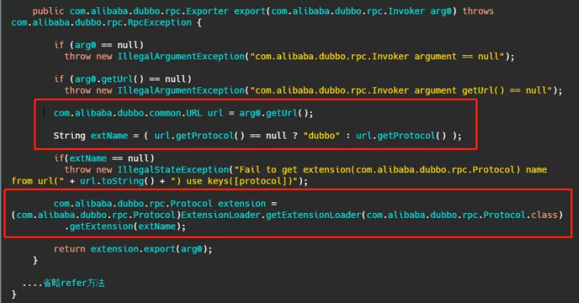
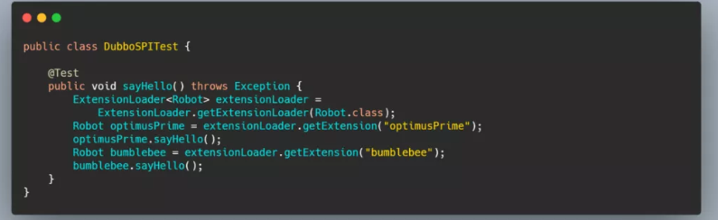

# Dubbo SPI

## 获取ExtensionLoader

**ExtensionLoader#getExtensionLoader**

```java
    public static <T> ExtensionLoader<T> getExtensionLoader(Class<T> type) {
        ......
        ExtensionLoader<T> loader = (ExtensionLoader<T>) EXTENSION_LOADERS.get(type);
        if (loader == null) {
            EXTENSION_LOADERS.putIfAbsent(type, new ExtensionLoader<T>(type));
            loader = (ExtensionLoader<T>) EXTENSION_LOADERS.get(type);
        }
        return loader;
    }

    private ExtensionLoader(Class<?> type) {
        this.type = type;
        objectFactory = (type == ExtensionFactory.class ? null : ExtensionLoader.getExtensionLoader(ExtensionFactory.class).getAdaptiveExtension());
    }
```

先从缓存中获取，没有的话就通过new去创建。

### 加载@Adaptive类

这里会去加载@Adaptive类。

getAdaptiveExtension先从缓存中拿，如果没有再调用createAdaptiveExtension去创建。

```java
    private T createAdaptiveExtension() {
        try {
            // 获取Adaptive类，并且注入依赖
            return injectExtension((T) getAdaptiveExtensionClass().newInstance());
        } catch (Exception e) {
            throw new IllegalStateException("Can't create adaptive extension " + type + ", cause: " + e.getMessage(), e);
        }
    }
    ---------------------------
    private Class<?> getAdaptiveExtensionClass() {
        // 这个方法回去加载三个目录下面的class，并且缓存起来。
        getExtensionClasses();
        // 如果@Adaptive注释在类上，就会返回这个类
        if (cachedAdaptiveClass != null) {
            return cachedAdaptiveClass;
        }
        // 如果@Adaptive注释在方法上，就会生成代理类。代理类根据@Spi的值去加载对应的类
        return cachedAdaptiveClass = createAdaptiveExtensionClass();
    }
```

`getExtensionClasses`会去加载三个文件夹下面的类，再通过loadClass去缓存一下Class，分别有 `Adaptive` 、`WrapperClass` 和普通类这三种，普通类又将`Activate`记录了一下。

#### getExtensionClasses加载类

**ExtensionLoader#getExtensionClasses**

```java
private Map<String, Class<?>> getExtensionClasses() {
    Map<String, Class<?>> classes = cachedClasses.get();
    if (classes == null) {
        synchronized (cachedClasses) {
            classes = cachedClasses.get();
            if (classes == null) {
                // 主要是这个
                classes = loadExtensionClasses();
                cachedClasses.set(classes);
            }
        }
    }
    return classes;
}
-------------------------------------
    private Map<String, Class<?>> loadExtensionClasses() {
        cacheDefaultExtensionName();
		// 这边有六个，主要是有apache和alibaba的替换，其实也就三个目录。
        Map<String, Class<?>> extensionClasses = new HashMap<>();
        loadDirectory(extensionClasses, DUBBO_INTERNAL_DIRECTORY, type.getName());
        loadDirectory(extensionClasses, DUBBO_INTERNAL_DIRECTORY, type.getName().replace("org.apache", "com.alibaba"));
        loadDirectory(extensionClasses, DUBBO_DIRECTORY, type.getName());
        loadDirectory(extensionClasses, DUBBO_DIRECTORY, type.getName().replace("org.apache", "com.alibaba"));
        loadDirectory(extensionClasses, SERVICES_DIRECTORY, type.getName());
        loadDirectory(extensionClasses, SERVICES_DIRECTORY, type.getName().replace("org.apache", "com.alibaba"));
        return extensionClasses;
    }
```

loadDirectory里最后会调用loadClass。

**ExtensionLoader#loadClass**

```java
private void loadClass(Map<String, Class<?>> extensionClasses, java.net.URL resourceURL, Class<?> clazz, String name) throws NoSuchMethodException {
    ......
	// 缓存Adaptive
    if (clazz.isAnnotationPresent(Adaptive.class)) {
        cacheAdaptiveClass(clazz);
    } else if (isWrapperClass(clazz)) {
        // 缓存WrapperClass
        cacheWrapperClass(clazz);
    } else {
        ......
        // 缓存普通类
        String[] names = NAME_SEPARATOR.split(name);
        if (ArrayUtils.isNotEmpty(names)) {
            // 缓存ActivateClass
            cacheActivateClass(clazz, names[0]);
            for (String n : names) {
                // 缓存普通类和名字
                cacheName(clazz, n);
                saveInExtensionClass(extensionClasses, clazz, n);
            }
        }
    }
}
```

可以看到代码，就是加载了Class，并且做了一堆缓存。

再来看一下`createAdaptiveExtensionClass`

### 创建Adaptive代理类

**ExtensionLoader#createAdaptiveExtensionClass**

```java
private Class<?> createAdaptiveExtensionClass() {
    // cachedDefaultName这里的cachedDefaultName通常就是@Spi的值
    String code = new AdaptiveClassCodeGenerator(type, cachedDefaultName).generate();
    ClassLoader classLoader = findClassLoader();
    org.apache.dubbo.common.compiler.Compiler compiler = ExtensionLoader.getExtensionLoader(org.apache.dubbo.common.compiler.Compiler.class).getAdaptiveExtension();
    return compiler.compile(code, classLoader);
}
```

我们以 Protocol 为例子来看一下。Protocol 没有实现类注释了 Adaptive ，但是接口上有两个方法export和refer注解了 Adaptive ，对于两个没有的方法，代理类生成的方法，调用会抛异常。对于注解的export方法，会变成这样子：



可以根据请求的参数，得到具体要调用的实现类名，然后再调用 `getExtension` 获取。

## getExtension获取实例

前面拿到了ExtensionLoader，后面会通过它的getExtension获取实例。



```java
public T getExtension(String name) {
	......
    final Holder<Object> holder = getOrCreateHolder(name);
    Object instance = holder.get();
    // 双重检锁
    if (instance == null) {
        synchronized (holder) {
            instance = holder.get();
            if (instance == null) {
                instance = createExtension(name);
                holder.set(instance);
            }
        }
    }
    return (T) instance;
}
```

getExtension()方法先去缓存查，缓存没有的话，就通过createExtension()去创建。

**ExtensionLoader#createExtension**

```java
private T createExtension(String name) {
    // 加载扩展类
    Class<?> clazz = getExtensionClasses().get(name);
	......
    try {
        T instance = (T) EXTENSION_INSTANCES.get(clazz);
        if (instance == null) {
            // 反射创建实例
            EXTENSION_INSTANCES.putIfAbsent(clazz, clazz.newInstance());
            instance = (T) EXTENSION_INSTANCES.get(clazz);
        }
        // setter 注入依赖（会调用set方法）
        injectExtension(instance);
        
        Set<Class<?>> wrapperClasses = cachedWrapperClasses;
        // 如果有包装类则包装一下
        if (CollectionUtils.isNotEmpty(wrapperClasses)) {
            for (Class<?> wrapperClass : wrapperClasses) {
                instance = injectExtension((T) wrapperClass.getConstructor(type).newInstance(instance));
            }
        }
        return instance;
    } 
}
```

创建的过程可以注入依赖，并且可以有包装类实现。

主要流程在getExtensionClasses()上面，之前我们提到了，这个类会去加载三个目录下面的类，并且做缓存。这时候里面应该就已经有缓存了。

这个过程差不多就是这样。

