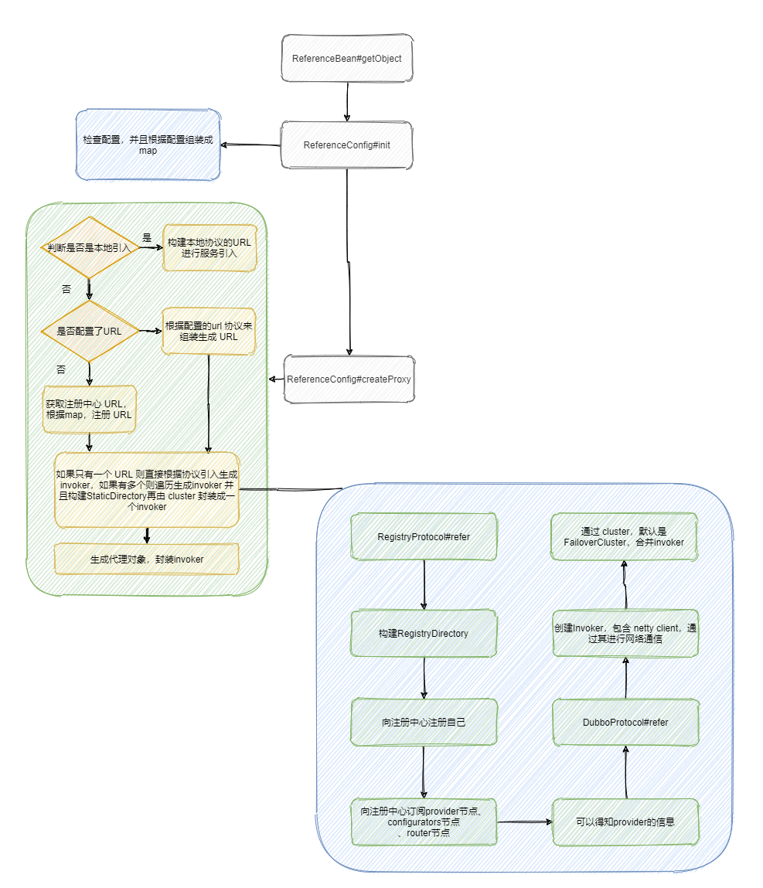

# Dubbo服务引入

**ReferenceBean#getObject**

```java
@Override
public Object getObject() {
    return get();
}
```

**ReferenceConfig#get**

```java
    public synchronized T get() {
        checkAndUpdateSubConfigs();

        if (destroyed) {
            throw new IllegalStateException("The invoker of ReferenceConfig(" + url + ") has already destroyed!");
        }
        if (ref == null) {
            init();
        }
        return ref;
    }
```

**ReferenceConfig#init**

```java
    private void init() {
        if (initialized) {
            return;
        }
        checkStubAndLocal(interfaceClass);
        checkMock(interfaceClass);
        Map<String, String> map = new HashMap<String, String>();
        //中间就是往map里面放置参数,这里就不贴了。
		.......
        // 创建代理类
        ref = createProxy(map);

        String serviceKey = URL.buildKey(interfaceName, group, version);
        ApplicationModel.initConsumerModel(serviceKey, buildConsumerModel(serviceKey, attributes));
        initialized = true;
    }
```

init 方法很长，不过大部分就是检查配置然后将配置构建成 map，这里代码就不贴了。map里面是这样的：


然后就进入重点方法 createProxy，从名字可以得到就是要创建的一个代理。

**ReferenceConfig#createProxy**

```java
private T createProxy(Map<String, String> map) {
    // 本地引入
    if (shouldJvmRefer(map)) {
        URL url = new URL(LOCAL_PROTOCOL, LOCALHOST_VALUE, 0, interfaceClass.getName()).addParameters(map);
        invoker = REF_PROTOCOL.refer(interfaceClass, url);
        if (logger.isInfoEnabled()) {
            logger.info("Using injvm service " + interfaceClass.getName());
        }
    } else {
        urls.clear(); // reference retry init will add url to urls, lead to OOM
        if (url != null && url.length() > 0) { // user specified URL, could be peer-to-peer address, or register center's address.
            String[] us = SEMICOLON_SPLIT_PATTERN.split(url);
            if (us != null && us.length > 0) {
                for (String u : us) {
                    URL url = URL.valueOf(u);
                    if (StringUtils.isEmpty(url.getPath())) {
                        url = url.setPath(interfaceName);
                    }
                    // 如果是注册中心，将map转变成查询字符串，并将refer参数加到url中
                    if (REGISTRY_PROTOCOL.equals(url.getProtocol())) {
                        urls.add(url.addParameterAndEncoded(REFER_KEY, StringUtils.toQueryString(map)));
                    } else {
                        // 如果是点对点的直连，移除服务提供者的一些配置
                        urls.add(ClusterUtils.mergeUrl(url, map));
                    }
                }
            }
        } else { // url为空，那就是走注册中心的引入服务了。
            // if protocols not injvm checkRegistry
            if (!LOCAL_PROTOCOL.equalsIgnoreCase(getProtocol())){
                checkRegistry();
                // 拿到注册的url
                List<URL> us = loadRegistries(false);
                if (CollectionUtils.isNotEmpty(us)) {
                    for (URL u : us) {
                        URL monitorUrl = loadMonitor(u);
                        if (monitorUrl != null) {
                            map.put(MONITOR_KEY, URL.encode(monitorUrl.toFullString()));
                        }
                        // 往url中拼接refer参数
                        urls.add(u.addParameterAndEncoded(REFER_KEY, StringUtils.toQueryString(map)));
                    }
                }
				......
            }
        }
		// 到这里就拿到了url了
        if (urls.size() == 1) {
            // 这里调用refer获取invoker
            invoker = REF_PROTOCOL.refer(interfaceClass, urls.get(0));
        } else {
            List<Invoker<?>> invokers = new ArrayList<Invoker<?>>();
            URL registryURL = null;
            // 如果有多个url就封装成多个Invoker
            for (URL url : urls) {
                // 这里调用refer获取invoker
                invokers.add(REF_PROTOCOL.refer(interfaceClass, url));
                if (REGISTRY_PROTOCOL.equals(url.getProtocol())) {
                    registryURL = url; // use last registry url
                }
            }
            if (registryURL != null) { // registry url is available
                // use RegistryAwareCluster only when register's CLUSTER is available
                URL u = registryURL.addParameter(CLUSTER_KEY, RegistryAwareCluster.NAME);
                // The invoker wrap relation would be: RegistryAwareClusterInvoker(StaticDirectory) -> FailoverClusterInvoker(RegistryDirectory, will execute route) -> Invoker
                // 将多个invoker用StaticDirectory封装，并由cluster对其进行合并，暴露出一个invoker。
                invoker = CLUSTER.join(new StaticDirectory(u, invokers));
            } else { // not a registry url, must be direct invoke.
                invoker = CLUSTER.join(new StaticDirectory(invokers));
            }
        }
    }
	......
    /**
     * @since 2.7.0
     * ServiceData Store
     */
    MetadataReportService metadataReportService = null;
    if ((metadataReportService = getMetadataReportService()) != null) {
        URL consumerURL = new URL(CONSUMER_PROTOCOL, map.remove(REGISTER_IP_KEY), 0, map.get(INTERFACE_KEY), map);
        metadataReportService.publishConsumer(consumerURL);
    }
    // create service proxy
    return (T) PROXY_FACTORY.getProxy(invoker);
}
```

整个方法就是如果走本地就是本地的引入。如果将map转为url参数，并拼接refer参数。

最终拼接出来的 URL 长这样。


拿到url之后，就是调用refer获得invoker，然后动态代理生成一个代理类，将invoker封装进去，这样实际上就是会去调用这个invoker了。

来具体看一下refer里面，看看是怎么获得注册中心的配置信息的。

协议是 registry 因此走的是 RegistryProtocol#refer，我们来看一下这个方法。

**RegistryProtocol#refer**

```java
public <T> Invoker<T> refer(Class<T> type, URL url) throws RpcException {
    url = URLBuilder.from(url)
            .setProtocol(url.getParameter(REGISTRY_KEY, DEFAULT_REGISTRY))
            .removeParameter(REGISTRY_KEY)
            .build();
    // 获取注册中心实例
    Registry registry = registryFactory.getRegistry(url);
    if (RegistryService.class.equals(type)) {
        return proxyFactory.getInvoker((T) registry, type, url);
    }

    // group="a,b" or group="*" 将参数转化为map
    Map<String, String> qs = StringUtils.parseQueryString(url.getParameterAndDecoded(REFER_KEY));
    String group = qs.get(GROUP_KEY);
    if (group != null && group.length() > 0) {
        if ((COMMA_SPLIT_PATTERN.split(group)).length > 1 || "*".equals(group)) {
            // 主要的逻辑在这里
            return doRefer(getMergeableCluster(), registry, type, url);
        }
    }
    return doRefer(cluster, registry, type, url);
}
```

主要就是获取注册中心实例，然后调用 doRefer 进行真正的 refer。

**RegistryProtocol#doRefer**

```java
private <T> Invoker<T> doRefer(Cluster cluster, Registry registry, Class<T> type, URL url) {
    RegistryDirectory<T> directory = new RegistryDirectory<T>(type, url);
    directory.setRegistry(registry);
    directory.setProtocol(protocol);
    // all attributes of REFER_KEY
    Map<String, String> parameters = new HashMap<String, String>(directory.getUrl().getParameters());
    URL subscribeUrl = new URL(CONSUMER_PROTOCOL, parameters.remove(REGISTER_IP_KEY), 0, type.getName(), parameters);
    if (!ANY_VALUE.equals(url.getServiceInterface()) && url.getParameter(REGISTER_KEY, true)) {
        directory.setRegisteredConsumerUrl(getRegisteredConsumerUrl(subscribeUrl, url));
        // 向注册中心注册消费者。
        registry.register(directory.getRegisteredConsumerUrl());
    }
    directory.buildRouterChain(subscribeUrl);
    // 再订阅注册中心的providers，configurators，routers。订阅好之后会触发notify的回调函数
    directory.subscribe(subscribeUrl.addParameter(CATEGORY_KEY,
            PROVIDERS_CATEGORY + "," + CONFIGURATORS_CATEGORY + "," + ROUTERS_CATEGORY));

    Invoker invoker = cluster.join(directory);
    ProviderConsumerRegTable.registerConsumer(invoker, url, subscribeUrl, directory);
    return invoker;
}
```

**RegistryDirectory#notify**

```java
public synchronized void notify(List<URL> urls) {
    // 将url按照三个目录分组
    Map<String, List<URL>> categoryUrls = urls.stream()
            .filter(Objects::nonNull)
            .filter(this::isValidCategory)
            .filter(this::isNotCompatibleFor26x)
            .collect(Collectors.groupingBy(url -> {
                if (UrlUtils.isConfigurator(url)) {
                    return CONFIGURATORS_CATEGORY;
                } else if (UrlUtils.isRoute(url)) {
                    return ROUTERS_CATEGORY;
                } else if (UrlUtils.isProvider(url)) {
                    return PROVIDERS_CATEGORY;
                }
                return "";
            }));

    List<URL> configuratorURLs = categoryUrls.getOrDefault(CONFIGURATORS_CATEGORY, Collections.emptyList());
    this.configurators = Configurator.toConfigurators(configuratorURLs).orElse(this.configurators);

    List<URL> routerURLs = categoryUrls.getOrDefault(ROUTERS_CATEGORY, Collections.emptyList());
    toRouters(routerURLs).ifPresent(this::addRouters);

    // providers
    List<URL> providerURLs = categoryUrls.getOrDefault(PROVIDERS_CATEGORY, Collections.emptyList());
    // 这里更新invoker
    refreshOverrideAndInvoker(providerURLs);
}
```

这里整个调用链差不多是这个


拿到了`Provider`的信息之后就可以通过监听触发 DubboProtocol# refer 了（具体调用哪个 protocol 还是得看 URL的协议的，我们这里是 dubbo 协议），整个触发流程我就不一一跟一下了，看下调用栈就清楚了。

```java
@Override
public <T> Invoker<T> protocolBindingRefer(Class<T> serviceType, URL url) throws RpcException {
    optimizeSerialization(url);

    // create rpc invoker.
    DubboInvoker<T> invoker = new DubboInvoker<T>(serviceType, url, getClients(url), invokers);
    invokers.add(invoker);

    return invoker;
}
```

这里的重点在 `getClients`，因为终究是要跟远程服务进行网络调用的，而 getClients 就是用于获取客户端实例，实例类型为 ExchangeClient，底层依赖 Netty 来进行网络通信，并且可以看到默认是共享连接。

```java
    private ExchangeClient initClient(URL url) {

        // client type setting. 默认是netty
        String str = url.getParameter(CLIENT_KEY, url.getParameter(SERVER_KEY, DEFAULT_REMOTING_CLIENT));

        url = url.addParameter(CODEC_KEY, DubboCodec.NAME);
        // enable heartbeat by default
        url = url.addParameterIfAbsent(HEARTBEAT_KEY, String.valueOf(DEFAULT_HEARTBEAT));

        // BIO is not allowed since it has severe performance issue.
        if (str != null && str.length() > 0 && !ExtensionLoader.getExtensionLoader(Transporter.class).hasExtension(str)) {
            throw new RpcException("Unsupported client type: " + str + "," +
                    " supported client type is " + StringUtils.join(ExtensionLoader.getExtensionLoader(Transporter.class).getSupportedExtensions(), " "));
        }

        ExchangeClient client;
        try {
            // connection should be lazy
            if (url.getParameter(LAZY_CONNECT_KEY, false)) {
                client = new LazyConnectExchangeClient(url, requestHandler);

            } else {
                client = Exchangers.connect(url, requestHandler);
            }

        } catch (RemotingException e) {
            throw new RpcException("Fail to create remoting client for service(" + url + "): " + e.getMessage(), e);
        }

        return client;
    }
```

一个完整的流程差不多是这样：



## 大体流程

 ReferenceBean.getObject
 init:收集各种配置，并将配置存储到 map 中
 createProxy(map): 
	1、根据map生成url。
	2、根据url通过refprotocol.refer创建invoker
		DubboProtocol 的 refer:创建invoker，并且会生成一个客户端
		RegistryProtocol 的 refer：注册服务消费者，订阅providers、configurators、routers 等节点数据
	3、将invoker生成代理类		