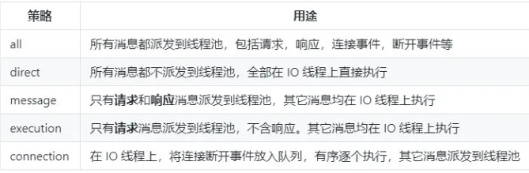
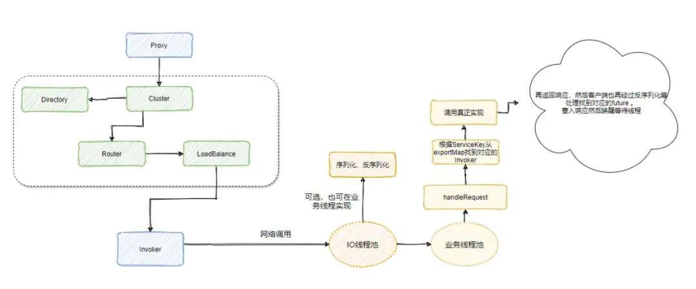

# Dubbo服务调用

**AbstractClusterInvoker#invoke**

```JAVA
@Override
public Result invoke(final Invocation invocation) throws RpcException {
    checkWhetherDestroyed();

    // binding attachments into invocation.
    Map<String, String> contextAttachments = RpcContext.getContext().getAttachments();
    if (contextAttachments != null && contextAttachments.size() != 0) {
        ((RpcInvocation) invocation).addAttachments(contextAttachments);
    }
	// 实际调用的directory的list，过滤出符合条件的invoker
    List<Invoker<T>> invokers = list(invocation);
    // 获得负载均衡实现类
    LoadBalance loadbalance = initLoadBalance(invokers, invocation);
    RpcUtils.attachInvocationIdIfAsync(getUrl(), invocation);
    return doInvoke(invocation, invokers, loadbalance);
}
```

list里面会从之前生成的invokers里面找到符合条件的invoker。

真正的调用是doInvoke里面实现的。

```java
public Result doInvoke(Invocation invocation, final List<Invoker<T>> invokers, LoadBalance loadbalance) throws RpcException {
    String methodName = RpcUtils.getMethodName(invocation);
    // 重试次数
    int len = getUrl().getMethodParameter(methodName, RETRIES_KEY, DEFAULT_RETRIES) + 1;
    if (len <= 0) {
        len = 1;
    }
    // retry loop.
    RpcException le = null; // last exception.
    List<Invoker<T>> invoked = new ArrayList<Invoker<T>>(copyInvokers.size()); // invoked invokers.
    Set<String> providers = new HashSet<String>(len);
    for (int i = 0; i < len; i++) {
		......
        // 负载均衡选择一个invoker
        Invoker<T> invoker = select(loadbalance, invocation, copyInvokers, invoked);
        invoked.add(invoker);
        RpcContext.getContext().setInvokers((List) invoked);
        try {
            // 发起调用
            Result result = invoker.invoke(invocation);
			......
            return result;
        } catch (RpcException e) {
           .....
        } finally {
            providers.add(invoker.getUrl().getAddress());
        }
    }
   
}
```

直接看子类 DubboInvoker 的 doInvoke 方法。

**DubboInvoker#doInvoke**

```java
    protected Result doInvoke(final Invocation invocation) throws Throwable {
        RpcInvocation inv = (RpcInvocation) invocation;
        final String methodName = RpcUtils.getMethodName(invocation);
        inv.setAttachment(PATH_KEY, getUrl().getPath());
        inv.setAttachment(VERSION_KEY, version);

        ExchangeClient currentClient;
        if (clients.length == 1) {
            currentClient = clients[0];
        } else {
            currentClient = clients[index.getAndIncrement() % clients.length];
        }
        try {
            boolean isOneway = RpcUtils.isOneway(getUrl(), invocation);
            int timeout = getUrl().getMethodPositiveParameter(methodName, TIMEOUT_KEY, DEFAULT_TIMEOUT);
            // oneway:不关心请求是否非发送成功
            if (isOneway) {
                boolean isSent = getUrl().getMethodParameter(methodName, Constants.SENT_KEY, false);
                currentClient.send(inv, isSent);
                return AsyncRpcResult.newDefaultAsyncResult(invocation);
            } else {
                // 异步请求
                AsyncRpcResult asyncRpcResult = new AsyncRpcResult(inv);
                // 发送请求
                CompletableFuture<Object> responseFuture = currentClient.request(inv, timeout);
                asyncRpcResult.subscribeTo(responseFuture);
                // save for 2.6.x compatibility, for example, TraceFilter in Zipkin uses com.alibaba.xxx.FutureAdapter
                FutureContext.getContext().setCompatibleFuture(responseFuture);
                return asyncRpcResult;
            }
        }
    }
```

currentClient.request里面会异步发送请求，返回一个CompletableFuture。但future完成的时候，会去获得结果。

## 服务端接受请求

服务端接收到请求之后就会解析请求得到消息，这消息又有五种派发策略：



默认走的是 all，也就是所有消息都派发到业务线程池中，我们来看下 AllChannelHandler 的实现。

**AllChannelHandler#received**

```java
public void received(Channel channel, Object message) throws RemotingException {
    ExecutorService executor = getExecutorService();
    try {
        executor.execute(new ChannelEventRunnable(channel, handler, ChannelState.RECEIVED, message));
    } catch (Throwable t) {
        ......
        // 这里主要是构建错误返回消息
    }
}
```

就是将消息封装成一个 ChannelEventRunnable 扔到业务线程池中执行，ChannelEventRunnable 里面会根据 ChannelState 调用对于的处理方法，这里是 `ChannelState.RECEIVED`，所以调用 `handler.received`，最终会调用 HeaderExchangeHandler#handleRequest，我们就来看下这个代码。

```java
void handleRequest(final ExchangeChannel channel, Request req) throws RemotingException {
    // 将请求的id和版本号返回
    Response res = new Response(req.getId(), req.getVersion());
    if (req.isBroken()) {
		......
    }
    // find handler by message class.
    Object msg = req.getData();
    try {
        // 最终调用dubbo的reply
        CompletionStage<Object> future = handler.reply(channel, msg);
        future.whenComplete((appResult, t) -> {
            try {
                if (t == null) {
                    res.setStatus(Response.OK);
                    res.setResult(appResult);
                } else {
                    res.setStatus(Response.SERVICE_ERROR);
                    res.setErrorMessage(StringUtils.toString(t));
                }
                channel.send(res);
            } 
        });
    }
}
```

最后调用DubboProtocol的requestHandler的reply

**ExchangeHandlerAdapter#reply**

```java
@Override
public CompletableFuture<Object> reply(ExchangeChannel channel, Object message) throws RemotingException {
    ......
    Invocation inv = (Invocation) message;
    // 通过inv找到具体的invoker
    Invoker<?> invoker = getInvoker(channel, inv);
	......
    RpcContext.getContext().setRemoteAddress(channel.getRemoteAddress());
    // 真正的调用
    Result result = invoker.invoke(inv);
    return result.completionFuture().thenApply(Function.identity());
}
```

这里找个具体的invoker就是去之前生成的缓存里面拿。我们知道拿到的这个invoker是一个代理类，会去执行真正的方法。

全部流程：



1、调用是调用代理类，代理类是调用invoker.invoke()，传递的参数是invocation，包含方法名，参数类型和参数的值。之后会调用具体协议的invoke

2.DubboInvoker的invoke会给invocation加上附加信息。然后发送数据，通过future异步返回信息。

服务方收到请求：

```
received(Channel channel, Object message)
message可能是请求也可能是响应
```

会先解码，然后把他放到线程池里面。根据派发策略不同，情况不同。默认是所有的请求和响应都放到线程池里面。

之后会使用相应的handler进行处理，比如dubbo协议会调用 DubboProtocol 类中的匿名类对象的逻辑。

根据invocation获得invoker，通过invoker去调用具体的服务。

