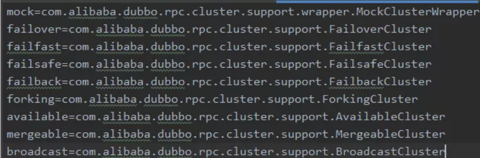
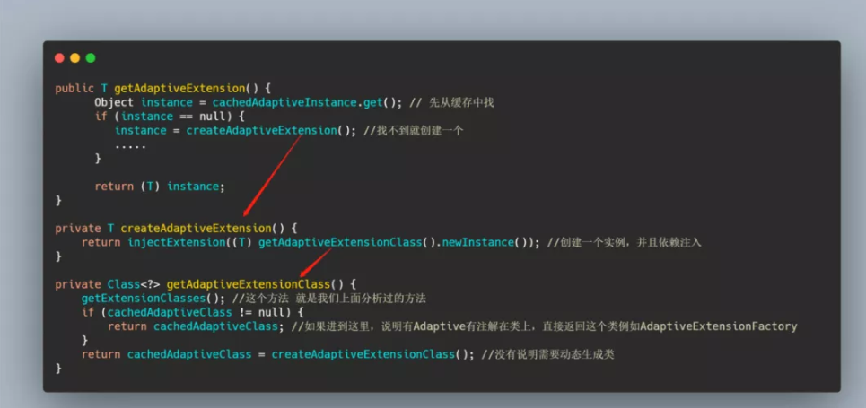
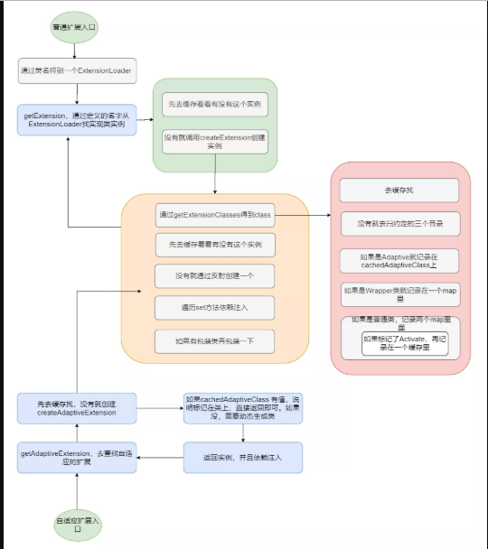

# dubbo面试题

## Dubbo 源码读过吗？没有

## Dubbo的核心组件以及功能

- Provider：服务的提供方
- Consumer：调用远程服务的服务消费方
- Registry：服务注册和发现的注册中心
- Monitor：统计服务调用次数和调用时间的监控中心
- Container：服务运行容器

## 注册中心宕机怎么办

启动dubbo时，消费者会从zk拉取注册的生产者的地址接口等数据，缓存在本地。每次调用时，按照本地存储的地址进行调用。但是在注册中心全部挂掉后增加新的提供者，则不能被消费者发现：

## 服务是怎么注册上去的？

Provider(服务提供者)绑定指定端口并启动服务

Provider 连接注册中心，将本机 IP、端口、应用信息和提供服务信息发送至注册中心存储

## 你们用的什么注册中心？

- Zookeeper 注册中心： 基于分布式协调系统 Zookeeper 实现，采用 Zookeeper 的 watch 机制实现数据变更(官方推荐)

- Multicast 注册中心： 基于网络中组播传输实现，不需要任何中心节点，只要广播地址，就能进行服务注册和发现
- Redis 注册中心： 基于 Redis 实现，采用 key/Map 数据结构存储，主 key 存储服务名和类型，Map 中 key 存储服务 URL，Map 中 value 存储服务过期时间，基于 Redis 的发布/订阅模式通知数据变更
- Simple 注册中心：一个普通的 Dubbo 服务，可以减少第三方依赖，使整体通讯方式一致，不支持集群

## 讲 Dubbo SPI 的源码？

Java SPI 无法按需加载实现类。

Java SPI 在查找扩展实现类的时候遍历 SPI 的配置文件并且**将实现类全部实例化**

因此 Dubbo 就自己实现了一个 SPI，按需加载。**Dubbo SPI 除了可以按需加载实现类之外，增加了 IOC 和 AOP 的特性，还有个自适应扩展机制。**

Dubbo 的配置文件里面存放的是键值对，可以通过名字去加载相应的类。



我们先来看一下 Dubbo 对配置文件目录的约定，不同于 Java SPI ，Dubbo 分为了三类目录。

- META-INF/services/ 目录：该目录下的 SPI 配置文件是为了用来兼容 Java SPI 。
- META-INF/dubbo/ 目录：该目录存放用户自定义的 SPI 配置文件。
- META-INF/dubbo/internal/ 目录：该目录存放 Dubbo 内部使用的 SPI 配置文件。

首先会去加载三个目录下面的类，如果类有@Adaptive接口会被缓存起来。对于@Adaptive会生成动态代理，里面会根据url得到要加载的名字，根据名字自适应获取实例。

**流程：**

先通过接口类找到一个 ExtensionLoader ，然后再通过 ExtensionLoader.getExtension(name) 得到指定名字的实现类实例。

getExtension先去缓存拿，没拿到就调用createExtension()。

**createExtension()**

先找实现类，判断缓存是否有实例，没有就反射建个实例，然后执行 set 方法依赖注入。如果有找到包装类的话，再包一层。

createExtension()里面会调用getExtensionClasses去获取实例，这里会去调用loadExtensionClasses。然后会去读取三个文件夹的资源，loadClass做缓存操作，生成name和class以及class和name的对应关系。

**@Adaptive**

在 ExtensionLoader 构造的时候就会去通过getAdaptiveExtension 获取指定的扩展类的 ExtensionFactory。

**getAdaptiveExtension**



总体流程是这样的：



## 讲 Dubbo 服务暴露源码 + Dubbo 服务注册 

ServiceBean可以看到它实现了 `ApplicationListener<ContextRefreshedEvent>`，这样就会**在 Spring IOC 容器刷新完成后调用 `onApplicationEvent`方法，而这个方法里面做的就是服务暴露**，这就是服务暴露的启动点。

我总结一下 Dubbo 协议的 export 主要就是根据 URL 构建出 key（例如有分组、接口名端口等等），然后 key 和 invoker 关联，关联之后存储到 DubboProtocol 的 exporterMap 中，然后如果是服务初次暴露则会创建监听服务器，默认是 NettyServer，并且会初始化各种 Handler 比如心跳啊、编解码等等。

doExportUrls会往map放入参数，然后根据参数生成url，之后封装成invoke，再暴露出去，变成Export。

会先调用RegistryProtocol的export()，这里面会再调用DubboProtocol的export。

根据url生成key，然后将key和invoker生成export，放入exporterMap中。

```java
        String key = serviceKey(url);
        DubboExporter<T> exporter = new DubboExporter<T>(invoker, key, exporterMap);
        exporterMap.put(key, exporter);
```


## 讲一下 Dubbo 服务引用底层？

开始一直以为是动态***调用 invoker 模型，结果说不够底层原理问 RPC 协议。

## 讲一下 Dubbo RPC 协议调用过程，使用哪些协议？  

|         |                                                              |                                        |                                                              |
| ------- | ------------------------------------------------------------ | -------------------------------------- | ------------------------------------------------------------ |
| 名称    | 实现描述                                                     | 连接描述                               | 使用场景                                                     |
| dubbo   | 传输服务: mina, netty(默认), grizzy； 序列化: dubbo, hessian2(默认), java, fastjson。 自定义报文 | 单个长连接NIO；异步传输                | 1.常规RPC调用 2.传输数据量小 3.提供者少于消费者              |
| rmi     | 传输：java rmi 服务； 序列化：java原生二进制序列化           | 多个短连接； BIO同步传输               | 1.常规RPC调用 2.与原RMI客户端集成 3.可传少量文件 4.不支持防火墙穿透 |
| hessian | 传输服务：servlet容器; 序列化：hessian二进制序列化           | 基于Http 协议传输，依懒servlet容器配置 | 1.提供者多于消费者 2.可传大字段和文件 3.跨语言调用           |
| http    | 传输服务：servlet容器; 序列化：http表单                      | 依懒servlet容器配置                    | 1、数据包大小混合                                            |
| thrift  | 与thrift RPC 实现集成，并在其基础上修改了报文头              | 长连接、NIO异步传输                    |                                                              |

## Dubbo 的连接

这里问的贼细，全靠推理推出来的。。

## Dubbo 的负载均衡

### AbstractLoadBalance

逻辑很简单，我们再来看一下计算权重的方法，这是个公共逻辑，其实是为了服务预热，我们知道缓存有预热，JIT 也有预热，反应到服务上就是服务需要预热。

当服务刚启动的时候不能一下次让它负载过高，得让它慢慢热身，再加上负载，所以这个方法会判断服务运行的时间，来进行服务的降权，这是一个优化手段。

### RandomLoadBalance

默认

这个算法是加权随机，思想其实很简单，我举个例子：假设现在有两台服务器分别是 A 和 B，我想让 70% 的请求落到 A 上，30% 的请求落到 B上，此时我只要搞个随机数生成范围在 [0,10)，这个 10 是由 7+3 得来的。

然后如果得到的随机数在 [0,7) 则选择服务器 A，如果在 [7,10) 则选择服务器 B ，当然前提是这个随机数的分布性很好，概率才会正确。

### LeastActiveLoadBalance

这个是最少活跃数负载均衡，从名字就可以知道选择现在活跃调用数最少的提供者进行调用，活跃的调用数少说明它现在很轻松，而且活跃数都是从 0 加起来的，来一个请求活跃数+1，一个请求处理完成活跃数-1，所以活跃数少也能变相的体现处理的快。

这其实就是最少活跃数的思想了，而 Dubbo 在活跃数相等的时候再通过权重来判断，这个权重其实就和 RandomLoadBalance 的实现一样了。

代码我就不贴了，简单的说下流程就是先遍历 invokers 列表，寻找活跃数最小的 Invoker，如果有多个 Invoker 具有相同的最小活跃数，则记录这些 invoker 的下标，并累加它们的权重来进行权重选择。

如果最小活跃数的 invoker 只有一个则直接返回即可。

### ConsistentHashLoadBalance

这个是一致性 Hash 负载均衡算法，一致性 Hash 想必大家都很熟悉了，常见的一致性 Hash 算法是 Karger 提出的，就是将 hash值空间设为 [0, 2^32 - 1]，并且是个循环的圆环状。

将服务器的 IP 等信息生成一个 hash 值，将这个值投射到圆环上作为一个节点，然后当 key 来查找的时候顺时针查找第一个大于等于这个 key 的 hash 值的节点。

一般而言还会引入虚拟节点，使得数据更加的分散，避免数据倾斜压垮某个节点，来看下官网的一个图。

### RoundRobinLoadBalance

这个是加权轮询负载均衡，轮询我们都知道，这个加权也就是加了权重的轮询，比如说现在有两台服务器 A、B，轮询的调用顺序就是 A、B、A、B....，如果加了权重，A比B 的权重是3:1，那现在的调用顺序就是 A、A、A、B、A、A、A、B....

**加权的原因是个别服务器性能比较好，所以想轮询的多一些**。

不过这种方式可以看到前三次都请求 A，然后再 B，不太均匀，假设是 90:80 这种，前 90 次都打到 A 上，A太繁忙，B 太空了。所以还需要平滑一下。

这种平滑的加权轮询比较好了，比如 A、B、A、A、B、A.....，简单的说就是打乱顺序的轮询。

Dubbo 的加权轮询就经历了上述的加权轮询到平滑加权轮询的过程。

具体的代码不做分析了，比较绕，反正就是这个意思， Dubbo 是参考 Nginx 做的平滑加权轮询。

## 为什么不选 SpringCloud，而选 Dubbo？

**Dubbo 专注 RPC 和服务治理，Spring Cloud 则是一个微服务架构生态。**

## Dubbo原理

## RPC分为哪几部分

