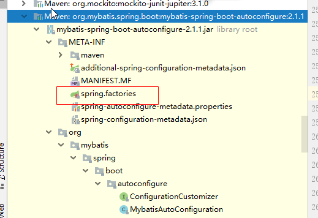

# mybatis面试题

## mybatis怎么处理安全问题的

## MyBatis中#和$符号的区别

\#{} 实现的是sql语句的预处理参数、之后执行sql中用?号代替，使用时不需要关注数据类型，mybatis自动实现数据类型的转换，并 且可以防止sql注入

${} 实现是sql语句的直接拼接、不做数据类型转换。需要自行判断数据类型、不能防止sql注入

## mybatis一级缓存、二级缓存

### 一级缓存

MyBatis在开启一个数据库会话时，会 创建一个新的SqlSession对象，SqlSession对象中会有一个新的Executor对象。Executor对象中持有一个新的PerpetualCache对象；当会话结束时，SqlSession对象及其内部的Executor对象还有PerpetualCache对象也一并释放掉。

SqlSession中执行了任何一个update操作(update()、delete()、insert()) ，都会清空PerpetualCache对象的数据。

 **2、怎么判断某两次查询是完全相同的查询？**

　　mybatis认为，对于两次查询，如果以下条件都完全一样，那么就认为它们是完全相同的两次查询。

　　2.1 传入的statementId

　　2.2 查询时要求的结果集中的结果范围

　　2.3. 这次查询所产生的最终要传递给JDBC java.sql.Preparedstatement的Sql语句字符串（boundSql.getSql() ）

　　2.4 传递给java.sql.Statement要设置的参数值

### **二级缓存**

**假如定义了MyBatis二级缓存，那么MyBatis二级缓存读取优先级高于MyBatis一级缓存**,因为是先查二级缓存，再去查一级缓存的。

**DefaultSqlSession**

```java
  @Override
  public <E> List<E> selectList(String statement, Object parameter, RowBounds rowBounds) {
    try {
      MappedStatement ms = configuration.getMappedStatement(statement);
      return executor.query(ms, wrapCollection(parameter), rowBounds, Executor.NO_RESULT_HANDLER);
    } catch (Exception e) {
      throw ExceptionFactory.wrapException("Error querying database.  Cause: " + e, e);
    } finally {
      ErrorContext.instance().reset();
    }
  }
```

**org.apache.ibatis.executor.CachingExecutor**

```java
  @Override
  public <E> List<E> query(MappedStatement ms, Object parameterObject, RowBounds rowBounds, ResultHandler resultHandler, CacheKey key, BoundSql boundSql)
      throws SQLException {
      // 先查二级缓存
    Cache cache = ms.getCache();
    if (cache != null) {
      flushCacheIfRequired(ms);
      if (ms.isUseCache() && resultHandler == null) {
        ensureNoOutParams(ms, boundSql);
        @SuppressWarnings("unchecked")
        List<E> list = (List<E>) tcm.getObject(cache, key);
        if (list == null) {
          list = delegate.query(ms, parameterObject, rowBounds, resultHandler, key, boundSql);
          tcm.putObject(cache, key, list); // issue #578 and #116
        }
        return list;
      }
    }
      // 这个方法里面会先去查一级缓存
    return delegate.query(ms, parameterObject, rowBounds, resultHandler, key, boundSql);
  }
```

　SqlSessionFactory层面上的二级缓存默认是不开启的，二级缓存的开席需要进行配置，实现二级缓存的时候，MyBatis要求返回的POJO必须是可序列化的。 也就是要求实现Serializable接口，配置方法很简单，只需要在映射XML文件配置就可以开启缓存了\<cache/>，如果我们配置了二级缓存就意味着：

- 映射语句文件中的所有select语句将会被缓存。
- 映射语句文件中的所欲insert、update和delete语句会刷新缓存。
- 缓存会使用默认的Least Recently Used（LRU，最近最少使用的）算法来收回。
- 根据时间表，比如No Flush Interval,（CNFI没有刷新间隔），缓存不会以任何时间顺序来刷新。
- 缓存会存储列表集合或对象(无论查询方法返回什么)的1024个引用
- 缓存会被视为是read/write(可读/可写)的缓存，意味着对象检索不是共享的，而且可以安全的被调用者修改，不干扰其他调用者或线程所做的潜在修改。

## mybatis用的什么连接池？

你知道有其他的连接池，各自有什么区别

你感觉连接池的功能都有什么

## 知道SQL注入吗、Java里怎么防止的呢

**采用预编译语句集**

第二种：

**采用正则表达式**将包含有 单引号(')，分号(;) 和 注释符号(--)的语句给替换掉来防止SQL注入

## mybatis执行SQL语句是怎么实现

接口和xml文件是如何加载的？

从springboot整合mybatis的内容来看，sprng会加载包中的spring.factories文件：



```
# Auto Configure
org.springframework.boot.autoconfigure.EnableAutoConfiguration=\
org.mybatis.spring.boot.autoconfigure.MybatisLanguageDriverAutoConfiguration,\
org.mybatis.spring.boot.autoconfigure.MybatisAutoConfiguration

```

可以看到有个**MybatisAutoConfiguration**配置类，配置类中有个内部类：

**MybatisAutoConfiguration**

```java
  @org.springframework.context.annotation.Configuration
  @Import(AutoConfiguredMapperScannerRegistrar.class)
  @ConditionalOnMissingBean({ MapperFactoryBean.class, MapperScannerConfigurer.class })
  public static class MapperScannerRegistrarNotFoundConfiguration implements InitializingBean {

    @Override
    public void afterPropertiesSet() {
      logger.debug(
          "Not found configuration for registering mapper bean using @MapperScan, MapperFactoryBean and MapperScannerConfigurer.");
    }

  }
```

@ConditionalOnMissingBean注释表示没有MapperScannerConfigurer这个类就执行@Import的内容。

这里就实现了，如果没有定义@MapperScan，就去找@Mapper的类。假设我们这里没有配置@MapperScan

```java
public static class AutoConfiguredMapperScannerRegistrar implements BeanFactoryAware, ImportBeanDefinitionRegistrar {

  private BeanFactory beanFactory;

  @Override
  public void registerBeanDefinitions(AnnotationMetadata importingClassMetadata, BeanDefinitionRegistry registry) {

    if (!AutoConfigurationPackages.has(this.beanFactory)) {
      logger.debug("Could not determine auto-configuration package, automatic mapper scanning disabled.");
      return;
    }

    logger.debug("Searching for mappers annotated with @Mapper");

    List<String> packages = AutoConfigurationPackages.get(this.beanFactory);
    if (logger.isDebugEnabled()) {
      packages.forEach(pkg -> logger.debug("Using auto-configuration base package '{}'", pkg));
    }

    BeanDefinitionBuilder builder = BeanDefinitionBuilder.genericBeanDefinition(MapperScannerConfigurer.class);
    builder.addPropertyValue("processPropertyPlaceHolders", true);
    builder.addPropertyValue("annotationClass", Mapper.class);
    builder.addPropertyValue("basePackage", StringUtils.collectionToCommaDelimitedString(packages));
    BeanWrapper beanWrapper = new BeanWrapperImpl(MapperScannerConfigurer.class);
    Stream.of(beanWrapper.getPropertyDescriptors())
        // Need to mybatis-spring 2.0.2+
        .filter(x -> x.getName().equals("lazyInitialization")).findAny()
        .ifPresent(x -> builder.addPropertyValue("lazyInitialization", "${mybatis.lazy-initialization:false}"));
    registry.registerBeanDefinition(MapperScannerConfigurer.class.getName(), builder.getBeanDefinition());
  }

  @Override
  public void setBeanFactory(BeanFactory beanFactory) {
    this.beanFactory = beanFactory;
  }

}
```

这里主要注册了一个MapperScannerConfigurer类，用来扫描@Mapper。

由于MapperScannerConfigurer实现了BeanDefinitionRegistryPostProcessor接口，所以后面会调用它的postProcessBeanDefinitionRegistry方法

```java
  @Override
  public void postProcessBeanDefinitionRegistry(BeanDefinitionRegistry registry) {
    if (this.processPropertyPlaceHolders) {
      processPropertyPlaceHolders();
    }

    ClassPathMapperScanner scanner = new ClassPathMapperScanner(registry);
    scanner.setAddToConfig(this.addToConfig);
    // 这里的就是mapper注解
    scanner.setAnnotationClass(this.annotationClass);
    scanner.setMarkerInterface(this.markerInterface);
    scanner.setSqlSessionFactory(this.sqlSessionFactory);
    scanner.setSqlSessionTemplate(this.sqlSessionTemplate);
    scanner.setSqlSessionFactoryBeanName(this.sqlSessionFactoryBeanName);
    scanner.setSqlSessionTemplateBeanName(this.sqlSessionTemplateBeanName);
    scanner.setResourceLoader(this.applicationContext);
    scanner.setBeanNameGenerator(this.nameGenerator);
    scanner.setMapperFactoryBeanClass(this.mapperFactoryBeanClass);
    if (StringUtils.hasText(lazyInitialization)) {
      scanner.setLazyInitialization(Boolean.valueOf(lazyInitialization));
    }
    scanner.registerFilters();
      // 主要逻辑在这里
    scanner.scan(
        StringUtils.tokenizeToStringArray(this.basePackage, ConfigurableApplicationContext.CONFIG_LOCATION_DELIMITERS));
  }
```

这个方法主要作用是确定了要扫描什么类，然后是sacn

```java
@Override
public Set<BeanDefinitionHolder> doScan(String... basePackages) {
    // 这里获得了@Mapper注解的类
  Set<BeanDefinitionHolder> beanDefinitions = super.doScan(basePackages);

  if (beanDefinitions.isEmpty()) {
    LOGGER.warn(() -> "No MyBatis mapper was found in '" + Arrays.toString(basePackages)
        + "' package. Please check your configuration.");
  } else {
      // 主要处理逻辑在这里
    processBeanDefinitions(beanDefinitions);
  }

  return beanDefinitions;
}
```

主要处理逻辑processBeanDefinitions方法，这里对扫描出来的beanDefinitions进行了处理

```java
  private void processBeanDefinitions(Set<BeanDefinitionHolder> beanDefinitions) {
    GenericBeanDefinition definition;
    for (BeanDefinitionHolder holder : beanDefinitions) {
      definition = (GenericBeanDefinition) holder.getBeanDefinition();
      String beanClassName = definition.getBeanClassName();
      LOGGER.debug(() -> "Creating MapperFactoryBean with name '" + holder.getBeanName() + "' and '" + beanClassName
          + "' mapperInterface");

      // the mapper interface is the original class of the bean
      // but, the actual class of the bean is MapperFactoryBean
      definition.getConstructorArgumentValues().addGenericArgumentValue(beanClassName); // issue #59
        // 将它的类换成了mapperFactoryBeanClass。
      definition.setBeanClass(this.mapperFactoryBeanClass);

      definition.getPropertyValues().add("addToConfig", this.addToConfig);

      boolean explicitFactoryUsed = false;
      if (StringUtils.hasText(this.sqlSessionFactoryBeanName)) {
        definition.getPropertyValues().add("sqlSessionFactory",
            new RuntimeBeanReference(this.sqlSessionFactoryBeanName));
        explicitFactoryUsed = true;
      } else if (this.sqlSessionFactory != null) {
        definition.getPropertyValues().add("sqlSessionFactory", this.sqlSessionFactory);
        explicitFactoryUsed = true;
      }

      if (StringUtils.hasText(this.sqlSessionTemplateBeanName)) {
        if (explicitFactoryUsed) {
          LOGGER.warn(
              () -> "Cannot use both: sqlSessionTemplate and sqlSessionFactory together. sqlSessionFactory is ignored.");
        }
        definition.getPropertyValues().add("sqlSessionTemplate",
            new RuntimeBeanReference(this.sqlSessionTemplateBeanName));
        explicitFactoryUsed = true;
      } else if (this.sqlSessionTemplate != null) {
        if (explicitFactoryUsed) {
          LOGGER.warn(
              () -> "Cannot use both: sqlSessionTemplate and sqlSessionFactory together. sqlSessionFactory is ignored.");
        }
        definition.getPropertyValues().add("sqlSessionTemplate", this.sqlSessionTemplate);
        explicitFactoryUsed = true;
      }

      if (!explicitFactoryUsed) {
        LOGGER.debug(() -> "Enabling autowire by type for MapperFactoryBean with name '" + holder.getBeanName() + "'.");
        definition.setAutowireMode(AbstractBeanDefinition.AUTOWIRE_BY_TYPE);
      }
      definition.setLazyInit(lazyInitialization);
    }
  }
```

这里把definition里面的类换成了mapperFactoryBeanClass，这个类实现了FactoryBean，后面创建bean对象会调用其getObject()方法。

```java
/**
 * {@inheritDoc}
 */
@Override
public T getObject() throws Exception {
  return getSqlSession().getMapper(this.mapperInterface);
}
```

getMapper最后是调用SqlSessionTemplate的getMapper

```
  @Override
  public <T> T getMapper(Class<T> type) {
    return getConfiguration().getMapper(type, this);
  }
```

最终是调用org.apache.ibatis.binding.MapperRegistry的getMapper

```java
  @SuppressWarnings("unchecked")
  public <T> T getMapper(Class<T> type, SqlSession sqlSession) {
    final MapperProxyFactory<T> mapperProxyFactory = (MapperProxyFactory<T>) knownMappers.get(type);
    if (mapperProxyFactory == null) {
      throw new BindingException("Type " + type + " is not known to the MapperRegistry.");
    }
    try {
      return mapperProxyFactory.newInstance(sqlSession);
    } catch (Exception e) {
      throw new BindingException("Error getting mapper instance. Cause: " + e, e);
    }
  }
```

这里有个knownMappers，这里其实已经有值了，我们后面再讲。

所以最后其实是调用`mapperProxyFactory.newInstance(sqlSession);`来实现mapper里面的方法。

```java
  public T newInstance(SqlSession sqlSession) {
    final MapperProxy<T> mapperProxy = new MapperProxy<>(sqlSession, mapperInterface, methodCache);
    return newInstance(mapperProxy);
  }
  
  protected T newInstance(MapperProxy<T> mapperProxy) {
    return (T) Proxy.newProxyInstance(mapperInterface.getClassLoader(), new Class[] { mapperInterface }, mapperProxy);
  }
```

所以最后是通过代理来实现了，具体实现是在MapperProxy的invoke方法里面。

```java
@Override
public Object invoke(Object proxy, Method method, Object[] args) throws Throwable {
  try {
    if (Object.class.equals(method.getDeclaringClass())) {
      return method.invoke(this, args);
    } else if (method.isDefault()) {
      if (privateLookupInMethod == null) {
        return invokeDefaultMethodJava8(proxy, method, args);
      } else {
        return invokeDefaultMethodJava9(proxy, method, args);
      }
    }
  } catch (Throwable t) {
    throw ExceptionUtil.unwrapThrowable(t);
  }
  // 将methon封装成MapperMethod，包括生成sql语句
  final MapperMethod mapperMethod = cachedMapperMethod(method);
  return mapperMethod.execute(sqlSession, args);
}
```

主要在最后两行，最后执行execute

```java
public Object execute(SqlSession sqlSession, Object[] args) {
  Object result;
  switch (command.getType()) {
    case INSERT: {
      Object param = method.convertArgsToSqlCommandParam(args);
      result = rowCountResult(sqlSession.insert(command.getName(), param));
      break;
    }
    case UPDATE: {
      Object param = method.convertArgsToSqlCommandParam(args);
      result = rowCountResult(sqlSession.update(command.getName(), param));
      break;
    }
    case DELETE: {
      Object param = method.convertArgsToSqlCommandParam(args);
      result = rowCountResult(sqlSession.delete(command.getName(), param));
      break;
    }
    case SELECT:
      if (method.returnsVoid() && method.hasResultHandler()) {
        executeWithResultHandler(sqlSession, args);
        result = null;
      } else if (method.returnsMany()) {
        result = executeForMany(sqlSession, args);
      } else if (method.returnsMap()) {
        result = executeForMap(sqlSession, args);
      } else if (method.returnsCursor()) {
        result = executeForCursor(sqlSession, args);
      } else {
        Object param = method.convertArgsToSqlCommandParam(args);
        result = sqlSession.selectOne(command.getName(), param);
        if (method.returnsOptional()
            && (result == null || !method.getReturnType().equals(result.getClass()))) {
          result = Optional.ofNullable(result);
        }
      }
      break;
    case FLUSH:
      result = sqlSession.flushStatements();
      break;
    default:
      throw new BindingException("Unknown execution method for: " + command.getName());
  }
  if (result == null && method.getReturnType().isPrimitive() && !method.returnsVoid()) {
    throw new BindingException("Mapper method '" + command.getName()
        + " attempted to return null from a method with a primitive return type (" + method.getReturnType() + ").");
  }
  return result;
}
```

最前面提到的MybatisAutoConfiguration还有一个方法SqlSessionFactory

```java
  @Bean
  @ConditionalOnMissingBean
  public SqlSessionFactory sqlSessionFactory(DataSource dataSource) throws Exception {
    SqlSessionFactoryBean factory = new SqlSessionFactoryBean();
    factory.setDataSource(dataSource);
    factory.setVfs(SpringBootVFS.class);
    if (StringUtils.hasText(this.properties.getConfigLocation())) {
      factory.setConfigLocation(this.resourceLoader.getResource(this.properties.getConfigLocation()));
    }
    applyConfiguration(factory);
    if (this.properties.getConfigurationProperties() != null) {
      factory.setConfigurationProperties(this.properties.getConfigurationProperties());
    }
    if (!ObjectUtils.isEmpty(this.interceptors)) {
      factory.setPlugins(this.interceptors);
    }
    if (this.databaseIdProvider != null) {
      factory.setDatabaseIdProvider(this.databaseIdProvider);
    }
    if (StringUtils.hasLength(this.properties.getTypeAliasesPackage())) {
      factory.setTypeAliasesPackage(this.properties.getTypeAliasesPackage());
    }
    if (this.properties.getTypeAliasesSuperType() != null) {
      factory.setTypeAliasesSuperType(this.properties.getTypeAliasesSuperType());
    }
    if (StringUtils.hasLength(this.properties.getTypeHandlersPackage())) {
      factory.setTypeHandlersPackage(this.properties.getTypeHandlersPackage());
    }
    if (!ObjectUtils.isEmpty(this.typeHandlers)) {
      factory.setTypeHandlers(this.typeHandlers);
    }
    if (!ObjectUtils.isEmpty(this.properties.resolveMapperLocations())) {
      factory.setMapperLocations(this.properties.resolveMapperLocations());
    }
    Set<String> factoryPropertyNames = Stream
        .of(new BeanWrapperImpl(SqlSessionFactoryBean.class).getPropertyDescriptors()).map(PropertyDescriptor::getName)
        .collect(Collectors.toSet());
    Class<? extends LanguageDriver> defaultLanguageDriver = this.properties.getDefaultScriptingLanguageDriver();
    if (factoryPropertyNames.contains("scriptingLanguageDrivers") && !ObjectUtils.isEmpty(this.languageDrivers)) {
      // Need to mybatis-spring 2.0.2+
      factory.setScriptingLanguageDrivers(this.languageDrivers);
      if (defaultLanguageDriver == null && this.languageDrivers.length == 1) {
        defaultLanguageDriver = this.languageDrivers[0].getClass();
      }
    }
    if (factoryPropertyNames.contains("defaultScriptingLanguageDriver")) {
      // Need to mybatis-spring 2.0.2+
      factory.setDefaultScriptingLanguageDriver(defaultLanguageDriver);
    }

    return factory.getObject();
  }
```

这里会生成SqlSessionFactory，中间的SqlSessionFactoryBean的buildSqlSessionFactory方法会去解析mapperLocations配置，这里就是我们配置的xml文件的位置。

通过读取配置文件的namespace，来加载对应的mapper类。

最终通过MapperRegistry的addMapper方法将其加入进去。

```java
public <T> void addMapper(Class<T> type) {
  if (type.isInterface()) {
    if (hasMapper(type)) {
      throw new BindingException("Type " + type + " is already known to the MapperRegistry.");
    }
    boolean loadCompleted = false;
    try {
      knownMappers.put(type, new MapperProxyFactory<>(type));
      // It's important that the type is added before the parser is run
      // otherwise the binding may automatically be attempted by the
      // mapper parser. If the type is already known, it won't try.
      MapperAnnotationBuilder parser = new MapperAnnotationBuilder(config, type);
      parser.parse();
      loadCompleted = true;
    } finally {
      if (!loadCompleted) {
        knownMappers.remove(type);
      }
    }
  }
}
```

可以看到，每个mapper封装成了MapperProxyFactory类。这边也解释了前面的knownMappers。

## mybatis是如何做映射的

包括一对多映射

我们知道jdbc，最后都是通过resultSet进行操作的。mybatis也是一样，会先获取到resultSet，对其进行处理

```java
  @Override
  public List<Object> handleResultSets(Statement stmt) throws SQLException {
    ErrorContext.instance().activity("handling results").object(mappedStatement.getId());

    final List<Object> multipleResults = new ArrayList<>();

    int resultSetCount = 0;
    ResultSetWrapper rsw = getFirtResultSet(stmt);

    List<ResultMap> resultMaps = mappedStatement.getResultMaps();
    int resultMapCount = resultMaps.size();
    validateResultMapsCount(rsw, resultMapCount);
    while (rsw != null && resultMapCount > resultSetCount) {
      ResultMap resultMap = resultMaps.get(resultSetCount);
      // 根据resultMap进行映射
      handleResultSet(rsw, resultMap, multipleResults, null);
      rsw = getNextResultSet(stmt);
      cleanUpAfterHandlingResultSet();
      resultSetCount++;
    }

    String[] resultSets = mappedStatement.getResultSets();
    if (resultSets != null) {
      while (rsw != null && resultSetCount < resultSets.length) {
        ResultMapping parentMapping = nextResultMaps.get(resultSets[resultSetCount]);
        if (parentMapping != null) {
          String nestedResultMapId = parentMapping.getNestedResultMapId();
          ResultMap resultMap = configuration.getResultMap(nestedResultMapId);
          handleResultSet(rsw, resultMap, null, parentMapping);
        }
        rsw = getNextResultSet(stmt);
        cleanUpAfterHandlingResultSet();
        resultSetCount++;
      }
    }

    return collapseSingleResultList(multipleResults);
  }
```

```java
private void handleResultSet(ResultSetWrapper rsw, ResultMap resultMap, List<Object> multipleResults, ResultMapping parentMapping) throws SQLException {
  try {
    if (parentMapping != null) {
      handleRowValues(rsw, resultMap, null, RowBounds.DEFAULT, parentMapping);
    } else {
      if (resultHandler == null) {
        DefaultResultHandler defaultResultHandler = new DefaultResultHandler(objectFactory);
        handleRowValues(rsw, resultMap, defaultResultHandler, rowBounds, null);
        multipleResults.add(defaultResultHandler.getResultList());
      } else {
        handleRowValues(rsw, resultMap, resultHandler, rowBounds, null);
      }
    }
  } finally {
    // issue #228 (close resultsets)
    closeResultSet(rsw.getResultSet());
  }
}
```

**handleRowValues**

```java
  public void handleRowValues(ResultSetWrapper rsw, ResultMap resultMap, ResultHandler<?> resultHandler, RowBounds rowBounds, ResultMapping parentMapping) throws SQLException {
    if (resultMap.hasNestedResultMaps()) {
      ensureNoRowBounds();
      checkResultHandler();
      handleRowValuesForNestedResultMap(rsw, resultMap, resultHandler, rowBounds, parentMapping);
    } else {
      handleRowValuesForSimpleResultMap(rsw, resultMap, resultHandler, rowBounds, parentMapping);
    }
  }
```

handleRowValuesForSimpleResultMap中的getRowValue

```java
  private Object getRowValue(ResultSetWrapper rsw, ResultMap resultMap, String columnPrefix) throws SQLException {
    final ResultLoaderMap lazyLoader = new ResultLoaderMap();
    // 通过反射先生成对象，就是生成你需要返回的那个对象，此时里面还没有数据
    Object rowValue = createResultObject(rsw, resultMap, lazyLoader, columnPrefix);
    if (rowValue != null && !hasTypeHandlerForResultObject(rsw, resultMap.getType())) {
      final MetaObject metaObject = configuration.newMetaObject(rowValue);
      boolean foundValues = this.useConstructorMappings;
      if (shouldApplyAutomaticMappings(resultMap, false)) {
          // 判断是否是autoMapping="true"如果是就是自动映射赋值
        foundValues = applyAutomaticMappings(rsw, resultMap, metaObject, columnPrefix) || foundValues;
      }
        //根据配置信息赋值。
      foundValues = applyPropertyMappings(rsw, resultMap, metaObject, lazyLoader, columnPrefix) || foundValues;
      foundValues = lazyLoader.size() > 0 || foundValues;
      rowValue = foundValues || configuration.isReturnInstanceForEmptyRow() ? rowValue : null;
    }
    return rowValue;
  }
```

