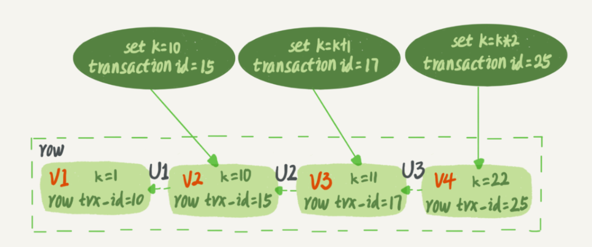

# MVCC机制

先来看个例子，有张表有两条数据。

```mysql
insert into t(id, k) values(1,1),(2,2);
```

有下面三个事务在对其进行修改。


begin/start transaction 命令并不是一个事务的起点，在执行到它们之后的第一个操作InnoDB表的语句（第一个快照读语句），事务才真正启动。如果你想要马上启动一个事务，可以使用start transaction with consistent snapshot 这个命令。

先自己判断一下结果，看看事务A和B的select语句的值是多少，然后再看答案：

事务A查询到的值是1。

如果多个事务对同一个数据进行更新的时候，对于可重复读的隔离级别，每个事务获取到的结果不会受其他事务的影响。

但是B查询到的值是3。如果不理解就继续往下看。

其实mysql每行数据有多个版本，通过事务id——row trx_id来进行标识，如果一个事务更新了这个数据，该数据的row trx_id就变成了当前事务的id。



当数据更新的时候，会生成undo log（回滚日志），就是图中三个虚线箭头就是undo log，根据undo log可以获得上一版本的数据。

 InnoDB为每个事务构造了一个数组，用来保存这个事务启动瞬间，当前正在“活跃”的所有事务ID。“活跃”指的就是，启动了但还没提交。

会记录活跃的事务中最小的id和最大的id。如果数据的row trx_id小于最小，表示在该事务启动前就存在的，对该事务可见，如果大于最大，表示是在之后创建的，不可见。

如果是在两者中间的，就判断是否在数组里，如果在数组中，则表示这个数据是其中某个活跃数据更新的，是启动但是未提交的，是不可见的；如果不在这个数组中，表示这个事务虽然事务id是在范围内，但是早早就提交了，不在活跃的事务中，所以对当前事务是可见的。

好了，知道了这些知识，再看看前面的过程

这里，我们不妨做如下假设：

1. 事务A开始前，系统里面只有一个活跃事务ID是99；
2. 事务A、B、C的版本号分别是100、101、102，且当前系统里只有这四个事务；
3. 三个事务开始前，(1,1）这一行数据的row trx_id是90。

这样，事务A的视图数组就是[99,100], 事务B的视图数组是[99,100,101], 事务C的视图数组是[99,100,101,102]。


对于事务A就没有疑问了。事务A要将数据从101版本回滚到102，再回滚到90的版本。90才是对它可见的。

对于事务B，为什么k=k+1后是3呢？

是的，如果事务B在更新之前查询一次数据，这个查询返回的k的值确实是1。

但是，当它要去更新数据的时候，就不能再在历史版本上更新了，否则事务C的更新就丢失了。因此，事务B此时的set k=k+1是在2的基础上进行的操作。

所以，这里就用到了这样一条规则：**更新数据都是先读后写的，而这个读，只能读当前的值，称为“当前读”（current read）。**

因此，在更新的时候，当前读拿到的数据是(1,2)，更新后生成了新版本的数据(1,3)，这个新版本的row trx_id是101。

所以，在执行事务B查询语句的时候，一看自己的版本号是101，最新数据的版本号也是101，是自己的更新，可以直接使用，所以查询得到的k的值是3。

其实，除了update语句外，select语句如果加锁，也是当前读。

把事务A的查询语句select * from t where id=1修改一下，加上lock in share mode 或 for update，也都可以读到版本号是101的数据，返回的k的值是3。