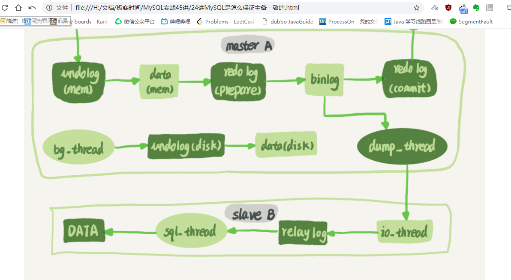

# MySQL

## MySQL的存储引擎

### mysql存储引擎都有啥？

命令 show ENGINES可以查看所有的存储引擎。


常用的存储引擎包括InnoDB、MyISAM、Memory等

###  InnoDB和MyISAM都是什么？

是否支持行锁 、 是否支持事务 、 是否支持 MVCC 、 底层索引结构不同

二者区别

1. InnoDB支持事务，MyISAM不支持
2.  InnoDB支持外键，而MyISAM不支持
3.  InnoDB是聚集索引，也就是主键索引，节点存放的是数据。MyISAM为非聚簇索引，节点存放的是数据的指针引用。
4.  InnoDB不保存表的具体行数，执行select count(\*) from table时需要全表扫描。而MyISAM用一个变量保存了整个表的行数（ 因为InnoDB的事务特性，在同一时刻表中的行数对于不同的事务而言是不一样的，因此count统计会计算对于当前事务而言可以统计到的行数，而不是将总行数储存起来方便快速查询）
5. MySQL 5.6 以前的版本，只有 MyISAM 存储引擎支持全文索引；5.7InnoDB也支持全文索引了。
6. MyISAM表格可以被压缩后进行查询操作
7. InnoDB支持表、行(默认)级锁，而MyISAM支持表级锁，不支持行级锁。
8. InnoDB表必须有唯一索引（如主键）（用户没有指定的话会自己找/生产一个隐藏列Row_id来充当默认主键），而Myisam可以没有
9. Innodb存储文件有frm、ibd，而Myisam是frm、MYD、MYI

​        Innodb：frm是表定义文件，ibd是数据文件

​        Myisam：frm是表定义文件，myd是数据文件，myi是索引文件

### select count(*) form 表 用哪个引擎快一点?

- MyISAM引擎把一个表的总行数存在了磁盘上，因此执行count(*)的时候会直接返回这个数，效率很高；

- 而InnoDB引擎就比较麻烦了，因为mvcc的关系，每一样记录都要判断是否对当前事务可见。所以数据量越多的表，count的速度就越慢了。

注意，如果带where条件的count，myISAM也没法直接获取到总数

不过InnoDB的count(*)还是有做了优化的，因为innodb是索引组织表，主键索引树的值是完整数据，普通索引的值是主键，对于count的操作，遍历任一索引树都是一样的，所以会选择最小的那棵树来遍历，也就是会选择普通索引遍历。

如果你用过show table status 命令的话，就会发现这个命令的输出结果里面也有一个TABLE_ROWS用于显示这个表当前有多少行，这个命令执行挺快的，那这个TABLE_ROWS能代替count(*)吗？

其实这个值也是通过采样来的，官方文档说误差可能达到40%到50%。**所以，show table status命令显示的行数也不能直接使用。**

**那么如果有需求是要经常查询当前的数据总数呢？**

答案是只能自己计数。

如果我们使用redis计数，每次插入一条数据，就在redis计数加一。但是这是在两个数据存储结构中，要保证其原子性比较难，需要使用分布式事务来保证。所以为了避免这个问题，就不用redis计数，而是都放在mysql中。

操作还是一样的，但是由于innodb支持事务，可以很好解决一致性的问题。

## 索引

### 为什么是B+树

索引用b+树实现每次读取的时候操作系统的动作；

B+tree相比于Btree优点是什么?

B+树非叶子节点存放了什么？

B+树如何利用磁盘预读特性？（因为B+树存了key，key接近）

磁盘上怎么存储这些数据的？

为什么索引使用B+树结构，而不是B树

为什么索引使用B+树结构，而不是红黑树 ： {  磁盘预读取 、红黑树高度 }

#### 二叉树和B+树的区别

二叉树只有两个子节点，树的深度毕竟高。二叉树没法实现范围查找。

B+树有子节点用链表连起来，支持范围查找。

**B+树最大的优点**

1. B+树所有数据都在叶子节点，每次查找时间稳定
2. 叶子节点都有指向下一个叶子节点的指针，范围查找比较方便

如果平衡二叉树呢？

### Hash索引和B+数索引的区别

**hash的特点：**

- 存储和查找的效率都是O(1)，不能实现范围查找。

- hash无法实现排序，因为hash值的大小和原来的大小不一定一样。

- 对于组合索引，没法根据前面字段的值进行索引，因为hash索引是将两个字段组合生成的hash值。

### 锁，MVCC，如何解决串行化，创建索引注意事项

（面试官基本上都会在回答后再问为什么😓）

### 什么列适合建立索引？

建立索引时关注的是区分度，区分度越高越好。因为区分度越高，意味着重复的键值越少。

那么我们应该建立多长的索引呢？可以使用下面的语句，让区分度达到90%以上

```sql
 select count(distinct left(列名, 索引长度))/count(*) as ratio from table_name
```

看一下不同的索引长度，那个长度的区分度比较大。

还有一个要注意的问题是，如果你设置索引的时候定义了长度，就无法使用覆盖索引了。即使你的索引长度大于你数据的长度。

### 普通索引什么情况下失效

**对索引字段做函数操作**

```sql
select count(*) from tradelog where month(t_modified)=7;
```

**隐式类型转换**

```sql
select * from tradelog where tradeid=110717;
```

tradeid的数据类型是varchar。

对于优化器来说，这个语句相当于：

```sql
select * from tradelog where  CAST(tradid AS signed int) = 110717;
```

所以其实是第一条规则相同，对索引字段做函数操作。

**隐式字符编码转换**

```sql
select d.* from tradelog l, trade_detail d where d.tradeid=l.tradeid and l.id=2;
```

如果l表的字符集是utf8，d表字符集是utf8mb4，字符集utf8mb4是utf8的超集，所以当这两个类型的字符串在做比较的时候，MySQL内部的操作是，先把utf8字符串转成utf8mb4字符集，再做比较。

等同于

```sql
select * from trade_detail  where CONVERT(traideid USING utf8mb4)=l.tradeid and l.id=2;
```

可以看到也是对字段进行了函数操作。

解决方法除了修改字符集让二者一致之外，还可以改写语句：

```sql
 select d.* from tradelog l , trade_detail d where d.tradeid=CONVERT(l.tradeid USING utf8) and l.id=2; 
```

可以看到，这里的CONVERT函数是加在输入参数上的，所以就不会有问题了。

三个例子，其实是在说同一件事儿，即：**对索引字段做函数操作，可能会破坏索引值的有序性，因此优化器就决定放弃走树搜索功能。**

MySQL的优化器确实有“偷懒”的嫌疑，即使简单地把where id+1=1000改写成where id=1000-1就能够用上索引快速查找，也不会主动做这个语句重写。

**最左前缀原则**

如果like ‘张%’则可以用到索引，如果是 like ‘%张’则没法用到索引。联合索引也是遵循最左前缀原则。

**innodb如果有or的话不会走索引**

组合索引是a，b   where a = 1 ,b = 2 OR b =3 走索引吗？不走

可以使用union，或者用in

### 其他

#### 唯一索引和普通索引底层的设计区别

只有普通索引可以用到change buffer，所以在更新的时候，唯一索引会比较慢。因为唯一索引要判断是否冲突，需要把数据从磁盘中读取出来，而普通索引只需要写入change buffer.

#### 聚簇索引和非聚簇索引区别？ 主键索引和二级索引了解吗？

**聚簇索引：**将数据存储与索引放到了一块，索引结构的叶子节点保存了行数据

**非聚簇索引：**将数据与索引分开存储，索引结构的叶子节点指向了数据对应的位置

主键索引的叶子节点存的是整行数据。在InnoDB里，主键索引也被称为聚簇索引（clustered index）。

非主键索引的叶子节点内容是主键的值。在InnoDB里，非主键索引也被称为二级索引（secondary index）。

#### 为什么不对每个列创建索引呢？

插入，更新、删除数据都会变更索引，如果都建了索引，这些操作都会变慢。

#### 回表

**回到主键索引树搜索的过程，我们称为回表**，比如select * from T where k between 3 and 5，k有索引，所以根据k的索引找到了3对应的主键id，再根据主键id去主键索引查找数据。

### 覆盖索引的实现

如果执行的语句是select ID from T where k between 3 and 5，这时只需要查ID的值，而ID的值已经在k索引树上了，因此可以直接提供查询结果，不需要回表。也就是说，在这个查询里面，索引k已经“覆盖了”我们的查询需求，我们称为覆盖索引。

### 更新的时候索引如何更新，描述一下算法

> 查看该目录《为什么要用b+树》里相关内容。

如果新增，可能引起树的分裂。删除的话，可能会有数组的合并。

### 索引的优化、分析SQL的时候你会关注的字段、索引的选择

### 联合索引，怎么建

**什么时候需要联合索引呢**？结合覆盖索引和索引下推的内容。假设建立了(name,age)的联合索引

如果索引里面包含了需要的信息，就不需要回表了。如果你有根据名字获取这个人的年龄的查找，这个联合索引就可以用到覆盖索引的特性。

如果是这样的语句select * from tuser where name like '张%' and age=10 and ismale=1，可以根据索引下推（5.6之后才有），先判断age是否符合条件，符合条件的再去回表，减少了回表的次数。

**如何确定顺序**

根据最左前缀原则，如果有（a,b）的联合索引，会根据a进行查找，就没必要单独建一个a了。所以要根据实际情况选择合适的顺序。

## MySQL中的事务隔离级别

### 事务特性ACID

深入一些 ： 为什么要有一致性 ？ AID不是已经保证了一致性了吗 ？

1. 原子性（atomicity)

   一个事务要么全部提交成功，要么全部失败回滚，不能只执行其中的一部分操作，这就是事务的原子性

2. 一致性（consistency)

   事务的执行不能破坏数据库数据的完整性和一致性，一个事务在执行之前和执行之后，数据库都必须处于一致性状态。

   如果数据库系统在运行过程中发生故障，有些事务尚未完成就被迫中断，这些未完成的事务对数据库所作的修改有一部分已写入物理数据库，这是数据库就处于一种不正确的状态，也就是不一致的状态

3. 隔离性（isolation）

   事务的隔离性是指在并发环境中，并发的事务时相互隔离的，一个事务的执行不能不被其他事务干扰。不同的事务并发操作相同的数据时，每个事务都有各自完成的数据空间，即一个事务内部的操作及使用的数据对其他并发事务时隔离的，并发执行的各个事务之间不能相互干扰。

   一共有四种隔离级别

4. 持久性（durability）

   一旦事务提交，那么它对数据库中的对应数据的状态的变更就会永久保存到数据库中。

   --即使发生系统崩溃或机器宕机等故障，只要数据库能够重新启动，那么一定能够将其恢复到事务成功结束的状态

### MVCC机制

> 详细可查看本目录下的MVCC机制

### innodb可重复读的实现原理

可重复读表示在一个事务里面，查询到的结果都一致。因为innodb有MVCC（多版本控制），如果有多个事务该了同一个值，这条记录就会有多个回滚操作，记录在undo log中。每个事务会获取到当前视图的数据。

（mvvc+next-key lock)

### 什么叫不可重复读

就是事务A第一次查询一个值是2，后面事务B改成了3，并且事务B提交了。事务A再查询就变成了3.

读已提交是会出现不可重复读的问题的。

### MVCC能解决幻读吗？

不能全部解决。可重复读情况，通过next key lock可以解决部分的幻读。


这种情况，insert由于next key lock会导致阻塞，事务1提交之后，事务2的insert才会执行，所以不会产生幻读。

所谓的next key lock就是一个行锁（record lock）+范围锁（gap lock），比如某一个辅助索引（比如上面的class_id），如果它有1,3,5这几个值，那么当我们使用next key lock的锁住class_id=1的时候，实际上锁住了（-无穷，1]，或者锁住class_id=3的时候，实际上锁住的是（1,3]，也就是一个左开右闭的区间。

但是下面这种情况会产生幻读：


这个例子没有用到next key lock，因为执行了update语句，需要先读再更新，这个读是当前读，可以获取到新增的数据，进行更新之后，当前事务就可以看到这个数据了。

### 自增主键进行写的时候会用什么事务隔离级别（读未提交）

### 隔离级别是通过什么原理实现的

mvcc?

### mysql的默认隔离级别，oracle默认的是？

oracle读已提交，innodb默认可重复读。

## sql语句的执行流程

客户端 连接器 分析器 优化器 执行器 存储引擎

> 可以查看该目录下面的《MySQL语句的执行流程》

### 一条mysql查询经历了什么

### 一条mysql更新经历了什么？

## 优化

### 如何查看慢查询

修改配置文件：

MySQL在Windows系统中的配置文件一般是是my.ini找到[mysqld]下面加上


log-slow-queries是慢查询的文件路径，long_query_time是超过指定时间的查询会被记录到日志中。

### 怎么解决慢查询

在MySQL中，会引发性能问题的慢查询，大体有以下三种可能：

1. 索引没有设计好；
2. SQL语句没写好；
3. MySQL选错了索引。

**索引没有设计好**，这种场景一般就是通过紧急创建索引来解决。

**SQL语句没写好**可以通过改写SQL语句来处理。

MySQL 5.7提供了query_rewrite功能，可以把输入的一种语句改写成另外一种模式。

```sql
mysql> insert into query_rewrite.rewrite_rules(pattern, replacement, pattern_database) values ("select * from t where id + 1 = ?", "select * from t where id = ? - 1", "db1");

call query_rewrite.flush_rewrite_rules();
```

**MySQL选错了索引。**

这时候，应急方案就是给这个语句加上force index。

同样地，使用查询重写功能，给原来的语句加上force index，也可以解决这个问题。

### mysql如何性能调优？比较缓慢的话，从哪个方面优化？

### 如何优化SQL语句？

讲了一下索引的优化，最左匹配原则、索引失效情况和索引区分度

### explain中rows type key extra字段的含义？

参考

[mysql explain详解](https://blog.csdn.net/weixin_43094917/article/details/104071048?ops_request_misc=%257B%2522request%255Fid%2522%253A%2522160523226719725266919757%2522%252C%2522scm%2522%253A%252220140713.130102334.pc%255Fblog.%2522%257D&request_id=160523226719725266919757&biz_id=0&utm_medium=distribute.pc_search_result.none-task-blog-2~blog~first_rank_v1~rank_blog_v1-1-104071048.pc_v1_rank_blog_v1&utm_term=explain&spm=1018.2118.3001.4450)

## count(1) count(*) count(列值)的区别

count(*)、count(主键id)、count(1)还有count(字段)的区别

count(*)、count(主键id)和count(1) 都表示返回满足条件的结果集的总行数；而count(字段），则表示返回满足条件的数据行里面，参数“字段”不为NULL的总个数。

**对于count(主键id)来说**，InnoDB引擎会遍历整张表，把每一行的id值都取出来，返回给server层。server层拿到id后，判断是不可能为空的，就按行累加。

**对于count(1)来说**，InnoDB引擎遍历整张表，但不取值。server层对于返回的每一行，放一个数字“1”进去，判断是不可能为空的，按行累加。

单看这两个用法的差别的话，你能对比出来，count(1)执行得要比count(主键id)快。因为从引擎返回id会涉及到解析数据行，以及拷贝字段值的操作。

**对于count(字段)来说**：

1. 如果这个“字段”是定义为not null的话，一行行地从记录里面读出这个字段，判断不能为null，按行累加；
2. 如果这个“字段”定义允许为null，那么执行的时候，判断到有可能是null，还要把值取出来再判断一下，不是null才累加。

也就是前面的第一条原则，server层要什么字段，InnoDB就返回什么字段。

**但是count(\*)是例外**，并不会把全部字段取出来，而是专门做了优化，不取值。count(*)肯定不是null，按行累加。

按照效率排序的话，count(字段)<count(主键id)<count(1)≈count(*)，所以我建议你，尽量使用count(\*)。

## 连接池是怎么回事

官方：数据库连接池（Connection pooling）是程序启动时建立足够的数据库连接，并将这些连接组成一个连接池，由程序动态地对连接池中的连接进行申请，使用，释放。

传统链接：一般来说，JAVA应用程序访问数据库的过程：

1） 装载数据库驱动程序；

2） 通过JDBC建立数据库连接；

3） 访问数据库，执行SQL语句；

4） 断开数据库连接；

使用了数据库连接池的机制：

1） 程序初始化时创建连接池；

2） 使用时向数据库申请可用连接；

3） 使用完毕，将连接返回给连接池；

4） 程序退出时，断开所有连接，并释放资源；

## 数据库几大范式

**第一范式**：当关系模式R的所有属性都不能在分解为更基本的数据单位时，称R是满足第一范式的，简记为1NF。

理解：每一列属性都是不可再分的属性值，确保每一列的原子性

**第二范式：**如果关系模式R满足第一范式，并且R得所有非主属性都完全依赖于R的每一个候选关键属性。

理解：第二范式（2NF）要求数据库表中的每个实例或记录必须可以被唯一地区分。选取一个能区分每个实体的属性或属性组，作为实体的唯一标识。每一行的数据只能与其中一列相关，即一行数据只做一件事。只要数据列中出现数据重复，就要把表拆分开来。

比如一个订单表，有多个订单，只存放和订单号相关的内容。不存放联系人姓名、电话、地址等内容，这些内容应该在另一张表上。

**第三范式：**在2NF基础上，任何非主属性不依赖于其它非主属性（在2NF基础上消除传递依赖）也就是在满足2NF的基础上，任何非主属性不得传递依赖于主属性。

理解：数据不能存在传递关系，即没个属性都跟主键有直接关系而不是间接关系。

比如Student表（学号，姓名，年龄，性别，所在院校，院校地址，院校电话）

这样一个表结构，就存在上述关系。 学号--> 所在院校 --> (院校地址，院校电话)，院校电话是跟所在院校有关系，间接跟学号有关系。

这样的表结构，我们应该拆开来，如下。

（学号，姓名，年龄，性别，所在院校）--（所在院校，院校地址，院校电话）

## 一致性视图

和MVCC是一个东西

## 日志模块

> 查看本目录下面的《MySQL日志模块》

### MYSQL日志分为几种

　　1：**重做日志（redo log）**

　　2：**回滚日志（undo log）**

　　3：**二进制日志（binlog）**

　　4：**错误日志（errorlog）**

　　5：**慢查询日志（slow query log）**

　　6：**一般查询日志（general log）**

　　7：**中继日志（relay log）。**

主要是前三个

### mysql更新了数据日志文件有什么改变

### undo log，redo log和binglog

## 数据库读写分离、分库分表；

## jdbc连接mysql的几个步骤、为什么要加载驱动呢，原理是什么、PreparedStatement和Statement区别、返回结果如何查询

>  1、首先注册驱动啊？怎么注册？反射啊，Class.forName("xx.xx.xx.Driver");底层怎么实现的？静态代码，DriverManager.registerDriver?启动的时候，会自动调用静态代码块的内容。
> 
>  2、接下来就是获取连接啊，怎么连接？远程连接(三次握手操作)，连接放哪里？作为资源必须放池子里。这样能提高性能。常见的连接池有DBCP，C3P0，传说中最安全，性能最好的Druid(国产)，而且还能监控。
> 
>  3、你总的有SQL语句吧，之后就是Statement编译那。这里会出现SQL注入的安全问题。在语句后面加"1=1"成立。所以我们采用预编译的方式，PreparedStatement。可以防止这种问题的出现。
> 
>  4、查完之后获取结果集。rs.getString().
> 
>  5、头疼的来了，释放资源。各种 if(xx != nu) {try{ xx.close();}catch{}} 不用担心JDK8 出来一个新特性，可以放在try-withresource中。还有各种异常可以采用通道的形式 XxxException | XxxException
> 
>  6、各种异常需要你放到一个try{}catch{}中，出问题你也不知道问题在哪里？
> 
>  麻烦吗？不用担心，我们可以封装成一个工具类，需要的时候调用工具类.getConnection();
> 
>  还是麻烦啊，可以用Spring框架为我们集成提供了jdbcTemplate，HibernaterTemplate。用模板代码消除了大量的样板代码。
>
>遍历结果集，叭叭

## MySQL语法，海量数据分页吧，用什么实现

先快速定位需要获取的 id 段，然后再关联：
SELECT a.* FROM 表 1 a, (select id from 表 1 where 条件 LIMIT 100000,20 ) b where a.id=b.id

## MySQL用的什么版本，5.5和5.7版本的一个区别

5.5新特性

**默认存储引擎更改为InnoDB**

5.6新特性

- Redo Log总大小的限制从之前的4G扩展至512G。
- Undo Log可保存在独立表空间中，因其是随机IO，更适合放到SSD中。但仍然不支持空间的自动回收。

5.7新特性

- 在线修改Buffer pool的大小。

## 非关系型数据库了解过什么，跟MySQL有啥区别

关系型数据库严格遵循ACID理论。但当数据库要开始满足横向扩展、高可用、模式自由等需求时，需要对ACID理论进行取舍，不能严格遵循ACID。以CAP理论和BASE理论为基础的NoSQL数据库开始出现。


临时性键值存储（**memcached**、**Redis**）

它的数据是以键值的形式存储的，速度非常快

## 查看一条数据，数据不存在，怎么加锁的

正常的查看，是不会加锁的。要加上lock in share mode或for update才可以

next key lock

1. 原则1：加锁的基本单位是next-key lock。next-key lock是前开后闭区间。
2. 原则2：查找过程中访问到的对象才会加锁。走不同的索引是不同的锁
3. 优化1：索引上的等值查询，给唯一索引加锁的时候，next-key lock退化为行锁。
4. 优化2：索引上的等值查询，向右遍历时且最后一个值不满足等值条件的时候，next-key lock退化为间隙锁。

## char和varchar的区别，为什么不同

**char类型的长度是固定的，varchar的长度是可变的。**

这就表示，存储字符串'abc'，使用char(10)，表示存储的字符将占10个字节（包括7个空字符）

使用varchar(10),，则表示只占3个字节，10是最大值，当存储的字符小于10时，按照实际的长度存储。

**varchar比char节省空间，但是在效率上比char稍差些。**既要获得效率即必须牺牲一点空间，这就是设计上的"以空间换时间"

如果一个字段经常被修改，而且每次修改的数据长度不同，为了效率应当考虑用char定长代替varchar变长。

## 事务操作进行到一半数据库断电了怎么办

只要 innodb_flush_log_at_trx_commit 和 sync_binlog 都为 1（通常称为：双一），就能确保 MySQL 机器断电重启后，数据不丢失。

这两个参数保证每次提交事务都会将redo log buffer 和binlog cache持久化到磁盘，这样能保证事务提交，两个日志是一致的。

## 数据库如何实现回滚到一天前？

使用binlog进行回滚。

##  数据库的备份怎么实现的？

针对不同的场景下, 我们应该制定不同的备份策略对数据库进行备份, 一般情况下, 备份策略一般为以下三种

- **直接cp,tar复制数据库文件**
- **mysqldump+复制BIN LOGS**
- **lvm2快照+复制BIN LOGS**
- **xtrabackup**

## 什么是冷备份什么是热备份

热备份指的是当数据库进行备份时, **数据库的读写操作均不是受影响** 

温备份指的是当数据库进行备份时, **数据库的读操作可以执行, 但是不能执行写操作** 

冷备份指的是当数据库进行备份时, **数据库不能进行读写操作, 即数据库要下线**

## SQL注入攻击

比如正常的语句这样的：

```sql
SELECT * FROM user WHERE username='admin' AND psw='password'
```

链接：https://www.imooc.com/article/275869

来源：慕课网

本文首次发布于慕课网 ，转载请注明出处，谢谢合作

但是恶意攻击者用奇怪用户名将你的 SQL 语句变成了如下形式：

```sql
SELECT * FROM user WHERE username='admin' --' AND psw='xxxx'
```

这样后面就变成了注释，psw就失效了

解决方法：

- 对进入数据库的特殊字符（’，"，\，<，>，&，\*，; 等）进行转义处理，或编码转换。

- 所有的查询语句建议使用数据库提供的参数化查询接口

## 哈希索引存的数据大小没有b树多

数据结构上面说，HashMap比树是要小一点

##  一个节点能够存储多少数据

**innodb_page_size**定义是16k，所以一个节点存储大小是16k，如果一行数据是1k，那么每个节点可以存16条数据

## 如何保证回滚

redo log可以设置参数innode_flush_log_at_trx_commit，默认是1，等到事务提交的时候再持久化到磁盘。所以如果事务回滚，redo log是没有记录的。


## 数据库中事务到底是mvcc回滚还是日志回滚

undo log记录的是逻辑日志，可以简单的理解为：当insert一条记录时，undo log会记录一条对应的delete语句；当update一条语句时，undo log记录的是一条与之操作相反的语句

当事务需要回滚时，可以从undo log中找到相应的内容进行回滚操作，回滚后数据恢复到操作之前的状态

## mysql挂了怎么后续处理

## join 连接主键优化

## redis事务与mysql事务的区别

## 这仨语句怎么建索引

首先，join和left join/right join并不能决定左表是驱动表还是右表是驱动表。具体要看优化器是怎么选择的。

​	select * from A join B on A.a=B.b;

 	select * from A left join B on A.a=B.b; 	

 	select * from A right join B on A.a=B.b;

假设left join是左表为驱动表，右表为被驱动表，那么：

left join的过程是先遍历表A，然后根据从表A中取出的每行数据中的a值，去表B中查找满足条件的记录。

所以对于A表是全表，**对于B表，应该给b加上索引，才可以提高效率。**

##  MySQL集群。假如集群出现延迟怎么处理。

## 主从同步过程



**一句话总结：**

主要是每次语句执行，主库会将binlog发送给从库，从库读取写到自己的本地文件，称为中转日志（relay log）里面，然后从库有线程会去解析出日志里的命令，并执行。

详细过程：

备库B跟主库A之间维持了一个长连接。主库A内部有一个线程，专门用于服务备库B的这个长连接。一个事务日志同步的完整过程是这样的：

1. 在备库B上通过change master命令，设置主库A的IP、端口、用户名、密码，以及要从哪个位置开始请求binlog，这个位置包含文件名和日志偏移量。
2. 在备库B上执行start slave命令，这时候备库会启动两个线程，就是图中的io_thread和sql_thread。其中io_thread负责与主库建立连接。
3. 主库A校验完用户名、密码后，开始按照备库B传过来的位置，从本地读取binlog，发给B。
4. 备库B拿到binlog后，写到本地文件，称为中转日志（relay log）。
5. sql_thread读取中转日志，解析出日志里的命令，并执行。

## 数据库分库分表

 分库分表的规则，分表之后的分页查询 排序查询如何实现

**分表规则：**

**1、根据数值范围**

按照时间区间或ID区间来切分。例如：按日期将不同月甚至是日的数据分散到不同的库中；将userId为1~9999的记录分到第一个库

**2、根据数值取模**

一般采用hash取模mod的切分方式，例如：将 Customer 表根据 cusno 字段切分到4个库中，余数为0的放到第一个库，余数为1的放到第二个库。

**问题：**

**跨节点关联查询 join 问题**

数据组装，在系统层面，分两次查询，第一次查询的结果集中找出关联数据id，然后根据id发起第二次请求得到关联数据。最后将获得到的数据进行字段拼装。

**跨节点分页、排序、函数问题**

当排序字段就是分片字段时，通过分片规则就比较容易定位到指定的分片；当排序字段非分片字段时，就变得比较复杂了。需要先在不同的分片节点中将数据进行排序并返回，然后将不同分片返回的结果集进行汇总和再次排序，最终返回给用户。

如果取得页数很大，情况则变得复杂很多，因为各分片节点中的数据可能是随机的，为了排序的准确性，需要将所有节点的前N页数据都排序好做合并，最后再进行整体的排序，这样的操作时很耗费CPU和内存资源的，所以页数越大，系统的性能也会越差。

在使用Max、Min、Sum、Count之类的函数进行计算的时候，也需要先在每个分片上执行相应的函数，然后将各个分片的结果集进行汇总和再次计算，最终将结果返回。如图所示：

## 锁

### 什么时候是行锁，什么时候是表锁？

**行锁：**

**在InnoDB事务中，行锁是在需要的时候才加上的，但并不是不需要了就立刻释放，而是要等到事务结束时才释放。这个就是两阶段锁协议。**

**表锁：**

表锁的语法就是 **lock tables … read/write**。与FTWRL类似，客户端断开之后，锁也会被释放。但是要注意lock table的语法除了会限制其他线程，也会限制当前线程。

比如A线程中执行了lock tables t1 read, t2 write，其他线程的写t1、读写t2操作会被阻塞，而对于A线程，就只能执行自己规定的操作，读t1，读写t2。其余操作都不允许。

### 间隙锁

锁定一个范围，但不包含记录本身

**next-key lock**

行锁+间隙锁，锁定一个范围，并且锁定记录本身。

### InnoDB如何实现悲观锁的（不懂）

### 加锁加在B+树的哪个地方（不懂）