# mysql实战

## mysql逻辑架构图

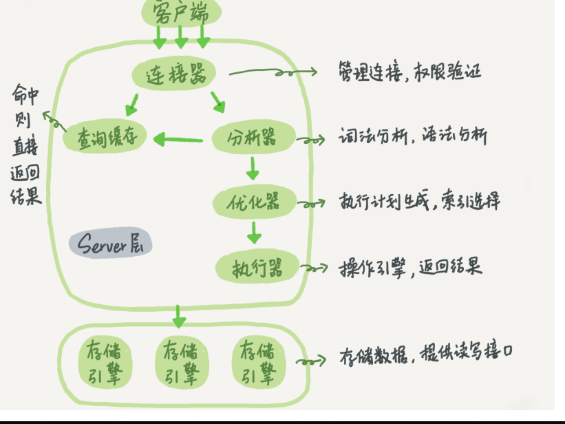

## 重要的日志模块redo log和binlog

### redo log

redo log是InnoDB引擎提供的。其他引擎就没有这个日志。

redo log的作用就是避免频繁访问磁盘。**更新的时候先写日志，更新内存，等到空闲的时候再写入磁盘。**

InnoDB的redo log是固定大小的，用两个指标标识现在更新的位置和写的位置。


当写的数据太多，write_pos追上checkpoint，表示redo log的空间用完了，要等把checkpoint推进一下才可以继续。

### binlog

binlog是mysql提供的归档日志。redo log是InnoDB引擎特有的；binlog是MySQL的Server层实现的，所有引擎都可以使用。

redo log是物理的，记录了这个页做了什么改动（注意并不是记录更新之后的数据）

binlog是逻辑的，有两种形式，statement 格式是记录sql语句，row格式会记录数据行的内容，记录更新前和更新后这条数据的内容，这样就会记录两条。

redo log大小有限，所以是循环写入的。binlog是追加写入的。binlog日志写到一定大小后，会换一个文件写，不会覆盖以前的日志。

### 更新流程

比如执行把id+1的操作。引擎会先找到这个数据给执行器，然后执行器加一再通知引擎更新数据。

引擎把这行数据更新到内存中后，在写入redo log，redo log处于prepare状态，注意只是并没有完全写入。

然后引擎通知执行器完成了，执行器将这个更新的操作写入binlog中

之后执行器调用存储引擎的提交事务的接口，引擎把刚才的redo log改成commit状态。

这个过程称为两阶段提交，目的是为了确保binlog 和redo log 的数据是一致的。不然写入binlog之后，如果去写redo log的过程机器挂掉了，这样最后两个文件的数据就不一致了。

## 事务隔离的实现

基于数据库的多版本并发控制（mvcc），每一条数据都有多个版本，每个视图看到的数据都是不一样的。

每次更新的时候，都会记录一个回滚操作。

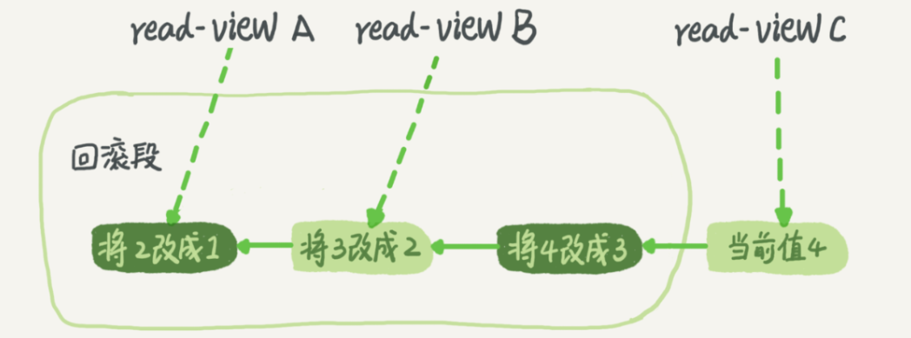

对于最后一个事务C，它的回滚段就包括了前面的这些操作。当系统判断没有比回滚日志更早的read-view的时候，就会把这个回滚日志删除。

所以说建议你尽量不要使用长事务，不然这个事务提交之前，可能用到的回滚记录都要留着。

## innodb索引（b+树）

### 为什么要用b+树？

考虑到查询效率要比较高。可以采用哈希表，有序数组，平衡二叉搜索树。

哈希表不能支持范围查找，所以不行。有序数组插入的时候效率太差了，也不行。有序数组只适合不需要更新的数据。

平衡二叉树是可以的，但是索引需要给每个数据都建立一个节点，占了很大的空间，所以不能放到内存中，只能放在磁盘里。二叉树的深度比较大，需要多次访问磁盘，效率比较低。所以需要N叉树。这个N取决于数据块的大小。以InnoDB的一个整数字段索引为例，这个N差不多是1200。这棵树高是4的时候，就可以存1200的3次方个值，这已经17亿了。所以十几亿的数据，最多只需要访问三次磁盘，效率比较高。

但是树的范围查找怎么解决呢？可以改造一下，把叶子节点用链表连起来。

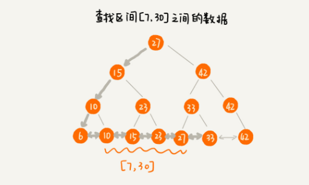

这样就解决了范围查找的问题。

### InnoDB 的索引模型

假设现在有一个表只有两个字段 id 和k，id是主键，k建立了一个普通索引

在InnoDB中，表都是根据主键顺序以索引的形式存放的，这种存储方式的表称为索引组织表。所以都会有一个主键索引来存放数据。两棵索引树是这样的。

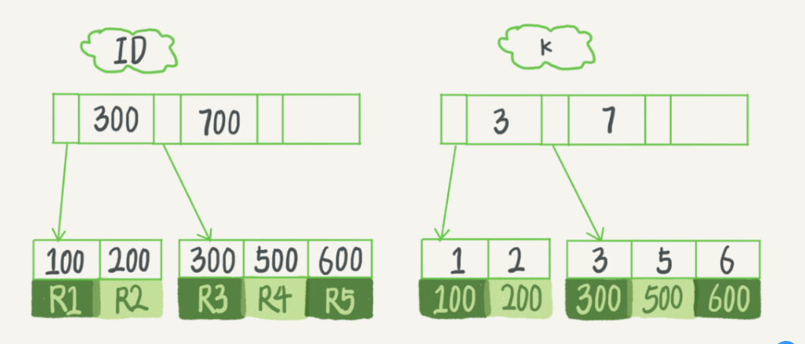

主键索引存放的数据是真实的，完整的数据。而普通索引放的数据是主键的值，在这里就是id。

在InnoDB里，主键索引也被称为聚簇索引（clustered index）。非主键索引也被称为二级索引（secondary index）。

如果我们使用where id = 300来查数据，只需要找主键索引树中id为300的数据就可以了。

而如果使用where k = 3来查数据，先在k的索引树中找到k=3，拿到这个数据的主键300，再去主键索引中查找id为300的数据。

也就是说，基于非主键索引的查询需要多扫描一棵索引树。因此，我们在应用中应该尽量使用主键查询。

### 索引维护

B+树在删除和增加的时候都要进行维护。

增加的时候，如果是二叉树，现在加了一个节点，变成3叉树了，就要进行分裂，父节点分裂后，可能也超了，又要继续分裂。如下图所示

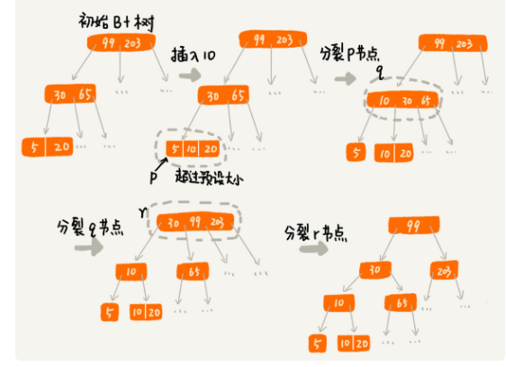

而如果删除节点，也要进行合并的操作。因为如果不合并的话，每个节点下面可能只有一个节点，这样效率就很差。在B+树中，我们可以设置阈值，当节点数量小于m/2的时候就合并，m是每个节点下的预订数量。合并的过程如下

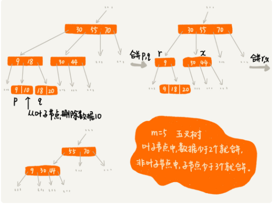

由于增加节点，会有可能需要改动树结构。所以mysql通常都是使用自增主键，这样就避免在树的中间插入数据，减少了索引的变动。

而且从存储空间上，也推荐主键的字段不要太长。

### 索引特性

#### 覆盖索引

如果我们执行`select ID from T where k between 3 and 5`，这时只需要查询k的索引树，树的节点存储的值就是id了，可以直接拿到id，不需要回表，这就是覆盖索引

所以如果我们一个高频操作：根据身份证号获取姓名的操作。我们可以建立一个身份证号和姓名的联合索引。这样只要走这个索引树就可以拿到数据了，也不需要去主键索引查找数据了，减少了回表的操作。

#### 最左前缀原则

如果我们定义一个联合索引（name,age）,那么索引就会按照你写的这个字段顺序进行排列

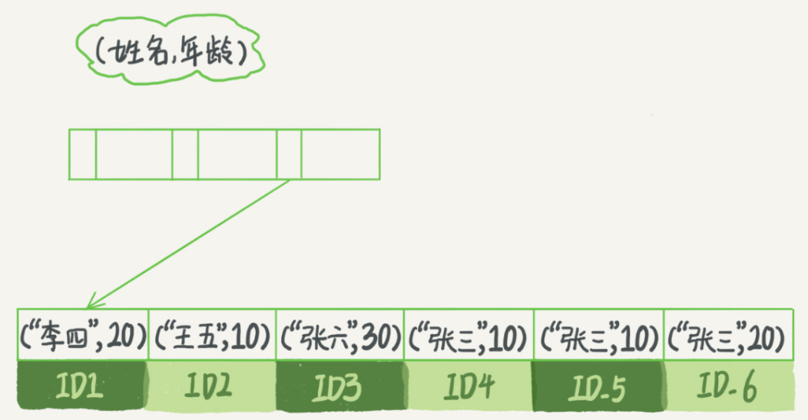

这时候，你根据姓名查找数据，比如like 张%，他就会根据索引先找到id3这个数据，然后按顺序遍历，找到所有满足的数据。但是你如果根据年龄查找，就用不到这个索引了。

**所以建立联合索引的时候，顺序很重要**

比如前面根据高频请求建立了(身份证号，姓名）这个索引，现在有“根据身份证号查询地址”的需求。由于最左前缀的规则，我们就没必要再建立一个索引，因为这个请求也可以利用到(身份证号，姓名）这个索引。

如果我们已经有了一个（a，b）的索引，但是现在的场景是a和b都会频繁用来做查找的条件。所以一定要有（a，b）和（b），或者（b，a）和（a）这样的索引，这时候就需要考虑空间的大小。如果a的字段比较小，我们就用

（b，a）和（a）这样的索引。

#### 索引下推

我们还是以联合索引（name, age）为例。如果有这么一个需求

```sql
select * from tuser where name like '张%' and age=10 and ismale=1;
```

检索出表中“名字第一个字是张，而且年龄是10岁的所有男孩”。根据最左前缀，这个语句在搜索索引树的时候，只能用 “张”，找到第一个满足条件的记录ID3，然后判断其他条件是否满足。

在MySQL 5.6之前，只能从ID3开始一个个回表。到主键索引上找出数据行，再对比字段值。

而MySQL 5.6 引入的索引下推优化（index condition pushdown)， 可以在索引遍历过程中，对索引中包含的字段先做判断，直接过滤掉不满足条件的记录，减少回表次数。

所以不需要每次都回表查是否满足，只要判断索引中的字段不满足就直接跳过，进行后面数据的判断。

## 06讲锁

### 全局锁

全局锁就是对整个数据库实例加锁。MySQL提供了一个加全局读锁的方法，命令是 Flush tables with read lock (FTWRL)，整个库就处于已读状态，以下语句被阻塞：数据更新语句（数据的增删改）、数据定义语句（包括建表、修改表结构等）和更新类事务的提交语句

如果支持事务的引擎，可以使用官方自带的逻辑备份工具mysqldump。但是有些引擎不支持事务，所以还是要用(FTWRL)。

既然要全库只读，为什么不使用set global readonly=true的方式呢？

readonly属性可能会对其他业务造成影响，比如readonly有可能用来判断一个库是主库还是从库。因此该global的影响范围太大，不建议使用。

还有一个原因是使用FTWRL命令后，如果客户端出现异常断开之后，这个全局锁会自动释放，而如果设置readonly之后，如果客户端发生异常，整个数据库还是回保持readonly的状态。

### 表级锁

mysql主要有两种表级别的锁，一种是表锁，另一种是元数据锁（meta data lock，MDL)。

#### 表锁

表锁的语法就是 **lock tables … read/write**。与FTWRL类似，客户端断开之后，锁也会被释放。但是要注意lock table的语法除了会限制其他线程，也会限制当前线程。

比如A线程中执行了lock tables t1 read, t2 write，其他线程的写t1、读写t2操作会被阻塞，而对于A线程，就只能执行自己规定的操作，读t1，读写t2。其余操作都不允许。

#### 元数据锁（MDL）

元数据锁不用显示调用，当访问一个表的时候会自动加上。当你进行更新操作的时候，会加上MDL读锁，而当你要更改数据结构的时候，会加上MDL写锁。

读锁之间可以随意访问，但是读锁和写锁、写锁和写锁之间是互斥的。

MDL锁只有在事务提交之后，锁才会释放。所以如果你要更改表结构的时候，会加上写锁，如果这时候有事务在读取数据，你的更改表结构的语句会被阻塞。这样之后的所有读请求也会被阻塞，整个数据库就都不可以用了。

那要怎么办呢？首先要解决长事务，如果事务一直存在，MDL锁就不会释放。

但是如果请求非常频繁呢？就一直会有事务存在。这时候就需要在修改表结构的语句上加上超时时间，如果在一定时间内拿不到锁就放弃。

MariaDB已经合并了AliSQL的这个功能，所以这两个开源分支目前都支持DDL NOWAIT/WAIT n这个语法。

```sql
ALTER TABLE tbl_name NOWAIT add column ...
ALTER TABLE tbl_name WAIT N add column ... 
```

### 行级锁

mysql的行锁是各个引擎自己实现的。但并不是所有的引擎都支持，比如MyISAM就不支持行锁。

行锁就是对一行记录的锁。

#### 两阶段提交

**在InnoDB事务中，行锁是在需要的时候才加上的，但并不是不需要了就立刻释放，而是要等到事务结束时才释放。这个就是两阶段锁协议。**

所以，如果你的事务中需要锁多个行，要把最可能造成锁冲突、最可能影响并发度的锁尽量往后放。这样就能减少加锁的时间了。

但是这样还是没法解决大量并发的问题，如果有大量事务都修改同一行数据，你会发现CPU消耗接近100%，但整个数据库每秒就执行不到100个事务。这是什么原因呢？

这里，就要说到死锁和死锁检测了

#### 死锁和死锁检测

死锁就是两个线程各自等待对方释放锁。没什么好说的。但是mysql是怎么判断死锁并且预防的呢？

有两种策略，一种是设置超时时间，如果过了很长时间后还没有获得锁就放弃。但是这种方式怎么确定超时时间的长短是个很大问题，太长了也不行，太短了也不行。

所以正常情况下采用第二种策略：主动发起死锁检测，如果检测到死锁，就回滚死锁链中的其中一个事务，让其他事务可以顺利进行。

但是如果很多线程更新同一行，每次阻塞之后都去判断一下有没有死锁，要耗费大量的cpu资源。如何解决呢？

一个思路是并发控制，可以考虑在中间件实现，或者去修改mysql源码来实现。基本的思路就是对于同一行的更新，在进入引擎前进行排队，这样就不会出现太多的死锁检测了。

还有一种思路就是将一行拆成多行，比如一个账号余额拆成10行，加金额的时候随机加在某一行中，算总额的时候，获取这十行的总和。这样做的问题是要对业务逻辑进行详细处理，确保没有问题。

## 再讲事务

有一张表，里面只有这么两条数据

```sql
insert into t(id, k) values(1,1),(2,2);
```

下面这几个事务查询到的数据是怎样的呢？

begin/start transaction 命令并不是一个事务的起点，在执行到它们之后的第一个操作InnoDB表的语句（第一个快照读语句），事务才真正启动。如果你想要马上启动一个事务，可以使用start transaction with consistent snapshot 这个命令。

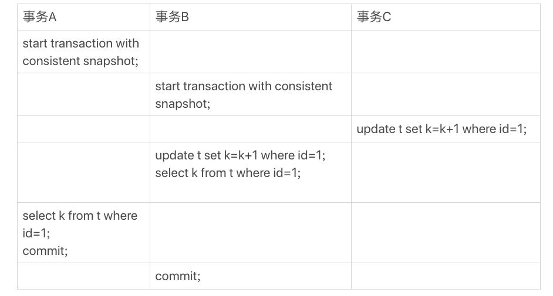

事务A查到的k的值是1，而事务B查到的k的值是3。

其实这里主要是查询和更新的区别。

在MySQL里，有两个“视图”的概念，一个是用来查询的，一个是用来更新的：

- 一个是view。它是一个用查询语句定义的虚拟表，在调用的时候执行查询语句并生成结果。创建视图的语法是create view ... ，而它的查询方法与表一样。
- 另一个是InnoDB在实现MVCC时用到的一致性读视图，即consistent read view，用于支持RC（Read Committed，读提交）和RR（Repeatable Read，可重复读）隔离级别的实现。

### “快照”在MVCC里是怎么工作的？

mysql会给每个事务生成一个唯一的事务ID——transaction id，这个id是按照时间顺序递增的。下面是一个数据的多个版本。


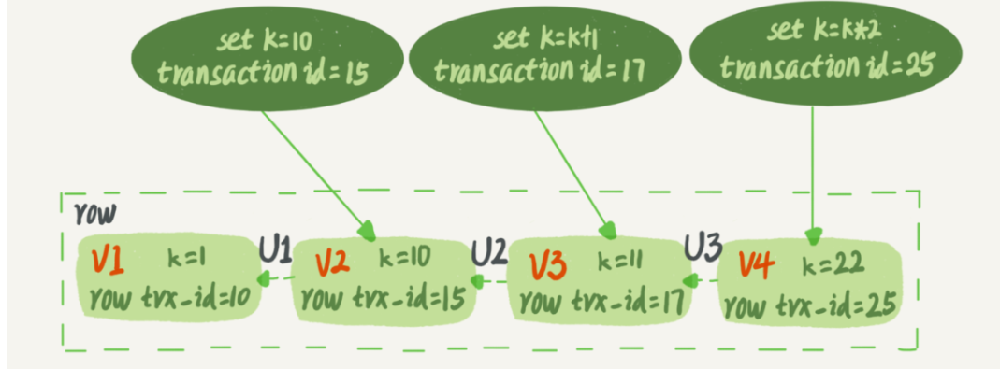

每行数据也会有多个版本，当有事务改数据的时候，会更新数据，并且更新当前数据行的row trx_id为当前事务的id,并且记录undo log，让其他事务可以得到之前的版本。现在这个数据就只有最新的值22了，如果要得到V2，就要根据undo log一步步回滚得到之前的数据。

所以事务在访问数据的时候，只要判断一下当前数据的版本，如果在自己之后的版本，就要回滚到在自己之前的版本才行。

具体是下图这个样子。


事务在启动的同时，innodb为每个事务创建了一个当前活跃的事务数组。就是中间的黄色部分。这部分表示已经创建的事务，但是还没有提交。如果一个事务比黄色部分的事务都早，那么这个事务就是已提交的事务，也就是绿色部分。同样，未开始的事务比所有的黄色部分的事务都晚，也就是红色部分。

所以每次只需要判断一下是在哪个部分

如果在黄色部分中，注意黄色部分并不是连续的，中间可能有一些已经提交了。所以判断当前事务id如果在黄色范围内，但是不在数组中，就表示是已提交的事务，可见，而如果在数组中，表示是未提交的事务改的数据，不可见。

如果红色部分，肯定不可见

绿色部分，可见。

这部分是查询的逻辑，更新和这个不一样。

### 更新逻辑

更新有这么一条规则：**更新数据都是先读后写的，而这个读，只能读当前的值，称为“当前读”（current read）。**

在更新的时候，当前读拿到的数据是(1,2)，更新后生成了新版本的数据(1,3)

除了更新操作，查询操作如果加锁也是当前读，如果把事务A的查询语句select * from t where id=1修改一下，加上lock in share mode 或 for update，也都可以读到最新版本的数据，返回的k的值是3。

对于当前读，如果读的数据被加锁了，比如一个事务在修改这条数据，还没有commit，那么当前读就只能阻塞。直到释放锁，拿到最新的数据。

### 可重复读怎么实现的？

可重复读的核心就是一致性读（consistent read）；而事务更新数据的时候，只能用当前读。如果当前的记录的行锁被其他事务占用的话，就需要进入锁等待。

而读提交的逻辑和可重复读的逻辑类似，它们最主要的区别是：

- 在可重复读隔离级别下，只需要在事务开始的时候创建一致性视图，之后事务里的其他查询都共用这个一致性视图；
- 在读提交隔离级别下，每一个语句执行前都会重新算出一个新的视图。

对于读已提交的隔离级别，事务A查询语句返回的是k=2，事务B查询结果k=3。

## 普通索引or唯一索引？

**查询过程**：假设查询的语句是select id from T where k=5。

唯一索引在查到第一个k=5的数据之后，就会停止搜索了。

而普通索引在查到第一个k=5的数据之后，还会继续查找下一条记录，直到不满足k=5。

这个搜索一条记录的影响很小，因为innodb是按数据页为单位来读写的，每个数据页的默认大小是16k。一次会读取整个数据页的数据到内存中，所以再查找下一条记录只是在内存中再搜索一次，除非当前数据是这个数据页的最后一条，那么搜索下一条需要再访问磁盘，但这个概率很小。

所以对于查询来说，两种索引性能差不多。

**更新过程**：提到更新过程的话，就要先说一下change buffer。

### change buffer

当更新一个数据的时候，如果这个数据在内存中，则可以直接在内存中更新这个数据。

如果数据不在内存中的话，为了避免去磁盘读取数据所在的数据页，innodb就先把这个操作写到change buffer中。下次查询这条数据的时候，先把数据页读到内存中，然后再执行change buffer中与这个数据页有关的操作。通过这个方式保证正确性。

change buffer虽然叫做buffer，但是其在内存中有拷贝，也会被写入到磁盘中。

将change buffer中的操作应用到原数据页，得到最新结果的过程称为merge。除了访问这个数据页会触发merge外，系统有后台线程会定期merge。在数据库正常关闭（shutdown）的过程中，也会执行merge操作。

回到前面的问题，唯一索引在更新的时候，要判断唯一性，一定要先读取数据判断之后再更新，这样change buffer就没有用了。

所以只有普通索引才可以用到change buffer。

如果更新的数据在内存中，两种索引都可以直接更新，只是唯一索引要做一下判断，没有多大差别。

而如果数据不在内存中，唯一索引要读取内存中的数据，判断是否符合唯一性。而普通索引只需要写入到change buffer中即可。

将数据从磁盘读入内存涉及随机IO的访问，是数据库里面成本最高的操作之一。所以对于更新来说，change buffer 的帮助是显著的。

### change buffer的使用场景

change buffer的使用效果最好的场景是写多读少的业务。这种业务模型常见的就是账单类、日志类的系统。

所以如果有个“历史数据”的库，就最好将唯一索引改成普通索引，因为是历史数据库，所以可以保证数据的唯一性是没有问题的。其余情况要结合自己的业务来说，如果唯一性很有必要，还是要使用唯一索引。

### change buffer 和 redo log

感觉change buffer和 redo log有点像，都是为了尽量减少随机读写。这里给一个例子来区分一下这两个概念。

假设现在执行的是这条插入语句

```sql
insert into t(id,k) values(id1,k1),(id2,k2);
```

此时，id1数据在内存中，id2数据不在内存中。整个流程是这样的：

1. 更新内存从id1的数据
2. 把id2的更新操作记录到change buffer中
3. 把上面两条操作记录到redo log中。

就是写了两处内存，然后写了一处磁盘（两次操作合在一起写了一次磁盘），而且还是顺序写的。

再看一下读的过程，id1的读取直接从内存返回就好了，id2的读取先把数据页读取到内存中，然后再应用change buffer中的操作，生成一个正确版本的数据。

## 为何会选错索引？

选择索引是优化器的工作。

而优化器选择索引的目的，是找到一个最优的执行方案，并用最小的代价去执行语句。

在数据库中，影响执行代价的因素包括，扫描行数，是否使用临时表，是否排序等因素。

### 扫描行数是怎么判断的？

扫描行数的判断是基于统计信息来估算记录数，这个统计信息就是索引的区分度。

使用show index命令可以看到一个索引上不同的值的个数，我们称之为“基数”（cardinality）。

这个值是估算出来的，InnoDB默认会选择N个数据页，统计这些页面上的不同值，得到一个平均值，然后乘以这个索引的页面数，就得到了这个索引的基数。而数据表是会持续更新的，索引统计信息也不会固定不变。所以，当变更的数据行数超过1/M的时候，会自动触发重新做一次索引统计。

但是索引统计只是一个输入，对于一个具体的语句来说，优化器还要判断，执行这个语句本身要扫描多少行。

有时候你会发现explain的结果预估的rows值跟实际情况差距比较大，这时候可以使用analyze table t 命令，来重新统计索引信息。

还有一个例子。

```sql
select * from t where (a between 1 and 1000)  and (b between 50000 and 100000) order by b limit 1;
```

这里用索引a会更好，因为扫描1000个数据之后再回表判断数据是否满足b的条件。如果用b索引，要扫描50000条数据。

但是最后又使用了b索引，因为这条语句排序是order by b，使用b索引可以避免排序，所以认为代价较小，所以使用索引b。

### 索引选择异常和处理

可以使用force index强行选择一个索引。比如前面那个语句可以改成：

```
select * from t force index（a） where (a between 1 and 1000)  and (b between 50000 and 100000) order by b limit 1;
```

但是这样写的话，索引就写死了，之后改名的话会有影响，而且如果迁移到别的数据库的时候，这个语法可能不会兼容。

第二种方法就是，我们可以考虑修改语句，引导MySQL使用我们期望的索引。

在这个例子里，显然把“order by b limit 1” 改成 “order by b,a limit 1” ，语义的逻辑是相同的。注意这里是因为limit 1结果才是相同的。

第三种方法是，在有些场景下，我们可以新建一个更合适的索引，来提供给优化器做选择，或删掉误用的索引。

## 怎么给字符串字段加索引？

我们在使用前缀索引的时候，只要定义好长度，就可以做到既节省空间，又不用额外增加太多的查询成本。

那么我们应该建立多长的索引呢？可以使用下面的语句，让区分度达到90%以上

```sql
 select count(distinct left(列名, 索引长度))/count(*) as ratio from table_name
```

看一下不同的索引长度，那个长度的区分度比较大。

还有一个要注意的问题是，如果你设置索引的时候定义了长度，就无法使用覆盖索引了。即使你的索引长度大于你数据的长度。

### 四种方式

给字符串字段加索引可以考虑使用一下四种方式：

1. 直接建立完整的索引，这样比较占空间
2. 创建前缀索引，节省空间，但是会增加扫描次数，并且不能使用覆盖索引。
3. 倒序索引，再创建前缀索引。就是将要存储的数据倒序之后再存储。用于身份证这种开头区分度不高的数据
4. 创建hash字段索引。对字段进行hash，存储hash值，需要额外的存储和计算消耗。

3，4种方法不支持范围扫描。使用hash方案的时候，由于hash值会有冲突，所以查询的时候除了要看hash值是否相同以外，还要在比较真实的数据是否相同。

## 你的SQL语句为什么变“慢”了

不知道你有没有遇到过这样的场景，一条SQL语句，正常执行的时候特别快，但是有时也不知道怎么回事，它就会变得特别慢，并且这样的场景很难复现，它不只随机，而且持续时间还很短。

平时执行很快的更新操作，其实就是在写内存和日志，而MySQL偶尔“抖”一下的那个瞬间，可能就是在刷脏页（flush）。

### 脏页

当内存数据页跟磁盘数据页内容不一致的时候，我们称这个内存页为“脏页”。内存数据写入到磁盘后，内存和磁盘上的数据页的内容就一致了，称为“干净页”。

当更新的时候，只是改了一下内存的数据，磁盘的数据没有更新。这种内存和磁盘的数据不一致就叫脏页。所以有时候你的操作会触发flush，刷脏页的时候会有抖动。

### flush的时机

那么什么时候会出现flush呢？有四种情况：

1. 就是innodb的redo log满了，这时候需要更新check point指针，将记录的操作应用到磁盘的数据中。
2. 内存满了。内存满了之后需要淘汰掉最旧的数据页，如果淘汰的数据页是脏页，则会先flush之后再将其淘汰。你可能会想直接淘汰就好了，下次拿数据直接根据redo log生成正确的数据就好了。其实从性能考虑，每次flush一下效率会更高。
3. mysql会在系统不忙的时候进行flush，即使是很忙的时候，也会见缝插针地刷一点脏页。
4. 正常关闭的时候，会把内存的脏页都flush到磁盘。

四种情况对性能的影响。首先第三种是在不忙的时候进行的，不会影响性能，第四种情况是在关机的时候进行的，也不会影响到性能。主要是第一和第二种情形。

redo log满了的情况，所有的更新操作都被阻塞了，这是一定要避免的。

第二种内存满了的情况是常见的，因为innodb使用缓冲池（buffer pool）管理内存。InnoDB的策略是优先使用内存，所以淘汰脏页，或者查询操作查到的数据就是在脏页的时候，都会触发flush。

所以，innodb要控制脏页的比例来避免上面的两种情况。

### InnoDB刷脏页的控制策略

首先，你要正确地告诉InnoDB所在主机的IO能力。用到innodb_io_capacity这个参数了，它会告诉InnoDB你的磁盘能力。如果你的磁盘是ssd，这个数值可以设置得大一些，如果是机械硬盘就要设置小一点。

InnoDB的刷盘速度主要参考两个因素：一个是脏页比例，一个是redo log写盘速度。

参数innodb_max_dirty_pages_pct是脏页比例上限，默认值是75%。innodb会根据脏页比例和redo log的写盘速度来控制刷页的速度。

还有一个有趣的策略。在准备刷一个脏页的时候，如果这个数据页旁边的数据页刚好是脏页，就会把这个“邻居”也带着一起刷掉，如果邻居的邻居也是脏页，也会拖下水。

在InnoDB中，innodb_flush_neighbors 参数就是用来控制这个行为的，值为1的时候会有上述的“连坐”机制，值为0时表示不找邻居，自己刷自己的。使用的是SSD这类IOPS比较高的设备的话，我就建议你把innodb_flush_neighbors的值设置成0

在MySQL 8.0中，innodb_flush_neighbors参数的默认值已经是0了。

## 为什么删除一半数据，表文件大小不变？

表数据既可以存在共享表空间里，也可以是单独的文件。这个行为是由参数innodb_file_per_table控制的：MySQL 5.6.6版本开始，它的默认值就是ON了。这个参数设置为ON表示的是，每个InnoDB表数据存储在一个以 .ibd为后缀的文件中。所以我们都是以这个为前提说的。

### 数据删除流程

mysql的数据都是以B+树的结构存储的。假设我们要删除一个数据，mysql只会将这个节点的位置标记为已删除，并不会实际删除空间，之后如果有数据正好可以放到这个位置，就直接放进去，将标记为已删除的数据覆盖。

只是删除一个数据，如果删除整个数据页呢？那整个数据页就可以复用了，但是磁盘大小不会变，而且不像单独删除一个数据，只能有特定的数据才可以放在这个位置。如果整个数据页被删除，当一个数据需要新页的时候，可以复用这一页。

如果相邻的两个数据页利用率都很小，系统就会把这两个页上的数据合到其中一个页上，另外一个数据页就被标记为可复用。

所以delete语句只是会把相应的位置标记为已删除，磁盘大小不会变化。这个可以复用，但是还没有使用的空间就叫做“空洞”。

**不止是删除数据会造成空洞，插入数据也会。**

如果索引是紧凑的，插入数据会造成分页，每页都会有空洞存在。

另外，更新索引上的值，可以理解为删除一个旧的值，再插入一个新值。不难理解，这也是会造成空洞的。

那么怎样才可以减少数据占用的空间呢？答案就是重建表。

### 重建表

如果要把A表的空洞去掉，可以建一个临时表B，然后把A的数据一个一个放入到B中，完成之后用B代替A了，把A表删除。

但是如果再重建的时候有人对A表进行操作，就没法进行了。所以可以想个办法解决这个问题。

**MySQL 5.6版本开始引入的Online DDL，对这个操作流程做了优化。**

根据A表的数据生成B+树，放到临时文件中，在这个过程中，把所有对A表的操作记录到一个日志文件中（row log）。临时文件生成后，在将日志中的操作应用到临时文件中，得到一个逻辑数据和表A一样的数据文件，用临时文件替换掉A表的数据文件。

不过要注意，重建方法都会扫描原表数据和构建临时文件。对于很大的表来说，这个操作是很消耗IO和CPU资源的。因此，如果是线上服务，你要很小心地控制操作时间。如果想要比较安全的操作的话，我推荐你使用GitHub开源的gh-ost来做。

### 三种方式重建表的区别

optimize table、analyze table和alter table这三种方式重建表的区别。

- 从MySQL 5.6版本开始，alter table t engine = InnoDB（也就是recreate）默认的就是Online DDL，也就是提到的后一种操作
- analyze table t 其实不是重建表，只是对表的索引信息做重新统计，没有修改数据，这个过程中加了MDL读锁；
- optimize table t 等于recreate+analyze，就是等于前面两种方法的结合。

## count(*)

### count(*)的实现方式

你首先要明确的是，在不同的MySQL引擎中，count(*)有不同的实现方式。

- MyISAM引擎把一个表的总行数存在了磁盘上，因此执行count(*)的时候会直接返回这个数，效率很高；
- 而InnoDB引擎就麻烦了，它执行count(*)的时候，需要把数据一行一行地从引擎里面读出来，然后累积计数。

不过这里是不加where的count，如果有where语句，MyISAM引擎也没法这么快。

为什么innodb需要每一行读取呢？因为mvcc的关系，每一样记录都要判断是否对当前事务可见。所以数据量越多的表，count的速度就越慢了。

不过count(*)还是有做了优化的，因为innodb是索引组织表，主键索引树的值是完整数据，普通索引的值是主键，对于count的操作，遍历任一索引树都是一样的，所以会选择最小的那棵树来遍历，也就是会选择普通索引遍历。

如果你用过show table status 命令的话，就会发现这个命令的输出结果里面也有一个TABLE_ROWS用于显示这个表当前有多少行，这个命令执行挺快的，那这个TABLE_ROWS能代替count(*)吗？

其实这个值也是通过采样来的，方文档说误差可能达到40%到50%。**所以，show table status命令显示的行数也不能直接使用。**

### 用缓存系统保存计数

那么如果有需求是要经常查询当前的数据总数呢？答案是只能自己计数。

如果我们使用redis计数，每次插入一条数据，就在redis计数加一。但是这是在两个数据存储结构中，要保证其原子性比较难，需要使用分布式事务来保证。所以为了避免这个问题，就不用redis计数，而是都放在mysql中。

操作还是一样的，但是由于innodb支持事务，可以很好解决一致性的问题。

### 不同的count用法

count(*)、count(主键id)、count(1)还有count(字段)的区别

count(*)、count(主键id)和count(1) 都表示返回满足条件的结果集的总行数；而count(字段），则表示返回满足条件的数据行里面，参数“字段”不为NULL的总个数。

**对于count(主键id)来说**，InnoDB引擎会遍历整张表，把每一行的id值都取出来，返回给server层。server层拿到id后，判断是不可能为空的，就按行累加。

**对于count(1)来说**，InnoDB引擎遍历整张表，但不取值。server层对于返回的每一行，放一个数字“1”进去，判断是不可能为空的，按行累加。

单看这两个用法的差别的话，你能对比出来，count(1)执行得要比count(主键id)快。因为从引擎返回id会涉及到解析数据行，以及拷贝字段值的操作。

**对于count(字段)来说**：

1. 如果这个“字段”是定义为not null的话，一行行地从记录里面读出这个字段，判断不能为null，按行累加；
2. 如果这个“字段”定义允许为null，那么执行的时候，判断到有可能是null，还要把值取出来再判断一下，不是null才累加。

也就是前面的第一条原则，server层要什么字段，InnoDB就返回什么字段。

**但是count(\*)是例外**，并不会把全部字段取出来，而是专门做了优化，不取值。count(*)肯定不是null，按行累加。

按照效率排序的话，count(字段)<count(主键id)<count(1)≈count(*)，所以我建议你，尽量使用count(\*)。

## order by是怎么工作的？

假如你的sql语句是这么写的

```sql
select city,name,age from t where city='杭州' order by name limit 1000  ;
```

用explain查看一下这条语句，可以看到Extra这个字段中有“Using filesort”。表示需要排序。

mysql会给每个线程分配一块内存用于排序，称为sort_buffer。如果sort_buffer的大小不够用的话，会利用磁盘文件辅助排序。

外部排序是用归并排序，mysql将需要的数据分成N份，每一份数据单独排序好后，再将这N份数据合并一个有序的大文件。这里我们是可以查询到使用了多少个文件来辅助排序的。

排序的方法有两种：全字段排序和rowid排序

如果查询的字段不多，就会把所有的字段放在sort_buff中进行排序，如果查询的字段很多，一行的数据就很大，为了排序的行可以多一点，少用一些外部文件，就会使用rowid排序，只放主键和排序的字段。

### 全字段排序

还是那前面的例子描述一下这个过程。

```sql
select city,name,age from t where city='杭州' order by name limit 1000  ;
```

1. 这个过程首先初始化sort_buffer,里面就放上我们需要的三个字段city,name,age。

2. 然后根据索引找到第一个符合city=杭州的主键id，回表拿到三个字段放到sort_buffer中。

3. 接着遍历下一条数据，直到所有满足的数据都放到sort_buffer中。
4. 然后对sort_buffer中的数据做快速排序。
5. 最后将结果集里的1000条返回。

### rowid排序

我们这里只查找了三个字段的数据，如果查找很多个字段的数据，mysql就会使用rowid排序的方法。

max_length_for_sort_data，是MySQL中专门控制用于排序的行数据的长度的一个参数。它的意思是，如果单行的长度超过这个值，MySQL就认为单行太大，要换一个算法。

步骤类似，只是最后需要再回表查询需要的字段数据。

1. 初始化sort_buffer,只需要放排序的字段和主键id。
2. 根据索引city查到第一个满足的数据的主键id，回表拿到排序的字段(name)和id，放到sort_buffer
3. 根据索引继续查询剩下的数据，直到把所有的数据放到sort_buffer中。
4. 对sort_buffer中的数据按照name排序。
5. 根据排序结果，取出前1000行的id值，到原表中取出所有需要的字段返回客户端。

可以看到排序是个成本比较高的操作，那么有什么办法可以避免排序呢？如果我们根据索引拿到的数据就是有序的，就没必要排序了。

### 使用索引优化

对于我们这个例子，可以创建city和name的联合索引

```sql
alter table t add index city_user(city, name);
```

这样就可以直接根据索引的主键id，查原表，一行一行的返回给客户端，返回的数据就是有序的。

那么还可以进一步优化吗？

我们可以利用覆盖索引，创建一个city、name和age的联合索引，这样就不用回表查了，遍历索引就可以直接返回了。

当然，这里并不是说要为了每个查询能用上覆盖索引，就要把语句中涉及的字段都建上联合索引，毕竟索引还是有维护代价的。这是一个需要权衡的决定。

## 无法使用索引的情况

如果sql语句使用不当，可能会造成很大的性能损失。

### 条件字段函数操作

如果一张表有一个修改时间的字段，并且这个字段有索引。如果你想统计所有年份的7月数据，可能会用下面这个语句。

```sql
select count(*) from tradelog where month(t_modified)=7;
```

但是这个语句没办法用到索引。因为这个字段的索引都是2018-1-1，2019-1-1这种形式，如果只取了月份，前面这个索引就都是1月，mysql根据1根本无法找到索引。

这里说的没法用到索引指的是：没法使用索引的快速搜索功能，只能一个一个遍历。其实你explain后会发现它还是会使用t_modified这个索引。因为使用这个索引会比使用主键索引更好一点。

我们说虽然只是说month函数无法用到索引，但是实际上mysql“偷懒了”，只要所有对索引的操作都无法使用索引。比如where id - 1 = 2也是无法使用索引快速定位的，所以你需要改成where id = 3才可以。

### 隐式类型转换

再来看看这条语句

```sql
select * from tradelog where tradeid=110717;
```

tradeid是varchar类型的。mysql中，字符串和数字比较的时候，会默认把字符串转化成数字进行比较。

所以前面这条语句对于优化器来说，相当于：

```sql
select * from tradelog where  CAST(tradid AS signed int) = 110717;
```

所以，对于这条语句，是需要对索引字段进行操作的，也是无法使用索引快速定位的功能。

那另一种情况呢？

```sql
select * from tradelog where id = "23424";
```

id是数字类型，对于这个语句，mysql会将字符串“23424”转成数字类型，所以不需要对索引进行操作，可以用到索引。

### 隐式字符编码转换

如果两张表的字符编码不一样，比如一张表trade_detail是CHARSET=utf8，另一张表tradelog是utf8mb4。

```sql
select d.* from tradelog l, trade_detail d where d.tradeid=l.tradeid and l.id=2; 
```

对于这条语句，首先会使用log表的主键id拿到这行数据的tradeid，再在trade_detail表里查找tradeid相等的行。

但是这个操作没有使用detail表里面的tradeid索引。

这个执行计划里，是从tradelog表中取tradeid字段，再去trade_detail表里查询匹配字段。因此，我们把tradelog称为驱动表，把trade_detail称为被驱动表，把tradeid称为关联字段。

在被驱动表trade_detail里，执行的语句可以看成这样

```sql
select * from trade_detail where tradeid=$L2.tradeid.value; 
```

detail表的字符集是utf8，=后面是tradelog表的数据，字符集是utf8mb4。

因为utf8mb4字符集是utf8的超集，所以在进行比较的时候，会把utf8转化成utf8mb4。

所以实际上等同于这个语句

```sql
select * from trade_detail  where CONVERT(traideid USING utf8mb4)=$L2.tradeid.value; 
```

可以看到这里也是对索引进行了操作，所以也没法使用到索引。

那如果把这两张表的顺序换一下呢？

```sql
select l.operator from tradelog l , trade_detail d where d.tradeid=l.tradeid and d.id=4;
```

这样子最后的语句就差不多变成这样

```sql
select operator from tradelog  where traideid =CONVERT($R4.tradeid.value USING utf8mb4); 
```

可以看到这里是对输入的参数进行转化，所以可以用上索引。

所以对于字符集编码不一样的字段，我们可以把字符编码改成一样，不然就改sql语句，可以这么改

```sql
select d.* from tradelog l , trade_detail d where d.tradeid=CONVERT(l.tradeid USING utf8) and l.id=2; 
```

## 查询特别慢的原因

但有些情况下，“查一行”，也会执行得特别慢。

### 查询长时间不返回

#### 等MDL锁

使用show processlist命令查看Waiting for table metadata lock

出现**这个状态表示的是，现在有一个线程正在表t上请求或者持有MDL写锁，把select语句堵住了。**

处理方法就是找到谁持有MDL写锁，然后把它kill掉。

#### 等flush

MySQL里面对表做flush操作的用法，一般有以下两个：

```sql
flush tables t with read lock;

flush tables with read lock;
```

这两个flush语句，如果指定表t的话，代表的是只关闭表t；如果没有指定具体的表名，则表示关闭MySQL里所有打开的表。

但是正常这两个语句执行起来都很快，除非它们也被别的线程堵住了。

所以，出现Waiting for table flush状态的可能情况是：有一个flush tables命令被别的语句堵住了，然后它又堵住了我们的select语句。

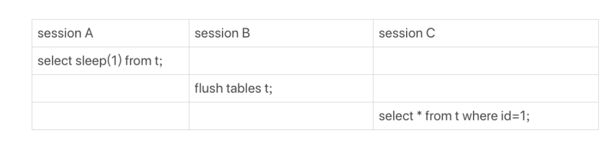

在session A中，我故意每行都调用一次sleep(1)，这样这个语句默认要执行10万秒，在这期间表t一直是被session A“打开”着。然后，session B的flush tables t命令再要去关闭表t，就需要等session A的查询结束。这样，session C要再次查询的话，就会被flush 命令堵住了。

使用show processlist命令，可以看到Waiting for table flush的状态。

#### 等行锁

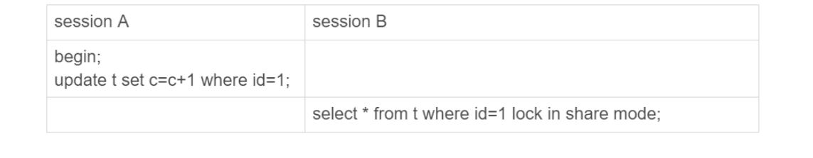

由于访问id=1这个记录时要加读锁，如果这时候已经有一个事务在这行记录上持有一个写锁，我们的select语句就会被堵住。

显然，session A启动了事务，占有写锁，还不提交，是导致session B被堵住的原因。

这个问题并不难分析，但问题是怎么查出是谁占着这个写锁。如果你用的是MySQL 5.7版本，可以通过sys.innodb_lock_waits 表查到。

查询方法是：

```sql
mysql> select * from t sys.innodb_lock_waits where locked_table=`'test'.'t'`\G
```

查到如果是4号进程造成阻塞，使用kill 4断开这个连接。

### 查询慢

```
select * from t where c=50000 limit 1;
```

如果c没有索引，即使看起来只查询了一条语句，但实际上要扫描5万行才可以，所以会比较慢，如果这个数据量一大就更加慢了。

还有一种情况

```sql
select * from t where id=1；
```

看起来这个语句只扫描了一行，但是执行时间却有800多毫秒，原因是什么呢？

而如果执行下面这个语句，执行时间却只要0.2毫秒就可以了

```sql
select * from t where id=1 lock in share mode
```

这两个语句的区别在于加了读锁之后，就是当前读了，而没有读锁，就会去读取属于自己的版本，如果在这个过程中，经过了很多更新，版本回滚的时候就需要很长时间。

具体情况是这样的

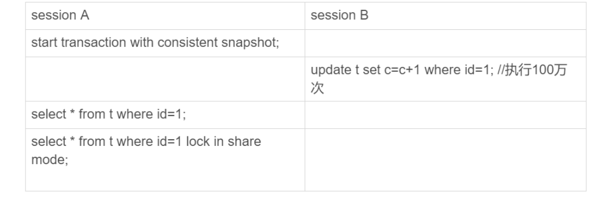

session A先用start transaction with consistent snapshot命令启动了一个事务，之后session B才开始执行update 语句。

session B执行完100万次update语句后，id=1这一行处于什么状态呢？你可以从下图中找到答案。

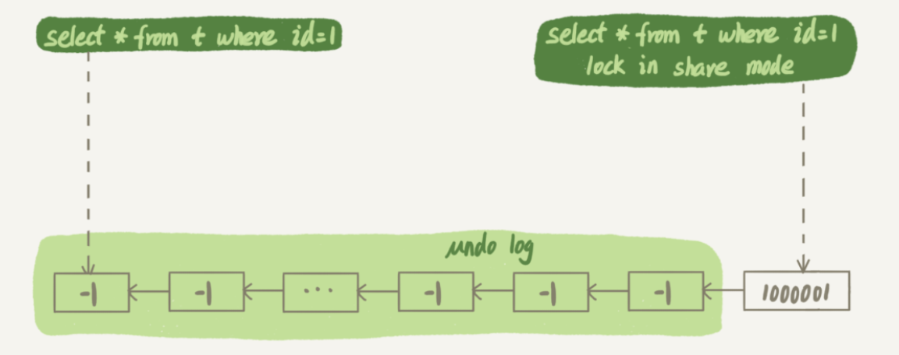

session B更新完100万次，生成了100万个回滚日志(undo log)。

带lock in share mode的SQL语句，是当前读，因此会直接读到1000001这个结果，所以速度很快；而select * from t where id=1这个语句，是一致性读，因此需要从1000001开始，依次执行undo log，执行了100万次以后，才将1这个结果返回。

注意，undo log里记录的其实是“把2改成1”，“把3改成2”这样的操作逻辑，画成减1的目的是方便你看图。

## 幻读

幻读指的是一个事务在前后两次查询同一个范围的时候，后一次查询看到了前一次查询没有看到的行。

### 如何解决幻读？

我们知道有行锁，但是即使把所有数据都加上行锁也无法解决幻读问题，因为数据是新加进来的。

为了解决这个问题，innodb只好引入新的锁，也就是间隙锁（Gap Lock）

间隙锁，锁的就是两个值之间的空隙。如果一张表初始化插入了6个记录，这就产生了7个间隙。


0，5，10......就是6条数据，下面的方格就是间隙锁。

select * from t where d=5 for update的时候，就不止是给数据库中已有的6个记录加上了行锁，还同时加了7个间隙锁。这样就确保了无法再插入新的记录。

我们知道行锁之前是锁与锁之前发生竞争。

但是间隙锁之前是不冲突的，如果一个查询操作给（5，10）上了间隙锁，另一个查询操作也是需要这个间隙锁，他们之间是不会发生阻塞的。只有在“往这个间隙插入数据”的时候，才会发生阻塞。

但是**间隙锁的引入，可能会导致同样的语句锁住更大的范围，这其实是影响了并发度的**

比如有个逻辑，要先后执行下面两条语句

```
/*如果行不存在*/
insert into t values(N,N,N);
/*如果行存在*/
update t set d=N set id=N;
```

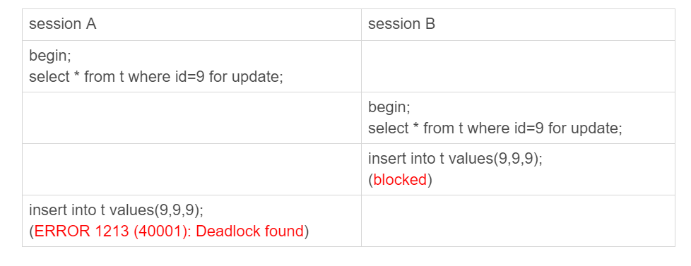

1. session A 执行select ... for update语句，由于id=9这一行并不存在，因此会加上间隙锁(5,10);
2. session B 执行select ... for update语句，同样会加上间隙锁(5,10)，间隙锁之间不会冲突，因此这个语句可以执行成功；
3. session B 试图插入一行(9,9,9)，被session A的间隙锁挡住了，只好进入等待；
4. session A试图插入一行(9,9,9)，被session B的间隙锁挡住了。

至此，两个session进入互相等待状态，形成死锁。当然，InnoDB的死锁检测马上就发现了这对死锁关系，让session A的insert语句报错返回了。

前面提到了，间隙锁是在可重复读的隔离级别下才有的。如果使用的是读提交的话，就不会有间隙锁了。

有些公司使用的是读提交隔离级别加binlog_format=row的组合，如果读提交隔离级别够用，也就是说，业务不需要可重复读的保证，这样考虑到读提交下操作数据的锁范围更小（没有间隙锁），这个选择是合理的。

## 加锁规则

因为间隙锁在可重复读隔离级别下才有效，所以本篇文章接下来的描述，若没有特殊说明，默认是可重复读隔离级别。

这部分很多很细，偷懒只是记录一下。**详情看21讲**。

**我总结的加锁规则里面，包含了两个“原则”、两个“优化”和一个“bug”。**需要注意的是，innodb锁是加在索引上面的。

1. 原则1：加锁的基本单位是next-key lock，next-key lock是前开后闭区间。
2. 原则2：查找过程中访问到的对象才会加锁。
3. 优化1：索引上的等值查询，给唯一索引加锁的时候，next-key lock退化为行锁。
4. 优化2：索引上的等值查询，向右遍历时且最后一个值不满足等值条件的时候，next-key lock退化为间隙锁。
5. 一个bug：唯一索引上的范围查询会访问到不满足条件的第一个值为止。

## “饮鸩止渴”提高性能的方法

### 短连接风暴

短连接模式就是连到数据库之后只执行很少的sql语句之后就断开连接。在高峰时期，就可能产生了很多连接。

如果超过了max_connections参数设置的数值，就会报错提示“Too many connections”。从业务角度来看就是不可用的情况。

可能第一时间想到调大max_connections参数，但是本来这个参数就是为了保护系统，如果改得太大，出现很多连接的话，可能很多资源都消耗在权限验证上面了，结果没有多余的cup资源去执行sql请求了。

所以可以考虑其他方法，这里有两个建议：

第一种方法：先处理掉那些占着连接但是不工作的线程

使用show processlist可以看到有些线程处于sleep状态。但是sleep状态并不表示就可以安全关闭。因为有些sleep仍然处于事务中，所以要优先关闭那些处于事务外空闲的连接。如果还是有压力，再关闭事务内空闲太久的连接。

如果判断是否在事务内呢？你可以查information_schema库的innodb_trx表。但是需要注意业务方面要处理断开连接的情况，因为如果客户端处于sleep状态，如果把服务端把连接断开的话，客户端不会马上知道，直到下一次请求的时候，才会报未连接。但是如果客户端没有对未连接处理，一直使用不能用的句柄重试查询这个请求，从客户端方面看上去，就好像“mysql一直没有恢复“。

第二种方法：减少连接中的损耗。可以跳过权限验证，但是这种方法不推荐。

### 慢查询性能问题

在MySQL中，会引发性能问题的慢查询，大体有以下三种可能：

1. 索引没有设计好；
2. SQL语句没写好；
3. MySQL选错了索引。

第一种情况，索引没有设计好，自从mysql5.6版本后，创建索引都支持Online DDL。

第二种情况，语句没有写好。我们可以通过改写SQL语句来处理。MySQL 5.7提供了query_rewrite功能，可以把输入的一种语句改写成另外一种模式。

第三种情况，选错了索引。应急方案就是给这个语句加上force index。当然也可以重写sql语句来增加force index。

### QPS突增问题

QPS，Queries-per-second，每秒查询率

有时候由于业务突然出现高峰，或者应用程序bug，导致某个语句的QPS突然暴涨，也可能导致MySQL压力过大，影响服务。

对于bug造成的，最好的方法就是下掉这个服务。而对于服务端，可以先将这个服务的白名单去掉。

如果这个新功能使用的是单独的数据库用户，可以用管理员账号把这个用户删掉，然后断开现有连接。这样，这个新功能的连接不成功，由它引发的QPS就会变成0。

还可以使用sql语句重写，来将SQL语句直接重写成"select 1"返回。但是这个方法的风险比较大，一种可能会造成误伤，把其他sql也重写了。还有很多业务并不是靠这一条sql语句完成的，如果这条返回结果有问题的话，会影响后面的业务逻辑。

## MySQL是怎么保证数据不丢的（弃坑）

只要redo log和binlog保证持久化到磁盘，就能确保MySQL异常重启后，数据可以恢复。

### binlog的写入机制

binlog的写入逻辑比较简单：事务执行过程中，先把日志写到binlog cache，事务提交的时候，再把binlog cache写到binlog文件中。

一个事务的binlog是不能被拆开的，因此不论这个事务多大，也要确保一次性写入。

系统给binlog cache分配了一片内存，每个线程一个，参数 binlog_cache_size用于控制单个线程内binlog cache所占内存的大小。如果超过了这个参数规定的大小，就要暂存到磁盘。

事务提交的时候，执行器把binlog cache里的完整事务写入到binlog中，并清空binlog cache。

每个线程有自己binlog cache，但是共用同一份binlog文件。

write操作把日志写入到文件系统的page cache，并没有把数据持久化到磁盘，所以速度比较快。

fsync才是将数据持久化到磁盘的操作。一般情况下，我们认为fsync才占磁盘的IOPS。

write 和fsync的时机，是由参数sync_binlog控制的，可以控制是积攒几个write才去进行fsync持久化操作。

### redo log的写入机制

事务在执行过程中，生成的redo log是要先写到redo log buffer。


## 24讲MySQL是怎么保证主备一致的（弃坑）

### MySQL主备的基本原理


图中，包含了前面讲到的binlog和redo log的写入机制相关的内容，可以看到：主库接收到客户端的更新请求后，执行内部事务的更新逻辑，同时写binlog。

备库B跟主库A之间维持了一个长连接。主库A内部有一个线程，专门用于服务备库B的这个长连接。一个事务日志同步的完整过程是这样的：

1. 在备库B上通过change master命令，设置主库A的IP、端口、用户名、密码，以及要从哪个位置开始请求binlog，这个位置包含文件名和日志偏移量。
2. 在备库B上执行start slave命令，这时候备库会启动两个线程，就是图中的io_thread和sql_thread。其中io_thread负责与主库建立连接。
3. 主库A校验完用户名、密码后，开始按照备库B传过来的位置，从本地读取binlog，发给B。
4. 备库B拿到binlog后，写到本地文件，称为中转日志（relay log）。
5. sql_thread读取中转日志，解析出日志里的命令，并执行。

### binlog的三种格式对比

binlog有两种格式，一种是statement，一种是row。可能你在其他资料上还会看到有第三种格式，叫作mixed，其实它就是前两种格式的混合。

### 循环复制问题

## 34讲到底可不可以使用join

1. 我们DBA不让使用join，使用join有什么问题呢？
2. 如果有两个大小不同的表做join，应该用哪个表做驱动表呢？

首先对于这么一个语句：

```sql
select * from t1 straight_join t2 on (t1.a=t2.b);
```

因为join/left join/right join，优化器会判断是哪张表驱动，这取决于优化器，所以使用straight_join。

这样，t1表示驱动表，t2表示被驱动表。这点要先搞清楚。

对于第一个问题：使用join有问题吗？

如果可以使用被驱动表的索引，join语句还是有其优势的；不能使用被驱动表的索引，只能使用Block Nested-Loop Join算法，这样的语句就尽量不要使用。

所以你在判断要不要使用join语句时，就是看explain结果里面。如果发现Extra字段里面出现“Block Nested Loop”字样就不用使用join了。

第二个问题：有两个大小不同的表做join，应该用哪个表做驱动表呢？

使用join的时候，应该让小表做驱动表。

那么什么才叫做**小表**呢？

假设表1有100条数据，表2有50条数据。

```sql
select * from t1 straight_join t2 on (t1.b=t2.b) where t2.id<=50;
select * from t2 straight_join t1 on (t1.b=t2.b) where t2.id<=50;
```

对于语句一，会把t1的100条数据放到join_buffer中，然后把t2中的每一行取出来和join_buffer中的数据做对比，符合的结果就返回。

而对于语句二，会把t2的50条数据放到join_buffer中，再进行其他操作。

这里默认前提是被驱动表都能用到索引。

所以，第二条语句只取了50条，第一条语句取了100条，所以第二种语句才算是使用小表做驱动表。

但是如果数据都是100条，因为t1的全部数据也只有100条：

```sql
select t1.b,t2.* from  t1  straight_join t2 on (t1.b=t2.b) where t2.id<=100;
select t1.b,t2.* from  t2  straight_join t1 on (t1.b=t2.b) where t2.id<=100;
```

但是语句一只需要把100条t1的b字段放入join_buffer，而语句二要把100条表t2的所有字段放入join_buffer中，所以这里t1作为驱动表才会小表。

## 39讲自增主键为什么不是连续的

知道自增主键有可能出现不是连续的情况。因为如果多个事务插入的话，一个事务回滚，那么自增主键也要退回，这样自增主键的效率就比较差了，所以就允许主键出现“空洞”。

