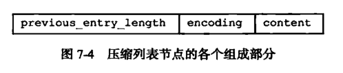

# Redis基础数据结构

## 简单动态字符串(SDS)

sds其实是个存有长度的char数组

### SDS的定义

每个sds.h/sdshdr结构表示一个SDS值：

```c
struct sdshdr {

    // 记录 buf 数组中已使用字节的数量, 不包括 '\0' 的长度
    // 等于 SDS 所保存字符串的长度
    int len;

    // 记录 buf 数组中未使用字节的数量
    int free;

    // 字节数组，用于保存字符串
    char buf[];

};
```

free表示这个SDS未使用的空间大小。

len表示这个SDS已使用的空间大小。

buf是一个char类型的数组。

SDS遵循C字符串以空字符结尾的惯例，保存的空字符不算在len属性中。添加空字符到末尾的操作都是SDS函数自动完成的，也就是说这个空字符串对于SDS使用者来说是完全透明的。

## 双端链表

链表节点：

```c
typedef  struct listNode{
       //前置节点
       struct listNode *prev;
       //后置节点
       struct listNode *next;
       //节点的值
       void *value;  
}listNode
```

还提供了操作链表的结构：

```c
typedef struct list{
     //表头节点
     listNode *head;
     //表尾节点
     listNode *tail;
     //链表所包含的节点数量
     unsigned long len;
     //节点值复制函数
     void (*free) (void *ptr);
     //节点值释放函数
     void (*free) (void *ptr);
     //节点值对比函数
     int (*match) (void *ptr,void *key);
}list;
```

包含头尾指针，链表的数量。复制，释放，对比函数

头尾的节点都指向null，对链表的访问都以null为终点。

## 字典

Redis 的字典使用哈希表作为底层实现，结构和java的hashMap类似：


哈希表结构定义：

```c
typedef struct dictht{
     //哈希表数组
     dictEntry **table;
     //哈希表大小
     unsigned long size;
     //哈希表大小掩码，用于计算索引值
     //总是等于 size-1
     unsigned long sizemask;
     //该哈希表已有节点的数量
     unsigned long used;
}dictht
```

哈希表是由数组 table 组成，table 中每个元素都是指向 dict.h/dictEntry 结构，dictEntry 结构定义如下：

```c
typedef struct dictEntry{
     //键
     void *key;
     //值
     union{
          void *val;
          uint64_tu64;
          int64_ts64;
     }v;
 
     //指向下一个哈希表节点，形成链表
     struct dictEntry *next;
}dictEntry
```

## 跳跃表


跳表的节点：

```c
typedef struct zskiplistNode {
     //层
     struct zskiplistLevel{
           //前进指针
           struct zskiplistNode *forward;
           //跨度
           unsigned int span;
     }level[];
 
     //后退指针
     struct zskiplistNode *backward;
     //分值
     double score;
     //成员对象
     robj *obj;
 
} zskiplistNode
```

多个跳跃表节点构成一个跳跃表：包含

```c
typedef struct zskiplist{
     //表头节点和表尾节点
     structz skiplistNode *header, *tail;
     //表中节点的数量
     unsigned long length;
     //表中层数最大的节点的层数
     int level;
 
}zskiplist;
```


## 整数集合

整数集合（intset）是Redis用于保存整数值的集合抽象数据类型，它可以保存类型为int16_t、int32_t 或者int64_t 的整数值，并且保证集合中不会出现重复元素。

```c
typedef struct intset{
     //编码方式
     uint32_t encoding;
     //集合包含的元素数量
     uint32_t length;
     //保存元素的数组
     int8_t contents[];
 
}intset;
```

整数集合的每个元素都是 contents 数组的一个数据项，**它们按照从小到大的顺序排列，并且不包含任何重复项。**

length 属性记录了 contents 数组的大小。

需要注意的是虽然 contents 数组声明为 int8_t 类型，但是实际上contents 数组并不保存任何 int8_t 类型的值，其真正类型有 encoding 来决定。

## 压缩列表

　　压缩列表（ziplist）是Redis为了节省内存而开发的，是由一系列特殊编码的连续内存块组成的顺序型数据结构，一个压缩列表可以包含任意多个节点（entry），每个节点可以保存一个字节数组或者一个整数值。

　　**压缩列表的原理：压缩列表并不是对数据利用某种算法进行压缩，而是将数据按照一定规则编码在一块连续的内存区域，目的是节省内存。**




1. **previous_entry_ength：**记录压缩列表前一个字节的长度。previous_entry_ength的长度可能是1个字节或者是5个字节，如果上一个节点的长度小于254，则该节点只需要一个字节就可以表示前一个节点的长度了，如果前一个节点的长度大于等于254，则previous length的第一个字节为254，后面用四个字节表示当前节点前一个节点的长度。利用此原理即当前节点位置减去上一个节点的长度即得到上一个节点的起始位置，压缩列表可以从尾部向头部遍历。这么做很有效地减少了内存的浪费。

2. **encoding**：节点的encoding保存的是节点的content的内容类型以及长度，encoding类型一共有两种，一种字节数组一种是整数，encoding区域长度为1字节、2字节或者5字节长。

3. **content**：content区域用于保存节点的内容，节点内容类型和长度由encoding决定。