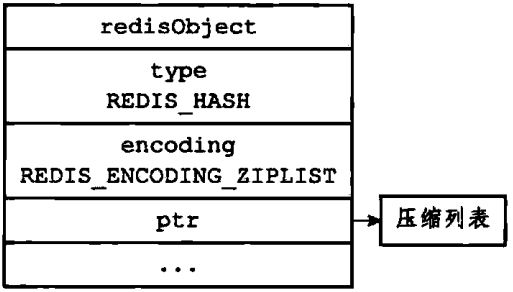
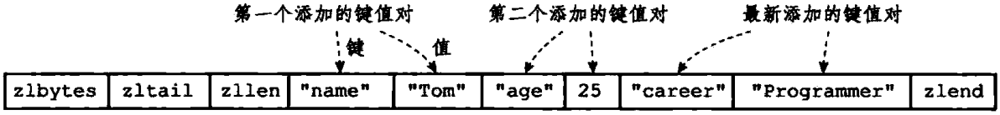
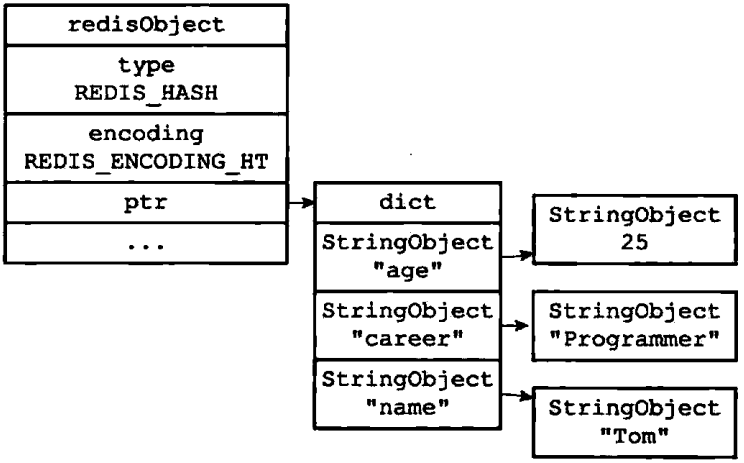
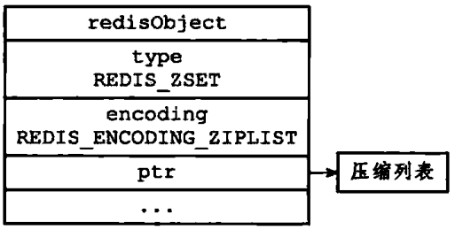
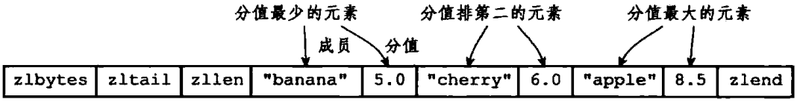
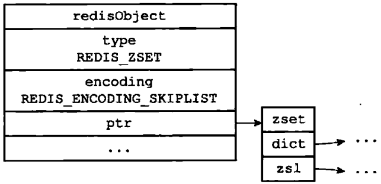
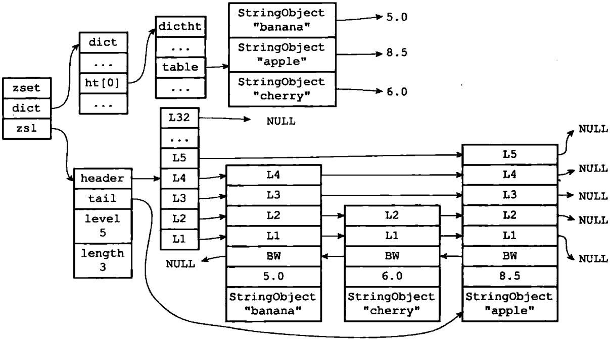

# Redis对象

## 对象的类型和编码

Redis使用对象来表示数据库中的键和值，每次当我们在Redis的数据库中新创建一个键值对时，我们至少会创建两个对象，一个对象用作键值对的键（键对象），另一个对象用作键值对的值（值 对象）

Redis中的每个对象都由一个redisObject结构表示，该结构中保存数据相关的三个属性分别是：type、encoding、ptr

```c
typedef struct redisObject {
    //类型
    unsigned type:4;
    unsigned notused:2; 
    //编码
    unsigned encoding:4;
    unsigned lru:22; 
    //引用计数
    int refcount;
    //指向底层实现数据结构的指针
    void *ptr;
} robj;
```

类型pyte表示是五种对象中的哪一个，编码encoding表示底层是使用哪种数据结构

**对象的编码**

| 编码常量                  | 编码所对应的底层数据结构   |
| ------------------------- | -------------------------- |
| REDIS_ENCODING_INT        | long类型的整数             |
| REDIS_ENCODING_EMBSTR     | embstr编码的简单动态字符串 |
| REDIS_ENCODING_RAW        | 简单动态字符串             |
| REDIS_ENCODING_HT         | 字典                       |
| REDIS_ENCODING_LINKEDLIST | 双端链表                   |
| REDIS_ENCODING_ZIPLIST    | 压缩列表                   |
| REDIS_ENCODING_INTSET     | 整数集合                   |
| REDIS_ENCODING_SKIPLIST   | 跳跃表和字典               |

## 字符串对象

字符串对象的编码可以是int、raw或者embstr。

如果一个字符串对象保存的是整数值，并且这个整数值可以用long类型来表示，那么字符串对象会将整数值保存在字符串结构的ptr属性中（将void *转换成long），并将字符串对象的编码设置为int。

如果字符串对象保存的是一个字符串值，并且这个字符串值的长度大于32字节，那么字符串对象将使用一个简单动态字符串（SDS）来保存这个字符串值，并将对象的编码设置为raw。

如果字符串对象保存的是一个字符串，并且这个字符串长度小于等于44字节，那么字符串将使用embstr编码

embstr编码是专门用于保存短字符串的一种优化编码方式，这种编码方式和raw编码一样，都使用redisObject结构和sdshdr结构来表示字符串对象，但raw编码会调用两次内存分配函数来分别创建redisObject结构和sdshdr结构，而embstr编码则通过调用一次内存分配函数来分配一块连续的空间，空间中依次包含redisObject和sdshdr结构

## 列表对象

列表对象的编码可以是ziplist或者linkedlist。

**ziplist**

ziplist编码的列表对象使用压缩列表作为底层实现，每个压缩列表节点（entry）保存了一个列表元素。

当列表对象可以同时满足以下两个条件时，列表对象使用ziplist编码：

- 列表对象保存的所有字符串元素的长度都小于64字节
- 列表对象保存的元素数量小于512个

不能满足以上两个条件的列表需要使用linkedlist编码

**linkedlist**

linkedlist编码的列表对象使用双端链表作为底层实现，每个双端链表节点（node）都保存了一个字符串对象，而每个字符串对象都保存了一个列表元素。

## 哈希对象

哈希对象的编码可以是ziplist或者hashtable。

**ziplist**

ziplist编码的哈希对象使用压缩列表作为底层实现，每当有新的键值对要加入到哈希对象时，会从表尾插入，会先放键，再放值。

ziplist编码的profile哈希对象：



profile哈希对象的压缩列表底层实现：



 当哈希对象可以同时满足以下两个条件时，哈希对象使用ziplist编码：

- 哈希对象保存的所有键值对的键和值的字符串长度都小于64字节
- 哈希对象保存的键值对数量小于512个

不能满足这两个条件的哈希对象需要使用hashtable编码。

**hashtable**

hashtable编码的哈希对象使用字典作为底层实现，哈希对象中的每个键值对都使用一个字典键值对来保存：

- 字典的每个键都是一个字符串对象，对象中保存了键值对的键
- 字典的每个值都是一个字符串对象，对象中保存了键值对的值

hashtable编码的profile哈希对象：



## 集合对象

集合对象的编码可以是intset或者hashtable。

**intset**

intset编码的集合对象使用整数集合作为底层实现，集合对象包含的所有元素都被保存在整数集合里面

当集合对象可以同时满足以下两个条件时，对象使用intset编码：

- 集合对象保存的所有元素都是整数值
- 集合对象保存的元素数量不超过512个

不能满足以上两个条件对的集合对象需要使用hashtable编码。

**hashtable**

hashtable编码的集合对象使用字典作为底层实现，字典的每个键都是一个字符串对象，每个字符串对象包含了一个集合元素，而字典的值则全部被设置为NULL。

## 有序集合对象

有序集合的编码可以是ziplist或者skiplist。

**ziplist**

ziplist编码的压缩列表中，用两个紧挨着的节点表示一个值，第一个节点保存元素的成员（member），而第二个元素保存元素的分值（score）。压缩列表内的集合元素按分值从小到大进行排序，较小的在表头。

ziplist编码的有序集合对象：





当有序集合对象可以同时满足以下条件时，对象使用ziplist编码：

- 有序集合保存的元素数量小于128个
- 有序集合保存的所有元素的长度小于64字节

不能满足以上两个条件的有序集合对象将使用skiplist编码。

**skiplist**

skiplist编码的有序集合对象使用zset结构作为底层实现，一个zset结构同时包含一个字典和一个跳跃表。

zset结构中的跳跃表按分值从小到大保存了所有集合元素，跳跃表节点的obj属性保存了元素的成员，而跳跃表节点的score属性则保存了元素的分值。通过这个跳跃表，程序可以对有序集合进行范围型操作。

zset结构中的dict字典为有序集合创建了一个从成员到分值的映射，字典的键保存了元素的成员，而字典的值则保存了元素的分值。通过这个字典，程序可以在O(1)的时间复杂度内查找给定成员的分值。

这两种数据结构都会通过指针来共享相同元素的成员和分值，所以同时使用跳跃表和字典来保存集合元素不会产生任何重复成员或分值，也不会因为浪费额外的内存。

> 为什么有序集合需要同时使用跳跃表和字典来实现？因为需要支持范围查找(ZRANk、ZRANGE)，还要支持精确查找(ZSCORE)。跳跃表可以做到范围查找，也能做到精确查找，但是效率是O(log(n))，比不上字典O(1)。所以二者结合才可以达到最大的效率。

 skiplist编码的有序集合对象：



有序集合元素同时被保存在字典和跳跃表中：

