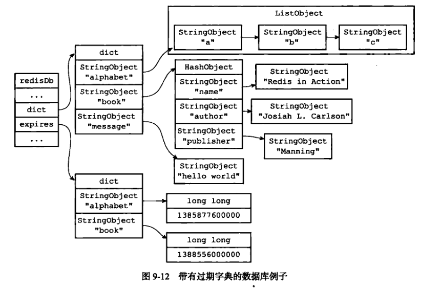
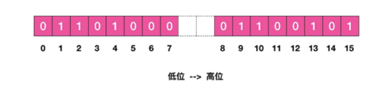

# Redis面试题

## Redis概述

### redis 作用

1. 缓存

2. 分布式锁
3. 记录帖子的点赞数、评论数和点击数 (hash)。
4. 排行榜

#### **什么样的场景下适合用缓存？有什么特点的数据适合做缓存**

缓存服务使用场景

- 在一些大流量读场景，可以通过Redis进行数据缓存，减少DB库的访问次数，提升访问速度。

- 在一些DB读写同步及时性要求高同时读流量又很大的场景，可以尝试配合场景在写入时，优先写入缓存，再落盘。查时，直接查缓存，而不查读库。 

### redis怎么提高访问速率

### 说说redis

（介绍了单线程，多路复用，主从模式，哨兵模式，集群模式，rdb，aof持久化流程）

### Redis为什么那么快，性能更高

主要是单线程和多路复用机制

还有一些原因，Redis 的大部分操作在内存上完成，再加上它采用了高效的数据结构，例如哈希表和跳表，这是它实现高性能的一个重要原因。

#### 单线程

Redis 是单线程，主要是指 **Redis 的网络 IO 和键值对读写是由一个线程来完成的，这也是 Redis 对外提供键值存储服务的主要流程。**但 Redis 的其他功能，比如持久化、异步删除、集群数据同步等，其实是由额外的线程执行的。

**为什么使用单线程？**

因为多线程编程模式面临的共享资源的并发访问控制问题。

如果没有精细的设计，比如说，只是简单地采用一个粗粒度互斥锁，就会出现不理想的结果：即使增加了线程，大部分线程也在等待获取访问共享资源的互斥锁，并行变串行，系统吞吐率并没有随着线程的增加而增加。

而且，采用多线程开发一般会引入同步原语来保护共享资源的并发访问，这也会降低系统代码的易调试性和可维护性

为了避免这些问题，Redis 直接采用了单线程模式。

#### 多路复用机制

Redis 采用了多路复用机制，使其在网络 IO 操作中能并发处理大量的客户端请求，实现高吞吐率。

**Io多路复用是啥？**

Linux 中的 IO 多路复用机制是指一个线程处理多个 IO 流，就是我们经常听到的 select/epoll 机制。简单来说，在 Redis 只运行单线程的情况下，该机制允许内核中，同时存在多个监听套接字和已连接套接字。内核会一直监听这些套接字上的连接请求或数据请求。一旦有请求到达，就会交给 Redis 线程处理，这就实现了一个 Redis 线程处理多个 IO 流的效果。

Redis 网络框架调用 epoll 机制，让内核监听多个套接字。此时，Redis 线程不会阻塞在某一个特定的监听或已连接套接字上，也就是说，不会阻塞在某一个特定的客户端请求处理上。正因为此，Redis 可以同时和多个客户端连接并处理请求，从而提升并发性。

select/epoll 提供了基于事件的回调机制，即针对不同事件的发生，调用相应的处理函数。那么，回调机制是怎么工作的呢？

其实，select/epoll 一旦监测到 FD 上有请求到达时，就会触发相应的事件。这些事件会被放进一个事件队列，Redis 单线程对该事件队列不断进行处理。这样一来，Redis 无需一直轮询是否有请求实际发生，这就可以避免造成 CPU 资源浪费。同时，Redis 在对事件队列中的事件进行处理时，会调用相应的处理函数，这就实现了基于事件的回调。因为 Redis 一直在对事件队列进行处理，所以能及时响应客户端请求，提升 Redis 的响应性能。

### redis的原理和实现

是一个高性能的 key-value 数据库。

有丰富的数据类型

Redis运行在内存中但是可以持久化到磁盘

## Redis的存储类型及底层实现

### Redis Object的底层实现

Z-Set基于什么？介绍一下跳表？jdk中的跳表？

> 见本目录下面的《Redis基础数据结构》和《Redis对象》

### 跳表如何维护

当往跳表中插入数据的时候，可以选择同时将这个数据插入到部分索引层中，那么如何选择这个索引层呢？可以通过随机函数来决定将这个节点插入到哪几级索引中，比如随机函数生成了值K，那就可以把这个节点添加到第1级到第K级索引中。

删除一个元素x，如果x被删除后某层只剩下头尾两个节点，则删除这一层。

## redis的数据过期删除策略

redisDb结构的expires字典保存了数据库中的所有键的过期时间，称之为过期字典。



过期键的判断是先找字典中有没有这个键，如果有的话，再判断当前Unix的时间戳是否大于键的过期时间，如果是的话，则表示已经过期了。

### 删除策略

redis是配合使用惰性删除和定期删除来实现的

**惰性删除的实现**

redis通过expireIfNeeded函数来实现。所有读写数据库的redis命令在执行之前都会调用expireIfNeeded函数对键进行检查，如果键已经过期了，就删除，如果没过期，就继续执行该命令。

但是惰性删除策略有个问题，如果键一直没有被访问到，那么这个过期键就永远不会删除。所以还需要定期删除配合。

**定期删除**

过期键的定期删除策略由redis.c/activeExpireCycle函数实现，每当Redis的服务器周期性操作redis.c/serverCron函数执行时，activeExpireCycle函数就会被调用，**它在规定的时间内**，分多次遍历服务器中的各个数据库，从数据库的expires字典中随机检查一部分键的过期时间，并删除其中的过期键。

函数每次执行的时候，都从一定数量的数据库中取出一定数量的随机键进行检查，并删除其中的过期键。

全局变量current_db会记录当前activeExpireCycle函数检查的进度，下一次接着上次的进度进行处理。比如这次遍历到10号数据库就返回了，下次就从11开始查找并删除过期键。

## 持久化方式

### 说说什么是RDB和AOF？

RDB通过持久化方式保存数据库中的键值对来记录数据库状态的不同。它保存的快照版本。

AOF(Appent Only File)通过保存redis服务器所执行的写命令来记录数据库的状态。

对于命令`SET msg "hello"`，

**RDB生成内容是:**

注意rdb文件是二进制文件，解析出来是这样：

```
\0 003 m s g 005 h e l l o
```

没有过期时间的键值对由类型、键、值三部分组成。字符串都是以字符串长度为前缀，后面跟着字符串的内容。

所以这里\0 表示类型是REDIS_RDB_TYPE_STRING(这个常量的实际值为0)，之后003是键msg的长度，005是值hello的长度。

如果有过期时间的键值，那么包括以下部分：

- 一个一字节长的EXPIRETIME_MS特殊值
- 一个八字节的过期时间（ms）
- 然后就是类型、键、值了

**AOF生成的内容是：**

```
*3\r\n$3\r\nSET\r\n$3\r\nmsg\r\n$5\r\nhello\r\n
```

\r\n是换行符，我们忽略就变成了在`*3  $3  SET  $3  msg  $5  hello`

*3表示有三个参数

$3表示下一个长度参数为3

set是命令，msg是key，hello是值

### 为什么要有两种持久化方式

**RDB优点：**

RDB 是一个非常紧凑（compact）的文件，它保存了 Redis 在某个时间点上的数据集。 这种文件非常适合用于进行备份： 比如说，你可以在最近的 24 小时内，每小时备份一次 RDB 文件，并且在每个月的每一天，也备份一个 RDB 文件。 这样的话，即使遇上问题，也可以随时将数据集还原到不同的版本。

RDB 在恢复大数据集时的速度比 AOF 的恢复速度要快。

**RDB缺点：**

服务器故障的时候，可能会丢失数据。如果你设置每五分钟保存文件的话，如果发生故障，这五分钟的数据你就没了。

**AOF优点**

使用 AOF 持久化会让 Redis 变得非常耐久

AOF 文件是一个只进行追加操作的日志文件（append only log）， 因此对 AOF 文件的写入不需要进行 `seek` 

**AOF的缺点**

对于相同的数据集来说，AOF 文件的体积通常要大于 RDB 文件的体积。

根据所使用的 `fsync` 策略，AOF 的速度可能会慢于 RDB 

### 如果AOF文件很大怎么办

AOF重做，还是特别大怎么办，分片集群

**AOF重写**

一个list如果分六次放一个数据，就会在AOF中生成6条命令。所以可以重写，只生成一条命令。

重写AOF和之前的AOF文件没有关系，**它是根据现在的redis数据库进行写入的**。redis会生成一个子进程去进行重写，这样父进程的操作就不会阻塞了。

但是如果增量的数据怎么办？

redis有设置一个AOF重写缓冲区，当服务器创建子进程后，这个缓冲区开始使用。

当redis执行完一个写命令后，会把该语句发送给AOF缓冲区和AOF重写缓冲区。AOF缓冲区是为了对现在的AOF文件进行写入的。

当子进程完成AOF重写后，父进程就会将AOF重写缓冲区的所有内容写入到新AOF文件中，这样新文件保存的数据就和数据库一致了。

然后通过改名，用重写后的文件覆盖原有的AOF文件，完成替换。

## redis启动时怎么加载数据

**Redis开始加载数据到内存中，如果启用了appendonly了，则Redis从appendfile加载数据，否则就从dbfile加载数据**。

### 从appendfile中加载数据：

loadAppendOnlyFile()函数

在开始加载之前暂时关闭appendonly，然后Redis创建一个假的Redis客户端。

然后读取appendonly.aof文件中的命令，在假的Redis客户端上下文中执行，同时服务器也不对该客户端做任何应答。

### 从dbfile中加载数据

rdbLoad()函数

如果Redis没有开启appendonly，就需要从数据库文件中加载数据到内存，基本步骤如下：

a. 处理SELECT命令，即选择数据库 
b. 读取key 
c. 读取value 
d. 检测key是否过期 
e. 添加新的对象到哈希表 
f. 设置过期时间（如果需要） 
g. 如果开启了VM，处理swap操作

## 如果使用redis怎么解决自增主键在分布式下高并发的问题

主要是通过incr来操作的：对存储在指定`key`的数值执行原子的加1操作。

## redis分布式锁

### redis实现分布式锁是怎么做的

早期版本是通过SETNX和SETEX来实现的，只有当键不存在的时候设值，设值成功后，再给键设置过期时间，以防系统出问题，锁一直没法释放。

但是这样两条命令不是原子性的，所以从2.6.12版本开始，redis为`SET`命令增加了一系列选项:

```shell
SET key value [EX seconds] [PX milliseconds] [NX|XX]SET key value [EX seconds] [PX milliseconds] [NX|XX]
```

- `EX` *seconds* – 设置键key的过期时间，单位时秒
- `PX` *milliseconds* – 设置键key的过期时间，单位时毫秒
- `NX` – 只有键key不存在的时候才会设置key的值
- `XX` – 只有键key存在的时候才会设置key的值

官方提供了一个简单的例子：

命令 `SET resource-name token NX EX max-lock-time` 是一种用 Redis 来实现锁机制的简单方法。

如果上述命令返回`OK`，那么客户端就可以获得锁（如果上述命令返回Nil，那么客户端可以在一段时间之后重新尝试），并且可以通过LUA脚本来释放锁。

客户端加锁之后，如果没有主动释放，会在过期时间之后自动释放。

- token不是一个固定的字符串，而是一个随机的唯一标识，目的是为了只有自己才可以释放自己的锁，避免被其他线程释放了。

- 并且释放锁要通过LUA脚本，而不是DEL命令。

上述要点会避免下述场景：a客户端获得的锁（键key）已经由于过期时间到了被redis服务器删除，但是这个时候a客户端还去执行[DEL](http://www.redis.cn/commands/del.html)命令。而b客户端已经在a设置的过期时间之后重新获取了这个同样key的锁，那么a执行[DEL](http://www.redis.cn/commands/del.html)就会释放了b客户端加好的锁。

解锁脚本的一个例子将类似于以下：

```python
if redis.call("get",KEYS[1]) == ARGV[1]
then
    return redis.call("del",KEYS[1])
else
    return 0
end
```

这个脚本执行方式如下：

EVAL …script… 1 resource-name token-value

### 加锁失败会怎么样

如果加锁失败可以设置循环等待，在timeout时间内仍未获取到锁，则获取失败。

### 分布式锁如何实现按序获取锁？

zk锁

### 分布式锁和普通的锁的区别

普通锁只能单系统

## redis和memcache的区别

redis和memecache的不同在于： 
1、存储方式： 
memecache 把数据全部存在内存之中，断电后会挂掉，数据不能超过内存大小 
redis有部份存在硬盘上，这样能保证数据的持久性，支持数据的持久化（笔者注：有快照和AOF日志两种持久化方式，在实际应用的时候，要特别注意配置文件快照参数，要不就很有可能服务器频繁满载做dump）。 
2、数据支持类型： 
redis在数据支持上要比memecache多的多。 
3、使用底层模型不同： 
新版本的redis直接自己构建了VM 机制 ，因为一般的系统调用系统函数的话，会浪费一定的时间去移动和请求。 
4、运行环境不同： 
redis目前官方只支持LINUX 上去行，从而省去了对于其它系统的支持，这样的话可以更好的把精力用于本系统 环境上的优化

## 位图

也叫位数组

其实就是二进制数组，可以看做byte数组。

底层是使用字符串对象来存储的，因为字符串对象使用的SDS数据结构是二进制安全的，正好可以直接用SDS保存位数组。

比如对于字符串"he"

h的ASCII码的二进制是01101000，SDS每个buf数组是一字节，也就是8bit。

e的二进制是01100101，he合在一起就是01101000 01100101。

在buf数组中，就是这么存储的



所以只需要设置1、2、4的值为1，就能得到h。

```sql
>setbit s 1 1
0
>setbit s 2 1
0
>setbit s 4 1
0
>get s
"h"
```

如果你接着设置后面位数的1，就能得到“he”

## HyperLogLog

HyperLogLog算法经常在数据库中被用来统计某一字段的Distinct Value（下文简称DV）

就是统计不同的活跃用户有多少，用set也可以实现，但是set消耗空间。HyperLogLog只会用到12k

为什么是12K呢？实现中用到的是 16384 个桶，也就是 2^14，每个桶的 maxbits 需要 6 个 bits 来存储。于是总共占用内存就是 2^14 * 6 / 8 = 12k 字节。

抛硬币序列1110100110为例，其中最长的反面序列是00，那么总共的次数大概是2的三次方=8次。

https://www.jianshu.com/p/55defda6dcd2


## redis多大内存，怎么扩容

redis设置配置文件的**maxmemory**参数，可以控制其最大可用内存大小（字节）。


## Redis哨兵

redis哨兵就是可以监视任意多个主服务器以及这些主服务器属下的所有从服务器，并在被监视的主服务器下线的时候，将从服务器升级成主服务器。

哨兵会跟主服务器和从服务器分别创建命令连接和订阅连接。

默认每十秒向服务器发送INFO命令，更新信息。

如果有多个哨兵监视同一个主服务器，那么由于他们订阅同一个频道，所以可以接收到其他哨兵的消息，彼此发现对方。并且互相创建命令连接。

### 检查主观下线状态

默认情况下，哨兵会以每秒一次的频率向所有与它创建了命令连接的实例（包括主服务器、从服务区、其他哨兵）发送PING命令来判断是否在线。如果在一定的时间范围内始终都无法连接，那么就判断是主观下线了。

### 检查客观下线状态

当哨兵将一个主服务器判断为主观下乡后，为了确认，会向同样监视这个服务器的其他哨兵进行询问，看它们是否也认为服务器下线了。如果多数都认为下线了，哨兵就会将主服务器判定为客观下线，进行故障转移。

### 故障转移

首先哨兵要选举出领头的哨兵。每个哨兵都能成为领头。

每个发现服务器下线的哨兵都会给其他哨兵发命令，要求将自己设置为局部领头哨兵。

每个哨兵只会设置一次局部领头，先到先得，如果它已经支持别人了，后面来的就没有机会了。

当某个哨兵被半数以上的哨兵支持的话，就变成了领头哨兵。负责处理故障转移。

**故障转移**

领头哨兵会从所有从服务器中挑选出一个作为主服务器，然后让其他从服务器改为复制新的主服务器。

原来的主服务器设置成新的主服务器的从服务器，当这个旧的主服务器上线后，会成为从服务器，复制新的主服务数据。

**选出新的主服务器**

首先要保证服务器可靠。哨兵会排除下线的机器，排除五秒内没有回复的机器，排除与主服务器失联超过10倍超时时间（毫秒）的机器。

之后优先选优先级比较高的，然后选复制偏移量最大的，如果仍然有多个的话，再选run ID最小的机器。

## Redis zset实现延时队列

延时队列可以通过 Redis 的 zset(有序列表) 来实现。我们将消息序列化成一个字符串作为 zset 的 value，这个消息的到期处理时间作为 score，然后用多个线程轮询 zset 获取到期的任务进行处理。

多个线程是为了保障可用性，万一挂了一个线程还有其它线程可以继续处理。因为有多个线程，所以需要考虑并发争抢任务，确保任务不能被多次执行。

Redis 的 zrem 方法是多线程多进程争抢任务的关键，它的作用是删除一个值，通过是否成功删除判断是否获取到值了，否则就是被其他线程处理了这个值。

它的返回值决定了当前实例有没有抢到任务，因为 loop 方法可能会被多个线程、多个进程调用，同一个任务可能会被多个进程线程抢到，通过 zrem来决定唯一的属主。

```java
public class RedisDelayingQueue<T> {
    static class TaskItem<T> {
        public String id;
        public T msg;
    }
    // fastjson 序列化对象中存在 generic 类型时，需要使用 TypeReference
    private Type TaskType = new TypeReference<TaskItem<T>>() { }.getType();
    private Jedis jedis;
    private String queueKey;
    public RedisDelayingQueue(Jedis jedis, String queueKey) {
        this.jedis = jedis;
        this.queueKey = queueKey;
    }
    public void delay(T msg) {
        TaskItem task = new TaskItem();
        task.id = UUID.randomUUID().toString(); // 分配唯一的 uuid
        task.msg = msg;
        String s = JSON.toJSONString(task); // fastjson 序列化
        jedis.zadd(queueKey, System.currentTimeMillis() + 5000, s); // 塞入延时队列 ,5s 后再试
    }
    public void loop() {
        while (!Thread.interrupted()) {
// 只取一条
            Set values = jedis.zrangeByScore(queueKey, 0, System.currentTimeMillis(), 0, 1);
            if (values.isEmpty()) {
                try {
                    Thread.sleep(500); // 歇会继续
                }
                catch (InterruptedException e) {
                    break;
                }
                continue;
            }
            String s = values.iterator().next();
            if (jedis.zrem(queueKey, s) > 0) { // 抢到了
                TaskItem task = JSON.parseObject(s, TaskType); // fastjson 反序列化
                this.handleMsg(task.msg);
            }
        }
    }
    public void handleMsg(T msg) {
        System.out.println(msg);
    }
    public static void main(String[] args) {
        Jedis jedis = new Jedis();
        RedisDelayingQueue queue = new RedisDelayingQueue<>(jedis, "q-demo");
        Thread producer = new Thread() {
            public void run() {
                for (int i = 0; i < 10; i++) {
                    queue.delay("codehole" + i);
                }
            }
        };
        Thread consumer = new Thread() {
            public void run() {
                queue.loop();
            }
        };
        producer.start();
        consumer.start();
        try {
            producer.join();
            Thread.sleep(6000);
            consumer.interrupt();
            consumer.join();
        }
        catch (InterruptedException e) {
        }
    }
}
```

## redis线程模型

io多路复用

## 缓存雪崩，缓存穿透，缓存击穿


### 缓存雪崩

缓存雪崩是指大量的应用请求无法在 Redis 缓存中进行处理，紧接着，应用将大量请求发送到数据库层，导致数据库层的压力激增。

缓存雪崩的原因一般有两个：

1. 缓存中有大量数据同时过期
2. redis实例宕机了，无法处理请求

**解决**

对于第一个情况，我们可以避免给大量的数据设置相同的过期时间，给这些数据的过期时间增加一个较小的随机数（例如，随机增加 1~3 分钟）

我们还可以通过服务降级，通过减少访问量减少压力，来应对缓存雪崩。

- 当业务应用访问的是非核心数据（例如电商商品属性）时，暂时停止从缓存中查询这些数据，而是直接返回预定义信息、空值或是错误信息；
- 当业务应用访问的是核心数据（例如电商商品库存）时，仍然允许查询缓存，如果缓存缺失，也可以继续通过数据库读取。

**对于redis宕机：**

**可以使用服务熔断、或者服务限流。**

服务熔断就业务应用调用缓存接口时，缓存客户端并不把请求发给 Redis 缓存实例，而是直接返回，等到 Redis 缓存实例重新恢复服务后，再允许应用请求发送到缓存系统。但是这样影响比较大，所以可以选择服务限流。

服务限流就是限制访问，只允许部分访问。

**还有就是事前预防**

通过主从节点的方式构建 Redis 缓存高可靠集群。如果 Redis 缓存的主节点故障宕机了，从节点还可以切换成为主节点，继续提供缓存服务，避免了由于缓存实例宕机而导致的缓存雪崩问题。

### 缓存击穿

缓存击穿是指，针对某个访问非常频繁的热点数据的请求，无法在缓存中进行处理，紧接着，访问该数据的大量请求，一下子都发送到了后端数据库，导致了数据库压力激增。

缓存击穿的情况，经常发生在热点数据过期失效时。

**解决**

对于访问特别频繁的热点数据，我们就不设置过期时间了。这样一来，对热点数据的访问请求，都可以在缓存中进行处理，而 Redis 数万级别的高吞吐量可以很好地应对大量的并发请求访问。

### 缓存穿透

缓存穿透是指要访问的数据既不在 Redis 缓存中，也不在数据库中，这样一来，缓存也就成了“摆设”，如果应用持续有大量请求访问数据，就会同时给缓存和数据库带来巨大压力。

那么，缓存穿透会发生在什么时候呢？一般来说，有两种情况。

- 业务层误操作：缓存中的数据和数据库中的数据被误删除了，所以缓存和数据库中都没有数据；

- 恶意攻击：专门访问数据库中没有的数据。

为了避免缓存穿透的影响，我来给你提供三种应对方案。

**第一种方案是，缓存空值或缺省值。**

一旦发生缓存穿透，我们就可以针对查询的数据，在 Redis 中缓存一个空值或是和业务层协商确定的缺省值（例如，库存的缺省值可以设为 0）。紧接着，应用发送的后续请求再进行查询时，就可以直接从 Redis 中读取空值或缺省值，返回给业务应用了。

**第二种方案是，使用布隆过滤器**

使用布隆过滤器快速判断数据是否存在，避免从数据库中查询数据是否存在，减轻数据库压力。

我们可以在把数据写入数据库时，使用布隆过滤器做个标记。当缓存缺失后，应用查询数据库时，可以通过查询布隆过滤器快速判断数据是否存在。如果不存在，就不用再去数据库中查询了。

这样一来，即使发生缓存穿透了，大量请求只会查询 Redis 和布隆过滤器，而不会积压到数据库，也就不会影响数据库的正常运行。

**最后一种方案是，在请求入口的前端进行请求检测**

缓存穿透的一个原因是有大量的恶意请求访问不存在的数据，所以，一个有效的应对方案是在请求入口前端，对业务系统接收到的请求进行合法性检测，把恶意的请求（例如请求参数不合理、请求参数是非法值、请求字段不存在）直接过滤掉，不让它们访问后端缓存和数据库。这样一来，也就不会出现缓存穿透问题了。

## Redis和数据库的一致性

在这里，我们讨论三种更新策略：

1. 先更新数据库，再更新缓存
2. 先删除缓存，再更新数据库
3. 先更新数据库，再删除缓存

**第一种弊端比较大**

首先是如何如果多线程情况，容易出现问题。

（1）线程A更新了数据库
（2）线程B更新了数据库
（3）线程B更新了缓存
（4）线程A更新了缓存

业务角度上看，有些数据，没有人读，也把它写到了缓存中，浪费资源。

**第二种不推荐**

该方案会导致不一致的原因是。同时有一个请求A进行更新操作，另一个请求B进行查询操作。那么会出现如下情形:

（1）请求A进行写操作，删除缓存
（2）请求B查询发现缓存不存在
（3）请求B去数据库查询得到旧值
（4）请求B将旧值写入缓存
（5）请求A将新值写入数据库

这样后面请求都是拿到缓存的旧数据了。

**第三种推荐**

首先，先说一下。老外提出了一个缓存更新套路，名为《Cache-Aside pattern》。其中就指出

- 跟新：应用程序先从cache取数据，没有得到，则从数据库中取数据，成功后，放到缓存中。
- 命中：应用程序从cache中取数据，取到后返回。
- 失效：先把数据存到数据库中，成功后，再让缓存失效。

另外，知名社交网站facebook也在论文《Scaling Memcache at Facebook》中提出，**他们用的也是先更新数据库，再删缓存的策略。**

**这种情况不存在并发问题么？**

不是的。假设这会有两个请求，一个请求A做查询操作，一个请求B做更新操作，那么会有如下情形产生

（1）缓存刚好失效
（2）请求A查询数据库，得一个旧值
（3）请求B将新值写入数据库
（4）请求B删除缓存
（5）请求A将查到的旧值写入缓存

ok，如果发生上述情况，确实是会发生脏数据。但是这种情况很需要满足步骤（3）的写数据库操作比步骤（2）的读数据库操作耗时更短。一般读都是比写快的。

**要怎么完全杜绝缓存不一致呢？**

不管是先删除缓存再更新数据库，还是先更新数据库，再删缓存。都可以在这两步完成之后，延迟一小会，再删一次缓存。这样就确保不存在脏缓存了。这个过程可以弄成异步。

如果出现删除缓存失败的情况可以进行重试，使用消息队列或者再开一个线程去重试都可以。

## 用hashmap去实现Redis，你会怎么实现

自由发挥。。。

##  redis其他的数据结构一般可以用于啥功能？你用过啥？

51. zset为什么可以做排行榜，底层是什么？
52. 那你讲讲跳表？

## netty和redis底层实现？（不懂）

等学了netty再来补充吧

## Redis TTL原理

redis针对TTL时间有专门的dict进行存储，就是redisDb当中的dict *expires字段，字典的key指针指向了redis的某一个key，value是一个毫秒精度的UNIX时间戳。

redis TTL命令根据key找到过期时间，然后过期时间减去当前时间，返回结果。

如果键不存在数据库，返回-2。如果没有设置过期时间，返回-1.

## Redis内存淘汰策略

淘汰策略主要通过LRU算法淘汰，还有随机淘汰。对于4.0新增了通过LFU算法淘汰。

**LRU算法**

在 Redis 中，LRU 算法被做了简化，以减轻数据淘汰对缓存性能的影响。具体来说，Redis 默认会记录每个数据的最近一次访问的时间戳（由键值对数据结构 RedisObject 中的 lru 字段记录）。然后，Redis 在决定淘汰的数据时，第一次会随机选出 N 个数据，把它们作为一个候选集合。接下来，Redis 会比较这 N 个数据的 lru 字段，把 lru 字段值最小的数据从缓存中淘汰出去。

当需要再次淘汰数据时，Redis 需要挑选数据进入第一次淘汰时创建的候选集合。这儿的挑选标准是：能进入候选集合的数据的 lru 字段值必须小于候选集合中最小的 lru 值。当有新数据进入候选数据集后，如果候选数据集中的数据个数达到了 maxmemory-samples，Redis 就把候选数据集中 lru 字段值最小的数据淘汰出去。

**volatile-lru**：从已设置过期时间的数据集中挑选最近最少使用的数据淘汰

**volatile-ttl**：从已设置过期时间的数据集中挑选将要过期的数据淘汰

**volatile-random**：从已设置过期时间的数据集中任意选择数据淘汰

**allkeys-lru**：从数据集中挑选最近最少使用的数据淘汰

**allkeys-random**：从数据集中任意选择数据淘汰

**no-envictio**：当内存达到限制的时候，不淘汰任何数据，不可写入任何数据集，所有引起申请内存的命令会报错。

Redis 4.0 后新增了两个lfu算法：

**volatile-lfu**：会使用 LFU 算法选择设置了过期时间的键值对

**allkeys-lfu** ：使用 LFU 算法在所有数据中进行筛选。

LFU是在 LRU 算法的基础上，同时考虑了数据的访问时效性和数据的访问次数，可以看作是对淘汰策略的优化。

Redis中实现LFU算法的时候，有这个两个重要的可配置参数：

- **server.lfu_log_factor** : 能够影响计数的量级范围，即上表中的factor参数；
- **server.lfu_decay_time**: 控制LFU计数衰减的参数。

简单说LFU会记录使用的频率，还结合访问的时间。再访问到后计数会增加，如果factor是100的话，要千万才能达到255。如果长时间不访问，还会减少计数。对于新建的值，会给一个初始值5，以防止新建的值被淘汰。

## redis主从同步策略

**增量同步**的过程主要是主服务器每执行一个写命令就会向从服务器发送相同的写命令，从服务器接收并执行收到的写命令。

**全量同步**

从服务器复制主服务器的数据是通过RDB文件，主服务器收到从服务器的SYNC命令，执行BGSAVE，后台去生成RDB文件，并且使用一个缓冲区记录下从现在开始执行的所有写命令。

主服务器生成RDB文件后发给从服务器，从服务器根据这个文件将自己的数据库更新。

然后主服务器将自己的缓冲区里的写命令发送给从服务器。从服务器执行这些命令更新自己的数据库。

新版本使用PSYNC命令，解决了从服务器断线重连的问题。以前断线重连也是发送所有的RDB文件。

新版本部分重同步功能是通过以下三部分实现的：

- 主服务器的复制偏移量和从服务器的复制偏移量
- 主服务器的复制积压缓冲区
- 服务器的运行ID（run ID）

当主服务器发送一个10字节的数据时，会把自己的复制偏移量+10。从服务器收到数据的时候，也会把自己的复制偏移量+10。

主服务器在命令传播的时候，除了发送写命令给从服务器，也会把命令写入复制积压缓冲区里。

在从服务器断线重连后，会发送之前保存的主服务器的run ID，如果不是同一个服务器，就执行完整同步。

从服务器也会将自己的复制偏移量发送给主服务器，主服务器判断没有同步的数据是否在缓冲区里，不在的话，就只能完成同步了。

因为缓冲区是一个固定长度，先进先出的队列，默认大小是1MB，如果从服务器断线太久了，这个缓冲区就存不下了，只能完整同步了

## redis挂了怎么办？集群都挂了怎么办？

## 热key问题

在日常工作生活中一些突发的的事件，例如：双十一期间某些热门商品的降价促销，当这其中的某一件商品被数万次点击浏览或者购买时，会形成一个较大的需求量，这种情况下就会造成热点问题。

同理，被大量刊发、浏览的热点新闻、热点评论、明星直播等，这些典型的读多写少的场景也会产生热点问题。

(1) 拆分复杂数据结构： 如果当前key的类型是一个二级数据结构，例如哈希类型。如果该哈希元素个数较多，可以考虑将当前hash进行拆分，这样该热点key可以拆分为若干个新的key分布到不同Redis节点上，从而减轻压力。

(2) 本地缓存加通知机制：可以将热点key放在业务端的本地缓存中，因为是在业务端的本地内存中，处理能力要高出Redis数十倍，但当数据更新时，此种模式会造成各个业务端和Redis数据不一致，通常会使用发布订阅机制来解决类似问题。

(3)备份热key，给key加个随机数，这样就会把一个key分散到多台服务器。


## redis集群

### redis集群怎么做的

分片集群就是把数据分到几个机器上。这样原本25G的一个机器就变成了每个5G的5台机器了。

主要要解决数据怎么分布，还有客户端怎么访问数据

**数据分布**

一个切片集群一共有16384个槽，可以通过cluster addslots 命令给每个机器手动分配哈希槽。

下面是对集群中的一个机器进行分配。

```shell
redis-cli -h 172.16.19.3 –p 6379 cluster addslots 0,1
```

必须所有的槽都被分配了，整个集群才可以工作。

存放数据的时候，首先根据键值对的 key，按照CRC16 算法计算一个 16 bit 的值；然后，再用这个 16bit 值对 16384 取模，得到 0~16383 范围内的模数，每个模数代表一个相应编号的哈希槽。

这样，每个数据都能映射到其中一个槽。

**客户端如何定位数据？**

每个节点除了记录下自己负责的槽，还会将自己负责的槽发送给集群中的其他节点。

因此每个节点都可以知道数据库中的16384个槽分别指派给集群中的哪个节点。

当客户端给一个机器发送命令的时候，节点发现这个数据所在的槽不在自己这里，就会返回MOVE命令，该命令的格式为

```
MOVED <slot> <ip>:<port>
MOVED 13320 172.16.19.5:6379
```

客户端会重新发送命令到正确的节点。

**ASK错误**

当客户端给一个机器发送命令，正好这个机器把这个数据迁移到了新的机器，就会返回ASK给客户端，让客户端去另一个节点访问。

与MOVED命令不同，MOVED之后，客户端就会知道以后这个数据要去哪里找了，而ASk只是临时的，下一次还是会去原来的机器找。

### redis集群的架构

### redis集群某个节点挂了数据会丢掉吗

如果主节点下线了，集群就会把这个主节点的一个从节点设置为新的主节点继续工作，这样集群就不会因为一个主节点的下线而无法正常工作。

如果某一个主节点和他所有的从节点都下线的话，redis集群就会停止工作了。redis集群不保证数据的强一致性，在特定的情况下，redis集群会丢失已经被执行过的写命令。

### 选主

和哨兵的选主比较像，因为都是基于Raft算法的领头选举。

当从节点发现自己的主节点下线了，会通过广播向所有的其他主节点发送消息，要求他们给自己投票。每个主节点只能投一次。

每个节点会根据自己发送命令的返回结果统计自己的票数，超过半票就是成为新的主节点。

这个选中的节点会执行SLAVEOF no one命令，成为新的主节点。

新的主节点会撤销旧的主节点的槽指派，并将这些槽全部指派给自己。

新的主节点会向集群广播一个消息，告知其他主节点，自己变成了新的主节点，接管了旧的主节点负责的槽，通知其他主节点更新信息。

### Redis集群下路由的选择,如何更高效（应该是Nginx吧）

不懂

### redis我想现在不停服务加集群集器怎么做

首先启动一个新机器，然后使用add-node将节点添加到集群

```
./redis-trib.rb add-node 127.0.0.1:7006 127.0.0.1:7000
```

把7006端口的机器加到了7000所在的集群中。

然后移动槽，给新的节点分配槽

```
./redis-trib.rb reshard 127.0.0.1:7000
```

会提示要移动多少个槽到你输入的机器中。

如果只是要加从节点，就不用给这个机器分配槽，而是执行命令，复制其他的主节点。

```
redis-cli -c -p 7006 cluster replicate 0b00721a509444db793d28448d8f02168b94bd38
```

如果删除机器，要先把该机器的槽移走，然后再用命令删除节点：

```
./redis-trib.rb del-node 127.0.0.1:7006 127.0.0.1:7006
```

如果要删除的是从节点，就不需要移动槽了，直接删节点。

### 主从复制流程

向机器A发送`CLUSTER REPLICATE <node_id>`，A就会变成node_id那个机器的从节点。

执行复制流程：

从服务器复制主服务器的数据是通过RDB文件，主服务器收到从服务器的SYNC命令，执行BGSAVE，后台去生成RDB文件，并且使用一个缓冲区记录下从现在开始执行的所有写命令。

主服务器生成RDB文件后发给从服务器，从服务器根据这个文件将自己的数据库更新。

然后主服务器将自己的缓冲区里的写命令发送给从服务器。从服务器执行这些命令更新自己的数据库。

新版本使用PSYNC命令，解决了从服务器断线重连的问题。以前断线重连也是发送所有的RDB文件。

新版本部分重同步功能是通过以下三部分实现的：

- 主服务器的复制偏移量和从服务器的复制偏移量
- 主服务器的复制积压缓冲区
- 服务器的运行ID（run ID）

当主服务器发送一个10字节的数据时，会把自己的复制偏移量+10。从服务器收到数据的时候，也会把自己的复制偏移量+10。

主服务器在命令传播的时候，除了发送写命令给从服务器，也会把命令写入复制积压缓冲区里。

在从服务器断线重连后，会发送之前保存的主服务器的run ID，如果不是同一个服务器，就执行完整同步。

从服务器也会将自己的复制偏移量发送给主服务器，主服务器判断没有同步的数据是否在缓冲区里，不在的话，就只能走全量同步了。

因为缓冲区是一个固定长度，先进先出的队列，默认大小是1MB，如果从服务器断线太久了，这个缓冲区就存不下了，只能完整同步了

## redis端口

6379