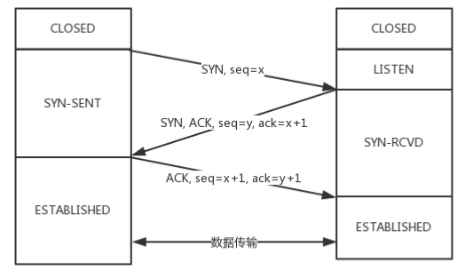

# 计算机网络面试题

## TCP/IP 模型  & OSI模型

### 应用层、传输层、网络层常见协议


DNS 、 HTTP 、FTP、 STMP 、SSL、 TCP、 UDP、 ARP、 IP   

## 交换机和路由器有什么区别

交换机是有 MAC 地址学习能力的，可以根据转发表知道这个MAC地址要往哪个口走。

## TCP

###  TCP 三次握手 、 TCP四次挥手

#### 三次握手过程中，SYN攻击是啥，业界最新的解决方法？



先是服务端主动监听某个端口，处于 LISTEN 状态。然后客户端主动发起连接 SYN，之后处于 SYN-SENT 状态。服务端收到发起的连接，返回 SYN，并且ACK 客户端的 SYN，之后处于 SYN-RCVD 状态。客户端收到服务端发送的 SYN 和 ACK 之后，发送ACK 的 ACK，之后处于 ESTABLISHED 状态，因为它一发一收成功了。服务端收到 ACK 的 ACK 之后，处于 ESTABLISHED 状态，因为它也一发一收了。

**什么是SYN攻击?**

**原理:**

1. Client伪造大量的虚假ip,向Server发送SYN包
2. Server在接收到SYN包后,会返回响应,并进入SYN_RECV状态,等待客户端的确认
3. 但是伪造的ip肯定不会给予响应,于是Server以为数据包丢失,不断重发,直到超时

**危害:**

这些伪造的SYN包会长期占用未连接队列,导致后来真实的ip无法加入队列,从而被丢弃,引起网络拥堵甚至网络瘫痪

**解决**

其实最常用的一个手段就是优化主机系统设置。比如降低SYN timeout时间，使得主机尽快释放半连接的占用或者采用SYN cookie设置，如果短时间内收到了某个IP的重复SYN请求，我们就认为受到了攻击。我们合理的采用防火墙设置等外部网络也可以进行拦截。

#### **深入一些 :     为什么三次握手，能否两次？**

#### ddos攻击在哪一阶段？

DDoS攻击通过大量合法的请求占用大量网络资源，以达到使网络瘫痪的目的。具体攻击方式可分为以下几种：

1、通过使网络过载来干扰甚至阻断正常的网络通讯；

2、通过向服务器提交大量请求，使服务器超负荷；

3、阻断某一用户访问服务器；

4、阻断某服务与特定系统或个人的通讯。

syn攻击也是ddos的一种，所以是第一阶段

#### 如果在最后出现丢包怎么办。

重发

### TCP如何保证消息传输可靠

确认和重传、  校验和、流量控制 、 拥塞控制 、

拥塞控制，数据的发送是怎样减少的

### TCP报文中有没有IP报文的头部

ip协议是网络层，TCP是传输层，TCP只有应用层HTTP的报文，不会有IP协议的东西。

### TCP超时重传

### 

### tcp在当前存在的问题，滑动窗口机制、拥塞控制的不合理性，如何解决这个问题

用udp的方式解决滑动窗口的问题，解决网络传输被限制的问题（参考google正在开发的一套网络协议）

### 流量控制解决什么问题？采用什么算法

### 拥塞控制解决什么问题，采用什么算法

###  如果UDP模拟TCP的拥塞控制过程，怎么做（我就说实现那四个算法）

### 拥塞避免是什么算法？

## TimeWait和CloseWait


### **四次挥手中什么是 time_wait 状态 ？ close-wait 状态?**

time_wait状态什么场景下过多 ， 会造成什么问题？

### TIME_WAIT状态的意义

这个是TCP断开连接时客户端发送最后ACK的时候处在的状态，时长2个RTT，主要是确保ACK被服务端收到。如果ACK没有被服务端收到，服务端会重发FIN，那么客户端在TIME_WAIT状态时会收到重发的FIN（至多2个RTT的多时间内）。如果客户端2个RTT都没有收到重发的FIN，那么就是ACK被服务端收到了，连接关闭。  

### 发现服务器上TIMEWAIT状态的TCP过多是什么问题？

正常的TCP退出的话，都会有TIME_WAIT状态，如果并发特别高的话，会有很多个连接，这些连接结束的时候就会出现很多的TIMEWAIT状态的TCP，一般持续1~4分钟。这样你的服务器端口就被这些状态的TCP占用了，其他请求来的时候无法连接。

们可以通过linux内核进行一些网络调整比如，开启socket重用和快速回收：

```
net.ipv4.tcp_syncookies = 1
net.ipv4.tcp_tw_reuse = 1
net.ipv4.tcp_tw_recycle = 1
net.ipv4.tcp_max_tw_buckets = 5000
net.ipv4.tcp_max_syn_backlog = 8192
net.ipv4.tcp_keepalive_time = 1200
net.ipv4.ip_local_port_range = 1024 65000
```

### 客户端处于time_wait状态，服务端发来数据怎么办？

### Time wait状态，为什么要2msl?

因为如果服务端没收到ack，那么就还会处于last-ack，就会重新发送。这样就需要2msl

### 为什么time wait可以消除本次连接产生的报文？（因为2msl，msl最长报文的生命周期）

## UDP

### UDP不可靠会丢包，为什么还用它，怎么解决UDP不可靠

UDP应用场景：

- 需要处理速度快，时延低，可以容忍少数丢包，但是要求即便网络拥塞，也毫不退缩，一往无前
  的
- 需要资源少，在网络情况比较好的内网，或者对于丢包不敏感的应用
- 不需要一对一沟通，建立连接，而是可以广播的应用。DHCP 就是一种广播的形式，就是
  基于 UDP 协议的

所以对于游戏实时性要求高的，可以使用。而且不是面向连接的，允许很多人连。

直播也是可以的。以前的包丢了也没关系。

### 如何用udp实现Tcp？

参考谷歌的QUIC协议 

**自定义连接机制**：

以一个 64 位的随机数作为 ID 来标识，而且 UDP 是无连接的，所以当 IP 或者端口变化
的时候，只要 ID 不变，就不需要重新建立连接。

**自定义重传机制**：

在 TCP 里面超时的采样存在不准确的问题。例如，发送一个包，序号为 100，发现没有返回，于
是再发送一个 100，过一阵返回一个 ACK101。这个时候客户端知道这个包肯定收到了，但是往返时间
是多少呢？是 ACK 到达的时间减去后一个 100 发送的时间，还是减去前一个 100 发送的时间呢？事实
是，第一种算法把时间算短了，第二种算法把时间算长了。

QUIC 也有个序列号，是递增的。任何一个序列号的包只发送一次，下次就要加一了。例如，发送一个
包，序号是 100，发现没有返回；再次发送的时候，序号就是 101 了；如果返回的 ACK 100，就是对第
一个包的响应。如果返回 ACK 101 就是对第二个包的响应，RTT 计算相对准确。

对于数据的一致性，QUIC 定义了一个 offset概念。QUIC 既然是面向连接的，也就像 TCP 一样，是一个数据流，发送的数据在这个数据流里面有个偏移量 offset，可以通过 offset 查看数据发送到了哪里，这样只要这个 offset 的包没有来，就要重发；如果来了，按照 offset 拼接，还是能够拼成一个流。

**机制四：自定义流量控制**

还记得吗？在 TCP 协议中，接收端的窗口的起始点是下一个要接收并且 ACK 的包，即便后来的包都到
了，放在缓存里面，窗口也不能右移，因为 TCP 的 ACK 机制是基于序列号的累计应答，一旦 ACK 了一
个系列号，就说明前面的都到了，所以只要前面的没到，后面的到了也不能 ACK，就会导致后面的到
了，也有可能超时重传，浪费带宽。

QUIC 的 ACK 是基于 offset 的，每个 offset 的包来了，进了缓存，就可以应答，应答后就不会重发，
中间的空挡会等待到来或者重发即可，而窗口的起始位置为当前收到的最大 offset，从这个 offset 到当
前的 stream 所能容纳的最大缓存，是真正的窗口大小。显然，这样更加准确。

## HTTP

### HTTPS 和HTTP 区别

### http几个版本的差别

（Http1.0 和HTTP1.1 和 Http2.x 的区别

#### HTTP2.0 

头压缩。HTTP 2.0 会对 HTTP 的头进行一定的压缩，将原来每次都要携带的大量 key value在两端建立一个索引表，对相同的头只发送索引表中的索引。

HTTP 2.0 的客户端可以将多个请求分到不同的流中，然后将请求内容拆成帧，进行二进制传输。这些帧可以打散乱序发送， 然后根据每个帧首部的流标识符重新组装，并且可以根据优先级，决定优先处理哪个流的数据。

### HTTPS 加密过程介绍 ？

客户端给服务端发送Client Hello消息，明文传输TLS 版本信息加密套件候选列表，压缩算法候选列表，还有一个随机数。

服务端返回Server Hello消息，告诉客户端，服务器选择使用的协议版本、加密套件、压缩算法等，还有一个随机数，用于后续的密钥协商。

服务端再发送一个证书给客户端

服务端再发送Server Hello Done表示结束。

客户端进行证书校验

客户端生成一个随机数，发送Client Key Exchange，用证书中的公钥加密，再发送给服务端。服务器可以通过私钥解密出来。

到目前为止，二者都有三个随机数。分别是：自己的、对端的，以及刚生成的Pre-Master 随机数。通过这三个随机数，可以在客户端和服务器产生相同的对称密钥。

有了对称密钥，客户端就可以说：“Change Cipher Spec，咱们以后都采用协商的通信密钥和加密算法
进行加密通信了。”
然后发送一个 Encrypted Handshake Message，将已经商定好的参数等，采用协商密钥进行加密，发
送给服务器用于数据与握手验证。
同样，服务器也可以发送 Change Cipher Spec，说：“没问题，咱们以后都采用协商的通信密钥和加
密算法进行加密通信了”，并且也发送 Encrypted Handshake Message 的消息试试。当双方握手结束
之后，就可以通过对称密钥进行加密传输了。


### HTTP在哪一层

应用层

### HTTPS可以完全避免中间人攻击吗

### Http 报文里有什么？

请求格式


```
GET / HTTP/1.1
Host: hackr.jp
User-Agent: Mozilla/5.0 (Windows NT 6.1; WOW64; rv:13.0) Gecko/20100101 Firefox/13.0
Accept: text/html,application/xhtml+xml,application/xml;q=0.9,*/*; q=0.8
Accept-Language: ja,en-us;q=0.7,en;q=0.3
Accept-Encoding: gzip, deflate DNT: 1
Connection: keep-alive
If-Modified-Since: Fri, 31 Aug 2007 02:02:20 GMT
If-None-Match: "45bae1-16a-46d776ac"
Cache-Control: max-age=0
```

**首部**

User-Agent ：将创建请求的浏览器和用户代理名称等信息传达给服务器

Content-Type：说明了实体主体内对象的媒体类型

Referer：该首部字段会告知服务器请求的原始资源的URI。

Location:重定向，基本上，该字段会配合 3xx ：Redirection 的响应，提供重定向的URI

### HTTP的返回码？


### HTTP基于？

TCP/IP

### http内部字段，怎么保持长连接，如果客户端挂了，服务器怎么办

HTTP 协议是基于 TCP 协议的，所以它使用面向连接的方式发送请求，通过 stream 二进制流的方式传
给对方。当然，到了 TCP 层，它会把二进制流变成一个的报文段发送给服务器。

**如果客户端挂了，服务器怎么办**

TCP的保活定时器能够保证TCP连接一直保持，但是TCP的保活定时器不是每个TCP/IP协议栈就实现了，因为RFC并不要求TCP保活定时器一定要实现。

（我答的就是保活计时器+探测报文），

##  Cookie和Session的区别

1. cookie数据存放在客户的浏览器上，session数据放在服务器上。
2. session会在一定时间内保存在服务器上。当访问增多，会比较占用你服务器的性能，考虑到减轻服务器性能方面，应当使用cookie。
3. 单个cookie保存的数据不能超过4K，很多浏览器都限制一个站点最多保存20个cookie。
4. 有效时间：开发可以通过设置cookie的属性，达到使cookie长期有效的效果。session有效时间只存在一次会话中。
5. cookie可以修改，不安全

### 你会怎么实现Session？

```
protected Map<String, Session> sessions = new ConcurrentHashMap();
```

## get和post的区别

GET把参数包含在URL中，POST通过request body传递参数。

GET请求在URL中传送的参数是有长度限制的，而POST没有。

GET比POST更不安全，因为参数直接暴露在URL上，所以不能用来传递敏感信息。

GET在浏览器回退时是无害的，而POST会再次提交请求。

GET请求只能进行url编码，而POST支持多种编码方式。

## get请求整个过程

## 常见的状态码

先看一下这些数字看看懂不懂。再去看答案。

200 301 302 304 403 404 500 502 503


200 OK

301 redirect： 代表永久性转移(Permanently Moved)

302 Found 临时性重定向。请求的资源已被分配了新的URI，希望用户使用新的URI访问。

304 Not Modified 服务端资源未改变，可直接使用客户端未过期的缓存。

403 Forbidden 请求被服务器拒绝了（未获得文件系统的访问授权，访问权限出现某些问题）

404 Not Found 服务器上无法找到请求的资源。

500 Internal Server Error 服务器内部错误。服务器端在执行请求时发生了错误。也有可能是web应用存在的bug或某些临时的故障

502 Bad Gateway：作为网关或者代理工作的服务器尝试执行请求时，从上游服务器接收到无效的响应。 

503 Service unavailable  因暂时超载或临时维护，您的 Web 服务器目前无法处理 HTTP 请求

## 网址传参数的问题，如果是a=1和A=1服务器会解析成一样的么，怎么过滤一些不合法的字符，怎么设置过滤器

协议和域名部分是不区分大小写的，但是路径部分则根据服务器平台而定。Windows 和 Mac OS X 系统是不区分大小写的，而采用UNIX和Linux系的服务器系统是区分大小写的，请大家要注意。

## dns基于udp还是tcp

DNS占用53号端口，同时使用TCP和UDP协议。那么DNS在什么情况下使用这两种协议？

DNS在区域传输的时候使用TCP协议，其他时候使用UDP协议。

DNS区域传输的时候使用TCP协议：

1.辅域名服务器会定时（一般3小时）向主域名服务器进行查询以便了解数据是否有变动。如有变动，会执行一次区域传送，进行数据同步。区域传送使用TCP而不是UDP，因为数据同步传送的数据量比一个请求应答的数据量要多得多。

域名解析时使用UDP协议：

客户端向DNS服务器查询域名，一般返回的内容都不超过512字节，用UDP传输即可。不用经过三次握手，这样DNS服务器负载更低，响应更快。理论上说，客户端也可以指定向DNS服务器查询时用TCP，但事实上，很多DNS服务器进行配置的时候，仅支持UDP查询包。

## tcp/udp的区别

微信使用的是哪种？

**1.登陆过程，客户端client 采用TCP协议向服务器server发送信息，HTTP协议下载信息。登陆之后，会有一TCP连接来保持在线状态。
2.和好友发消息，客户端client采用UDP协议，但是需要通过服务器转发。腾讯为了确保传输消息的可靠，采用上层协议来保证可靠传输。如果消息发送失败，客户端会提示消息发送失败，并可重新发送。
3.如果是在内网里面的两个客户端传文件，QQ采用的是P2P技术，不需要服务器中转。**

## SSL握手协议使用的加密算法，非对称加密的缺点

非对称加密算法用的一般是 [RSA 算法](https://en.wikipedia.org/wiki/RSA_(cryptosystem))（这可能是目前最重要的算法了）。这个算法由3个小伙子在1977年提出，它的主要原理是：将两个大素数相乘很简单，但想要这个乘积进行因式分解极其困难，因此可以将乘积公开作为非对称。

还有Diffie-Hellman密钥交换

就是双方（小明和小红）约定了一个数字A（黑客可能获取到），然后各自生成了一个数字B、C（这个数字只有自己知道），然后小明将A和B生成B1，小红将A和C生成C1，然后两个人交换B1和C1(黑客可能获取到)。之后小明将拿到的C1和自己独有的B生成D，小红将拿到的B1和自己独有的C生成D（这样D都是由A、B、C生成），D可以作为公钥，各自的数字B、C可以作为私钥。

缺点：加密和解密花费时间长、速度慢，只适合对少量数据进行加密。

## XSS攻击

Xss（跨站脚本攻击）

恶意攻击者向web页面中植入恶意js代码，当用户浏览到该页时，植入的代码被执行，达到恶意攻击用户的目的。

举个栗子：

一个简单的留言板功能，表单提交域如下，

```js
<input type="text" name="content" value="这里是用户填写的数据">
```

攻击者在value填写

```js
<script>alert('foolish!')</script>
```

【或者html其他标签（破坏样式。。。）、一段攻击型代码】，这些代码便被提交到了数据库中，其他用户取出数据显示的时候，将会执行这些攻击性代码。

**或者可以使用Xss攻击来盗取cookie**

根本解决：**不要相信任何客户端提交的任何数据！！！**

### Xss漏洞的修复

- HTML Encode
- 将重要的cookie标记为http only, 这样的话Javascript 中的document.cookie语句就不能获取到cookie了
- 规定表单数据值的类型，比如年龄int、姓名int+string
- 过滤或移除特殊的Html标签
- 过滤JavaScript 事件的标签

## CSRF介绍

XSS利用的是站点内的信任用户，而CSRF则是通过伪装来自受信任用户的请求来利用受信任的网站。

CRSF攻击原理

1. 首先用户C浏览并登录了受信任站点A；
2. 登录信息验证通过以后，站点A会在返回给浏览器的信息中带上已登录的cookie，cookie信息会在浏览器端保存一定时间（根据服务端设置而定）；
3. 完成这一步以后，用户在没有登出（清除站点A的cookie）站点A的情况下，访问恶意站点B；
4. 这时恶意站点 B的某个页面向站点A发起请求，而这个请求会带上浏览器端所保存的站点A的cookie；
5. 站点A根据请求所带的cookie，判断此请求为用户C所发送的。

**1、尽量使用POST，限制GET**
GET接口太容易被拿来做CSRF攻击
**2、将cookie设置为HttpOnly**
为了防止站内的XSS漏洞盗取cookie,需要在cookie中设置“HttpOnly”属性，这样通过程序（如JavaScript脚本、Applet等）就无法读取到cookie信息
**3、增加token**
CSRF攻击之所以能够成功，是因为攻击者可以伪造用户的请求，该请求中所有的用户验证信息都存在于cookie中由此可知，抵御CSRF攻击的关键在于：**在请求中放入攻击者所不能伪造的信息，并且该信总不存在于cookie之中**。鉴于此，系统开发人员可以在HTTP请求中以参数的形式加入一个随机产生的token，并在服务端进行token校验，如果请求中没有token或者token内容不正确，则认为是CSRF攻击而拒绝该请求。
token的值通过服务端生成，表单提交后token的值通过POST请求与参数一同带到服务端，每次会话可以使用相同的token，会话过期，则token失效，攻击者因无法获取到token，也就无法伪造请求。

**4、通过Referer识别**
根据HTTP协议，在HTTP头中有一个字段叫Referer，它记录了该HTTP请求的来源地址。在通常情况下，访问一个安全受限的页面的请求都来自于同一个网站。如果攻击者要对银行网站实施CSRF攻击，他只能在其他网站构造请求，当用户通过其他网站发送请求到银行时，该请求的Referer的值是其他网站的地址。

##  微信在群里发一条消息如何广播出去？怎么实现的？用的UDP还是TCP？


## 说说输入网址按下回车后的过程

输入 https://www.kaola.com，通过DNS找到ip地址，之后通过http协议发送数据，里面会封装你要买什么。这是应用层。下一层是传输层，TCP和UDP，会封装需要监听的端口。下一层是网络层，网络层的协议是 IP 协议。在 IP 协议里面会有源 IP 地址和目标 IP 地址。通过ARP协议获取MAC地址，发送给数据链路层，封装上mac地址，发送给网关。


网关往往是一个路由器，会根据自己的路由表判断去某个 IP 地址要怎么走。

网关根据路由协议OSPF和BGP等，可以知道该去哪里。

网络包到达后，根据ip地址，目标服务器会告诉你MAC地址，通过这个 MAC 地址就能找到目标服务器。
目标服务器发现 MAC 地址对上了，取下 MAC 头来，发送给操作系统的网络层。发现 IP 也对上了，就
取下 IP 头。IP 头里会写上一层封装的是 TCP 协议，然后将其交给传输层，即TCP 层。

在这一层里，对于收到的每个包，都会有一个回复的包说明收到了

## 发出一个url请求服务器怎么接收和处理；

浏览器解析、DNS协议、ICMP协议、路由选择协议、MAC和IP、ARP路由解析协议这些主要过程中设计的主要协议聊下

## tpc，http最小大小

### socket连接建立流程

new一个socket，然后 bind listen accept，之后就可以进行read、write.

没准备好，大概讲了bind套接字，监听客户端请求，建立连接。详细可百度

### socket如何判断断开

onclose、heartbeat

2通过OutputStream发送心跳消息，如果发送失败就表示远端已经断开连接，类似ping，远端需把正常数据和心跳信息分开。

3通过socket的InputStream.read返回-1/0表示 对方关闭连接，抛出异常表示对方异常终止连接。

4方法sendUrgentData，往输出流发送一个字节的数据，只要对方Socket的SO_OOBINLINE属性没有打开，就会自动舍弃这个字节，SO_OOBINLINE属性默认情况下就是关闭的！

### OAuth流程

## SYN序列号生成？

## webService和http区别

**什么是web service？**

   **答：soap请求是HTTP POST的一个专用版本，遵循一种特殊的xml消息格式Content-type设置为: text/xml任何数据都可以xml化。**

## DNS递归和迭代

## 递归查询与迭代查询


**客户端-本地dns服务端：这部分属于递归查询。**

所谓递归查询就是：如果主机所询问的本地域名服务器不知道被查询的域名的IP地址，那么本地域名服务器就以DNS客户的身份, 向其它根域名服务器继续发出查询请求报文(即替主机继续查询)，而不是让主机自己进行下一步查询。

​    因此，递归查询返回的查询结果或者是所要查询的IP地址，或者是报错，表示无法查询到所需的IP地址。

**本地dns服务端---外网：这部分属于迭代查询。**

  迭代查询的特点：当根域名服务器收到本地域名服务器发出的迭代查询请求报文时，要么给出所要查询的IP地址，要么告诉本地服务器：“你下一步应当向哪一个域名服务器进行查询”。

**递归查询时，返回的结果只有两种:查询成功或查询失败.**

**迭代查询，又称作重指引,返回的是最佳的查询点或者主机地址.**

## 重定向有哪几种，分别有什么区别。

转发和重定向

重定向方法对浏览器的请求直接作出响应，响应的结果就是告诉浏览器去重新发出对另外一个URL的访问请求。浏览器地址栏发生了改变。

转发方法在服务器端内部将请求转发给另外一个资源，浏览器只知道发出了请求并得到了响应结果，并不知道在服务器程序内部发生了转发行为。浏览器地址不会发生改变。

## 跨域

[关于跨域,以及跨域的几种方式](https://www.cnblogs.com/chenshishuo/p/4919224.html)
[不要再问我跨域的问题了](https://segmentfault.com/a/1190000015597029)

由于浏览器有同源策略，就是这个网页的js脚本不能调用另一个网页的js、对象或者数据。这种策略有时候给我们造成了麻烦，所以我们就需要跨域去访问数据。

**同域**简单的解释就是相同域名,端口相同,协议相同

解决方式：

**1.JSONP**

在HTML标签里，一些标签比如script、img这样的获取资源的标签是没有跨域限制的。

JSONP只能发GET请求，因为本质上script加载资源就是GET，那么如果要发POST请求怎么办呢？

**2.CORS**

参考[CORS](http://www.ruanyifeng.com/blog/2016/04/cors.html)

对于简单请求，浏览器直接发出CORS请求。具体来说，就是在头信息之中，增加一个`Origin`字段。

```
GET /cors HTTP/1.1
Origin: http://api.bob.com
Host: api.alice.com
Accept-Language: en-US
Connection: keep-alive
User-Agent: Mozilla/5.0...
```

如果`Origin`指定的域名在许可范围内，服务器返回的响应，会多出几个头信息字段。

```http
Access-Control-Allow-Origin: http://api.bob.com
Access-Control-Allow-Credentials: true
Access-Control-Expose-Headers: FooBar
Content-Type: text/html; charset=utf-8
```

非简单请求会预校验，通过了之后会带个头

**3.代理**

表面还是同源，实际上做了代理去访问了其他端口。