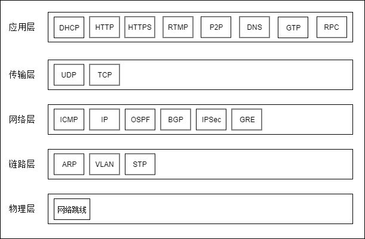
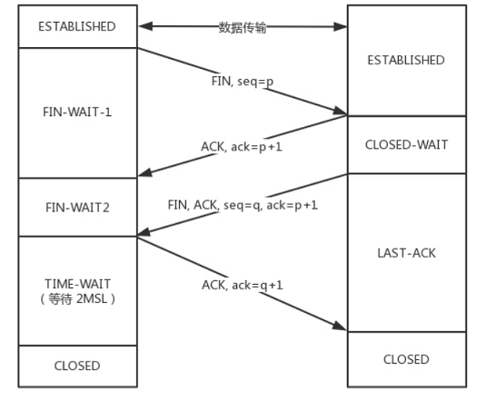
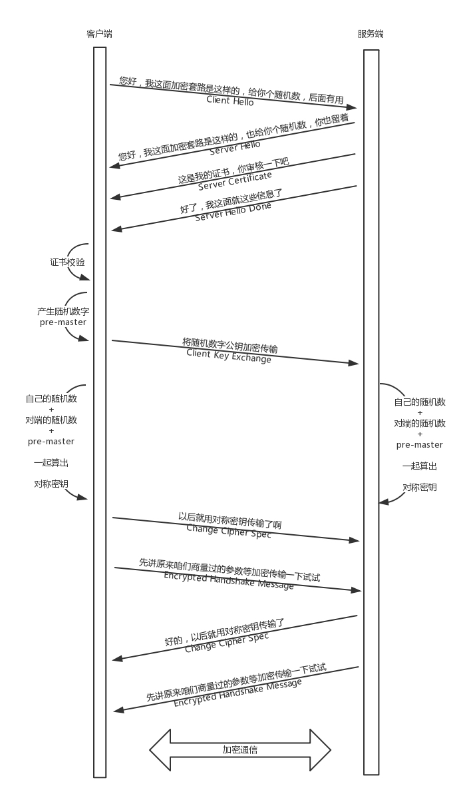
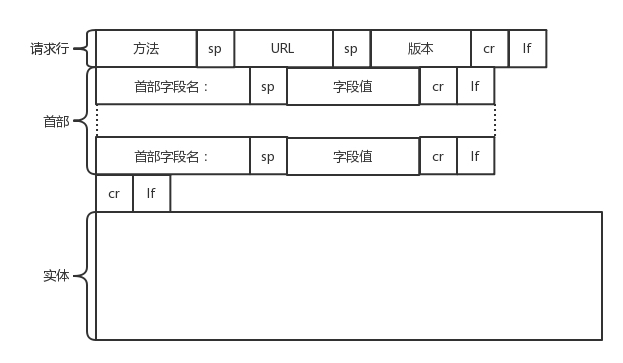
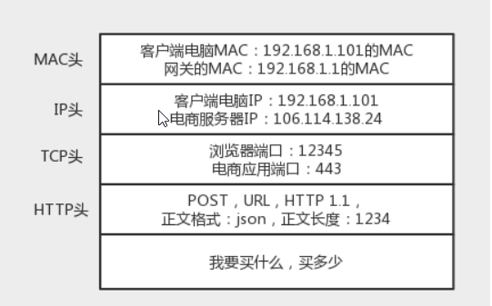

# 计算机网络面试题

## TCP/IP 模型  & OSI模型

### 应用层、传输层、网络层常见协议



DNS 、 HTTP 、FTP、 STMP 、SSL、 TCP、 UDP、 ARP、 IP   

## 交换机和路由器有什么区别

## Epoll的三个方法，MMP，零拷贝

## TCP

###  TCP 三次握手 、 TCP四次挥手

三次握手过程中，SYN攻击是啥，业界最新的解决方法？

**什么是SYN攻击?**

**原理:**

1. Client伪造大量的虚假ip,向Server发送SYN包
2. Server在接收到SYN包后,会返回响应,并进入SYN_RECV状态,等待客户端的确认
3. 但是伪造的ip肯定不会给予响应,于是Server以为数据包丢失,不断重发,直到超时

**危害:**

这些伪造的SYN包会长期占用未连接队列,导致后来真实的ip无法加入队列,从而被丢弃,引起网络拥堵甚至网络瘫痪

**深入一些 :     为什么三次握手，能否两次？**


ddos攻击在哪一阶段？

如果在最后出现丢包怎么办。


### TCP如何保证消息传输可靠

确认和重传、  校验和、流量控制 、 拥塞控制 、

拥塞控制，数据的发送是怎样减少的

### TCP报文中有没有IP报文的头部

ip协议是网络层，TCP是传输层，TCP只有应用层HTTP的报文，不会有IP协议的东西。

### TCP超时重传

### 

### tcp在当前存在的问题，滑动窗口机制、拥塞控制的不合理性，如何解决这个问题

用udp的方式解决滑动窗口的问题，解决网络传输被限制的问题（参考google正在开发的一套网络协议）

### 流量控制解决什么问题？采用什么算法

### 拥塞控制解决什么问题，采用什么算法

###  如果UDP模拟TCP的拥塞控制过程，怎么做（我就说实现那四个算法）

### 拥塞避免是什么算法？

## TimeWait和CloseWait



### **四次挥手中什么是 time_wait 状态 ？ close-wait 状态?**

time_wait状态什么场景下过多 ， 会造成什么问题？

### TIME_WAIT状态的意义

这个是TCP断开连接时客户端发送最后ACK的时候处在的状态，时长2个RTT，主要是确保ACK被服务端收到。如果ACK没有被服务端收到，服务端会重发FIN，那么客户端在TIME_WAIT状态时会收到重发的FIN（至多2个RTT的多时间内）。如果客户端2个RTT都没有收到重发的FIN，那么就是ACK被服务端收到了，连接关闭。  

### 发现服务器上TIMEWAIT状态的TCP过多是什么问题？

正常的TCP退出的话，都会有TIME_WAIT状态，如果并发特别高的话，会有很多个连接，这些连接结束的时候就会出现很多的TIMEWAIT状态的TCP，一般持续1~4分钟。这样你的服务器端口就被这些状态的TCP占用了，其他请求来的时候无法连接。

们可以通过linux内核进行一些网络调整比如，开启socket重用和快速回收：

```
net.ipv4.tcp_syncookies = 1
net.ipv4.tcp_tw_reuse = 1
net.ipv4.tcp_tw_recycle = 1
net.ipv4.tcp_max_tw_buckets = 5000
net.ipv4.tcp_max_syn_backlog = 8192
net.ipv4.tcp_keepalive_time = 1200
net.ipv4.ip_local_port_range = 1024 65000
```

### 客户端处于time_wait状态，服务端发来数据怎么办？

### Time wait状态，为什么要2msl?

### 为什么time wait可以消除本次连接产生的报文？（因为2msl，msl最长报文的生命周期）

## UDP

### UDP不可靠会丢包，为什么还用它，怎么解决UDP不可靠

UDP应用场景：

- 需要处理速度快，时延低，可以容忍少数丢包，但是要求即便网络拥塞，也毫不退缩，一往无前
  的
- 需要资源少，在网络情况比较好的内网，或者对于丢包不敏感的应用
- 不需要一对一沟通，建立连接，而是可以广播的应用。DHCP 就是一种广播的形式，就是
  基于 UDP 协议的

所以对于游戏实时性要求高的，可以使用。而且不是面向连接的，允许很多人连。

直播也是可以的。以前的包丢了也没关系。

### 如何用udp实现Tcp？

参考谷歌的QUIC协议 

**自定义连接机制**：

以一个 64 位的随机数作为 ID 来标识，而且 UDP 是无连接的，所以当 IP 或者端口变化
的时候，只要 ID 不变，就不需要重新建立连接。

**自定义重传机制**：

在 TCP 里面超时的采样存在不准确的问题。例如，发送一个包，序号为 100，发现没有返回，于
是再发送一个 100，过一阵返回一个 ACK101。这个时候客户端知道这个包肯定收到了，但是往返时间
是多少呢？是 ACK 到达的时间减去后一个 100 发送的时间，还是减去前一个 100 发送的时间呢？事实
是，第一种算法把时间算短了，第二种算法把时间算长了。

QUIC 也有个序列号，是递增的。任何一个序列号的包只发送一次，下次就要加一了。例如，发送一个
包，序号是 100，发现没有返回；再次发送的时候，序号就是 101 了；如果返回的 ACK 100，就是对第
一个包的响应。如果返回 ACK 101 就是对第二个包的响应，RTT 计算相对准确。

对于数据的一致性，QUIC 定义了一个 offset概念。QUIC 既然是面向连接的，也就像 TCP 一样，是一个数据流，发送的数据在这个数据流里面有个偏移量 offset，可以通过 offset 查看数据发送到了哪里，这样只要这个 offset 的包没有来，就要重发；如果来了，按照 offset 拼接，还是能够拼成一个流。

**机制四：自定义流量控制**

还记得吗？在 TCP 协议中，接收端的窗口的起始点是下一个要接收并且 ACK 的包，即便后来的包都到
了，放在缓存里面，窗口也不能右移，因为 TCP 的 ACK 机制是基于序列号的累计应答，一旦 ACK 了一
个系列号，就说明前面的都到了，所以只要前面的没到，后面的到了也不能 ACK，就会导致后面的到
了，也有可能超时重传，浪费带宽。

QUIC 的 ACK 是基于 offset 的，每个 offset 的包来了，进了缓存，就可以应答，应答后就不会重发，
中间的空挡会等待到来或者重发即可，而窗口的起始位置为当前收到的最大 offset，从这个 offset 到当
前的 stream 所能容纳的最大缓存，是真正的窗口大小。显然，这样更加准确。

## HTTP

### HTTPS 和HTTP 区别

### http几个版本的差别

（Http1.0 和HTTP1.1 和 Http2.x 的区别

#### HTTP2.0 

头压缩。HTTP 2.0 会对 HTTP 的头进行一定的压缩，将原来每次都要携带的大量 key value在两端建立一个索引表，对相同的头只发送索引表中的索引。

HTTP 2.0 的客户端可以将多个请求分到不同的流中，然后将请求内容拆成帧，进行二进制传输。这些帧可以打散乱序发送， 然后根据每个帧首部的流标识符重新组装，并且可以根据优先级，决定优先处理哪个流的数据。

### HTTPS 加密过程介绍 ？

客户端给服务端发送Client Hello消息，明文传输TLS 版本信息加密套件候选列表，压缩算法候选列表，还有一个随机数。

服务端返回Server Hello消息，告诉客户端，服务器选择使用的协议版本、加密套件、压缩算法等，还有一个随机数，用于后续的密钥协商。

服务端再发送一个证书给客户端

服务端再发送Server Hello Done表示结束。

客户端进行证书校验

客户端生成一个随机数，发送Client Key Exchange，用证书中的公钥加密，再发送给服务端。服务器可以通过私钥解密出来。

到目前为止，二者都有三个随机数。分别是：自己的、对端的，以及刚生成的Pre-Master 随机数。通过这三个随机数，可以在客户端和服务器产生相同的对称密钥。

有了对称密钥，客户端就可以说：“Change Cipher Spec，咱们以后都采用协商的通信密钥和加密算法
进行加密通信了。”
然后发送一个 Encrypted Handshake Message，将已经商定好的参数等，采用协商密钥进行加密，发
送给服务器用于数据与握手验证。
同样，服务器也可以发送 Change Cipher Spec，说：“没问题，咱们以后都采用协商的通信密钥和加
密算法进行加密通信了”，并且也发送 Encrypted Handshake Message 的消息试试。当双方握手结束
之后，就可以通过对称密钥进行加密传输了。



### HTTP在哪一层

应用层

### HTTPS可以完全避免中间人攻击吗

### Http 报文里有什么？

请求格式



### HTTP的返回码？

### HTTP基于？

TCP/IP

### http内部字段，怎么保持长连接，如果客户端挂了，服务器怎么办

HTTP 协议是基于 TCP 协议的，所以它使用面向连接的方式发送请求，通过 stream 二进制流的方式传
给对方。当然，到了 TCP 层，它会把二进制流变成一个的报文段发送给服务器。

（我答的就是保活计时器+探测报文），

##  Cookie和Session的区别

### 你会怎么实现Session？

## get和post的区别

## get请求整个过程

## 常见的状态码

状态码301与302的区别

## 网址传参数的问题，如果是a=1和A=1服务器会解析成一样的么，怎么过滤一些不合法的字符，怎么设置过滤器

## dns基于udp还是tcp

DNS占用53号端口，同时使用TCP和UDP协议。那么DNS在什么情况下使用这两种协议？

DNS在区域传输的时候使用TCP协议，其他时候使用UDP协议。

DNS区域传输的时候使用TCP协议：

1.辅域名服务器会定时（一般3小时）向主域名服务器进行查询以便了解数据是否有变动。如有变动，会执行一次区域传送，进行数据同步。区域传送使用TCP而不是UDP，因为数据同步传送的数据量比一个请求应答的数据量要多得多。

域名解析时使用UDP协议：

客户端向DNS服务器查询域名，一般返回的内容都不超过512字节，用UDP传输即可。不用经过三次握手，这样DNS服务器负载更低，响应更快。理论上说，客户端也可以指定向DNS服务器查询时用TCP，但事实上，很多DNS服务器进行配置的时候，仅支持UDP查询包。

## tcp/udp的区别

微信使用的是哪种？

## SSL握手协议使用的加密算法，非对称加密的缺点

## XSS和CSRF介绍

##  微信在群里发一条消息如何广播出去？怎么实现的？用的UDP还是TCP？

## XSS攻击

## 说说输入网址按下回车后的过程

输入 https://www.kaola.com，通过DNS找到ip地址，之后通过http协议发送数据，里面会封装你要买什么。这是应用层。下一层是传输层，TCP和UDP，会封装需要监听的端口。下一层是网络层，网络层的协议是 IP 协议。在 IP 协议里面会有源 IP 地址和目标 IP 地址。通过ARP协议获取MAC地址，发送给数据链路层，封装上mac地址，发送给网关。



网关往往是一个路由器，会根据自己的路由表判断去某个 IP 地址要怎么走。

网关根据路由协议OSPF和BGP等，可以知道该去哪里。

网络包到达后，根据ip地址，目标服务器会告诉你MAC地址，通过这个 MAC 地址就能找到目标服务器。
目标服务器发现 MAC 地址对上了，取下 MAC 头来，发送给操作系统的网络层。发现 IP 也对上了，就
取下 IP 头。IP 头里会写上一层封装的是 TCP 协议，然后将其交给传输层，即TCP 层。

在这一层里，对于收到的每个包，都会有一个回复的包说明收到了

## 发出一个url请求服务器怎么接收和处理；


## tpc，http最小大小

### socket连接建立流程

没准备好，大概讲了bind套接字，监听客户端请求，建立连接。详细可百度

### socket如何判断断开

onclose、heartbeat

### OAuth流程

## SYN序列号生成？

## webService和http区别

## DNS递归和迭代

## 重定向有哪几种，分别有什么区别。